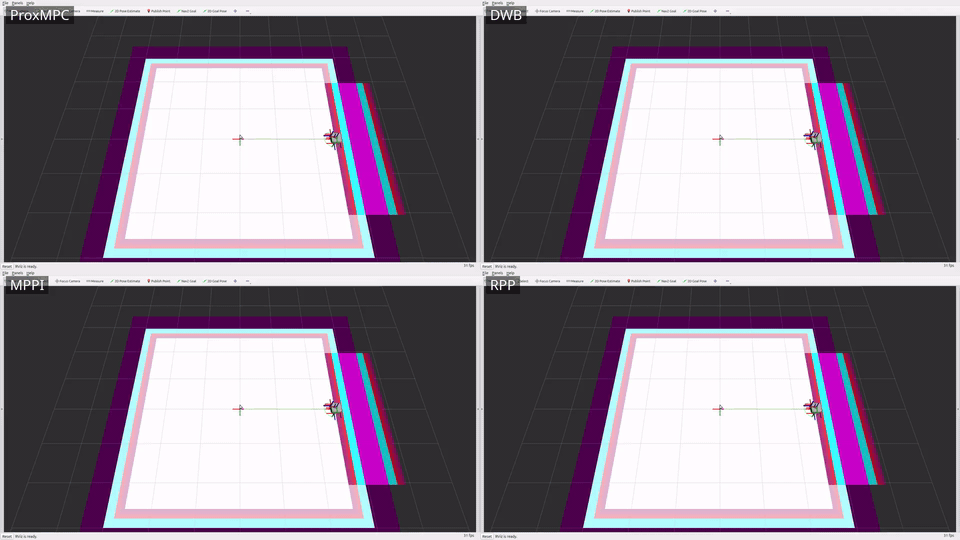
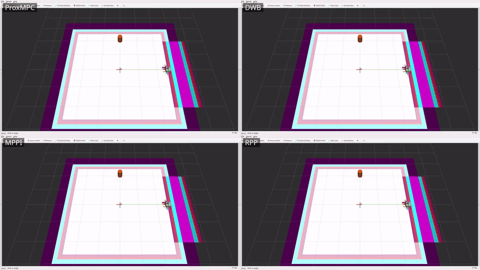
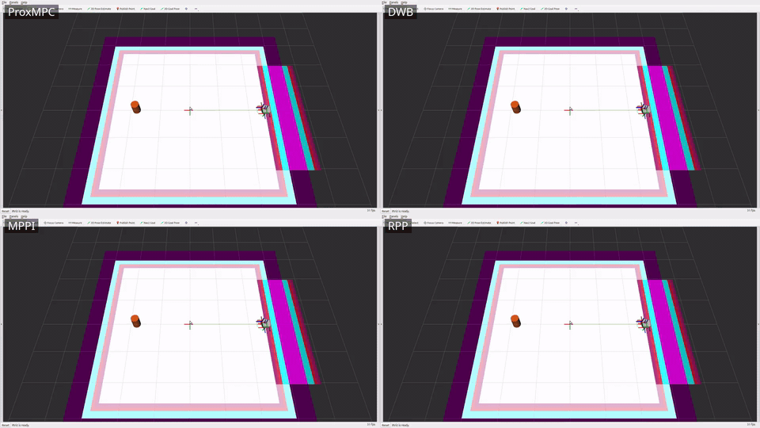

# prox_mpc_benchmark

Scenario-driven benchmarking harness for the ProxMPC stack.
It measures three metric classes - **accuracy** (cross-track / goal error),
**precision** (mean ± std over repeats), and **real-time / feasibility** (solver
diagnostics) - across a matrix of *scenario x model x controller x run mode*.

## Table of Contents

- [Overview](#overview)
- [Prerequisites](#prerequisites)
- [Build](#build)
- [Project Structure](#project-structure)
- [Run modes](#run-modes)
- [Coverage and status](#coverage-and-status)
- [Notes on the metrics](#notes-on-the-metrics)
- [Configuration](#configuration)
- [Usage](#usage)
  - [Quick start](#quick-start)
  - [Standalone matrix (b1)](#standalone-matrix-b1)
  - [Cross-controller comparison (b2)](#cross-controller-comparison-b2)
  - [Aggregate the tables](#aggregate-the-tables)
- [Demonstration videos](#demonstration-videos)
- [Results](#results)
- [License](#license)

## Overview

The package contains a controller-agnostic **C++ live metrics node**
([src/metrics_node.cpp](src/metrics_node.cpp)) plus installed **Python tooling**
([scripts/](scripts/)) for orchestration, map generation, goal sending, bag
reduction, and aggregation. It **reuses** the demo worlds/maps/models rather
than duplicating them, and **owns the result artifacts**, which stay local and
gitignored - the framework performs no git operations.

The narrative companion - how ProxMPC compares against the stock Nav2 controllers
and what the suite concluded - is in
[doc/controller-comparison-results.md](../doc/controller-comparison-results.md).

## Prerequisites

- **Operating system:** Ubuntu 24.04 (Noble).
- **ROS 2 distribution:** Jazzy.
- **Build system:** `ament_cmake`.
- **Always needed:** `prox_mpc_core`, `prox_mpc_msgs`, and `prox_mpc_demo` (the
  reused worlds, maps, and models).
- **Modes a / b2:** additionally Nav2 and the stock Nav2 controllers under
  comparison (DWB, MPPI, Regulated Pure Pursuit, Graceful, and Vector Pursuit -
  the one external community peer), plus `prox_mpc_controller`;
  mode a also needs Gazebo Harmonic and `ros_gz`.

ROS dependencies are declared in `package.xml` and resolved by `rosdep install`.

## Build

Build the harness and its dependencies in an overlay workspace:

```bash
colcon build --symlink-install --packages-select \
  prox_mpc_msgs prox_mpc_core prox_mpc_controller prox_mpc_demo prox_mpc_benchmark
source install/setup.bash
```

## Project Structure

- `config/scenarios/` - eleven scenarios, one YAML each. The four single-obstacle
  motion cells driven by the standalone matrix (`static_box`, `dynamic_circle`,
  `dynamic_line_forward`, `dynamic_line_backward`); `nav2_open`, the obstacle-free
  cross-controller cell; and the six multi-obstacle cells that carry the
  simultaneous two-mover collision comparison - `dynamic_multi`,
  `dynamic_multi_noise`, and `blind_multi_0` through `blind_multi_3`
  (generated by `gen_blind_multi.py`).
- `config/controllers/` - one preset per Nav2 controller under test: `proxmpc`,
  `proxmpc_pred` (the predictive ProxMPC variant), `dwb`, `mppi`,
  `regulated_pure_pursuit`, `graceful`, and `vector_pursuit`.
- `config/robots/` - robot <-> prox_mpc model pairing (`waffle`->Unicycle,
  `ackermann`->Bicycle).
- `config/metrics.yaml` - metric set, pass thresholds, repeats, shared control params.
- `config/nav2_b2_base.yaml` - the shared Nav2 stack the mode-b2 launch injects each controller preset into.
- `src/metrics_node.cpp` - live cross-track/goal-error + SolverDiagnostics tap; writes a per-run JSON.
- `src/kinematic_plant.cpp` - mode (b2) plant: integrates `/cmd_vel` as a unicycle, publishes `/odom` + TF.
- `src/scan_simulator.cpp` - synthesises the `LaserScan` the mode (b2) costmaps and the
  obstacle tracker perceive, so every controller sees the same sensor stream without Gazebo.
- `src/timing_controller_wrapper.cpp` - a `nav2_core::Controller` decorator that wall-clock times the
  wrapped controller's `computeVelocityCommands` so every controller's per-cycle compute is measured identically.
- `timing_controller_plugin.xml` - the `pluginlib` export for that decorator.
- `include/prox_mpc_benchmark/` - `metrics_math.hpp` (the ROS-free metric math),
  `obstacle_field.hpp` (scenario obstacle geometry), and `timing_controller_wrapper.hpp`.
- `test/` - GoogleTest suites `test_metrics.cpp` and `test_obstacle_field.cpp`.
- `launch/benchmark.launch.py` - standalone (b1) sim + metrics node for one scenario x model.
- `launch/benchmark_nav2.launch.py` - mode (b2) Nav2 + kinematic plant with the selected controller preset.
- `launch/interactive.launch.py` - the click-a-goal interactive Nav2 bring-up on the kinematic plant (no Gazebo).
- `scripts/run_matrix.py` - orchestrate the standalone (b1) matrix x repeats.
- `scripts/run_nav2.py` - orchestrate the mode (b2) cross-controller comparison (Nav2 + plant, no Gazebo).
- `scripts/resource_sampler.py` - sample the controller_server process CPU/RSS + `/cmd_vel` rate (b2).
- `scripts/generate_map.py` - world+map generation for the scale presets (7/15/30 m).
- `scripts/gen_blind_multi.py` - generate the `blind_multi_*` two-mover scenario YAMLs.
- `scripts/goal_sender.py` - auto-send NavigateToPose / NavigateThroughPoses (modes a/b2).
- `scripts/gt_obstacle_publisher.py` - publish the scenario's ground-truth obstacle states
  (the `--oracle` feed and the collision scoring reference).
- `scripts/obstacle_markers.py` - ground-truth obstacle markers for RViz and the recorded videos.
- `scripts/space_time_feasible.py` - offline space-time check that a two-mover cell is solvable at all.
- `scripts/record_scenarios.py` - record one controller through the scenarios for the video grids.
- `scripts/combine_grid.sh` - combine per-controller clips into a labelled comparison grid.
- `scripts/compute_metrics.py` - bag -> per-run JSON (modes a/b2).
- `scripts/aggregate.py` - per-run JSON -> mean ± std tables -> this README.
- `models/ackermann_robot/` - the Ackermann robot model used by the bicycle cells.
- `worlds/prox_mpc_scalable.sdf.xacro` - the scalable benchmark world (7/15/30 m presets).
- `rviz/recording.rviz` - the RViz configuration the video recordings use.
- `doc/` - [videos.md](doc/videos.md) (recording workflow) and `doc/media/` (the committed grids and posters).
- `init.sh` - one-command reproducible build + single-scenario (b1) run.
- `CHANGELOG.rst` - release notes for the package.
- `results/` - per-run JSON, the `scenarios.json` index, progress files (gitignored).

## Run modes

- **(b1) standalone core sim** - the deterministic, ProxMPC-only regression path
  (the core drives its own model; no Gazebo). Both models. Fully wired and exercised.
- **(a) Gazebo + Nav2** - full stack, ground-truth accuracy, real-time/feasibility
  telemetry from the controller plugin's `<plugin>/diagnostics`.
- **(b2) Nav2 without Gazebo** - a kinematic-plant node (`kinematic_plant`) +
  Nav2 controller_server for controller-agnostic comparison without Gazebo physics
  cost. Wired (`benchmark_nav2.launch.py`, `run_nav2.py`) and exercised.

## Coverage and status

Harness coverage (ROS 2 Jazzy, Gazebo Harmonic, full Nav2 with the seven
controllers compared):

| Mode / capability | Coverage |
| --- | --- |
| Solver telemetry (`SolverDiagnostics`, core slack getter, standalone + plugin publishers) | live diagnostics; plugin tap under Nav2 |
| Mode **b1** - standalone core sim | both models x the 4 single-obstacle scenarios x 5 repeats |
| Mode **a** - Gazebo Harmonic + full Nav2 | waffle / Unicycle + ProxMPC, open world, goal -> `SUCCEEDED` |
| Mode **b2** - Nav2 + kinematic plant + scan simulator, no Gazebo (`run_nav2.py`) | **the reported comparison**: 7 controllers x 11 scenarios x 5 repeats (10 for MPPI on obstacle cells) |
| Map scaling (`generate_map.py` 7/15/30 m + scalable world xacro) | maps matched to world geometry |
| Ackermann robot SDF + gz AckermannSteering bridge | mode-a bicycle bringup |

The cross-controller comparison runs in mode **b2** via `run_nav2.py`: each of the
seven controllers has a preset in
`config/controllers/`, `benchmark_nav2.launch.py` injects it into `FollowPath`, and
every controller drives the *identical* kinematic plant from the same start to the
same goal. On the obstacle scenarios the `scan_simulator` ray-casts the scenario
obstacles into `/scan` and a costmap `obstacle_layer` marks them, so every
controller perceives the *same* obstacle through the *same* costmap; the
controller-agnostic metrics node adds a min-clearance / collision metric. The
narrative and the conclusion on ProxMPC are in
[doc/controller-comparison-results.md](../doc/controller-comparison-results.md).

## Notes on the metrics

<details>
<summary>How the metrics are defined and why (precision, deadline-miss, obstacle placement, resources, fair tuning)</summary>

- **Precision.** Mode b1 is deterministic, so the geometric metrics (path,
  goal error, cross-track) have ~0 std across repeats - the precision signal is
  exact reproducibility; only wall-clock timing jitters. Mode a shows small real
  variance (Gazebo non-determinism), which **is** the precision signal there.
- **`deadline_missed`.** A pure compute-overrun signal: `solve_time_ms > 1000*dt`
  (the solve did not fit the cycle budget). The measured `control_period_ms` is
  published as a separate field but is deliberately not folded into the flag - the
  nominal period equals the budget by construction, so any period threshold would
  need an arbitrary slack. The actionable real-time signal is the
  `solve_p50/p95/max` distribution.
- **Non-finite timing samples.** A non-finite `solve_time_ms` is dropped at
  ingestion and counted rather than fed to the quantile code (a NaN breaks the
  sort's ordering). The percentile definition is unchanged and `num_diag_samples`
  still counts every diagnostics message received.
- **Scenario obstacle placement.** Obstacles are offset off the dead-centre line:
  a perfectly head-on symmetric point obstacle gives a soft-constraint avoider no
  lateral preference and stalls it (not a meaningful avoidance test). The offset
  gives a clear side to pass while still forcing a measurable detour.
- **Standalone goal-stop.** The b1 sim holds at its final goal (a waypoint
  follower stops rather than driving through), so `goal_error_m` reflects the
  stopping accuracy; the solver keeps running so telemetry still flows.
- **Embedded-resource metrics (mode b2).** `resource_sampler.py` reads the
  `controller_server` process's CPU (% of one core) and RSS from `/proc`, the
  achieved `/cmd_vel` rate, and - via the timing decorator - each controller's
  per-cycle `computeVelocityCommands` time, so the cross-controller comparison
  includes `control_rate_hz`, `cpu_mean_pct`/`cpu_peak_pct`, `rss_peak_mb`, and
  `compute_ms_p50`/`p95`/`max` (`n/a` for b1 / mode a). Process CPU/RSS are
  per-process (the identical local costmap is included); `compute_ms_*` is the
  cleaner controller-only measure. Measured on the x86 dev host (Intel Core
  i7-10750H, 6C/12T, 31 GiB RAM, Ubuntu 24.04.4) - the ranking transfers,
  absolutes are indicative.
- **Fair tuning (cross-controller).** The predictive controllers share a **2.0 s
  prediction horizon** (ProxMPC `np*dt`, DWB `sim_time`, MPPI `time_steps*model_dt`),
  a **genuine matched hard 0.5 m/s cap** (enforced in every controller's
  solver/sampler - for ProxMPC via the model's `v_max` input bound, sourced from
  the robot config), 20 Hz rate, and a
  0.24 m goal checker strictly inside the 0.25 m scored tolerance. Each method's
  intrinsic sampling (MPPI `batch_size`, DWB sample grid) stays at its upstream
  default. Every controller received a good-faith tuning pass on its own
  documented avoidance/completion knobs within ProxMPC's iteration budget;
  `regulated_pure_pursuit`/`graceful` kept genuine wins, `dwb`/`mppi` reverted to
  stock obstacle costs after harder settings only regressed them. MPPI (the one
  unseeded stochastic controller) runs n=10 per obstacle cell; the rest n=5.
- **Result summary (matched 0.5 m/s cap).** At a matched speed cap ProxMPC holds
  the largest static-obstacle margin of the field (+0.352 m) and clears the single
  crossing and orbiting obstacles reactively. On the six simultaneous two-mover
  cells the discriminator is the **median closest approach**, not the collision
  count: those cells are deliberately marginal, 40-80 % of runs finish within
  0.15 m of the threshold, and the same cell returned 1/5, 5/5, and 2/5 collisions
  on three runs of the same binary. By margin, predictive ProxMPC leads the field
  at **+0.190 m** (RPP +0.125, DWB +0.080, MPPI +0.048, Vector Pursuit +0.024,
  Graceful -0.013), while reactive ProxMPC is the narrowest at -0.118 m. Its
  weakest cell is `blind_multi_0`, the tightest two-mover geometry, where the
  linearised keep-out cannot make the non-convex per-obstacle side-choice.
  Per-cycle it computes ~3.3x lighter than DWB and ~3.5x than MPPI on the open
  cell and 1.1-2.7x lighter across the obstacle cells, the margin narrowing as the
  field tightens, at 5.0-9.1 % CPU against their 8.4-9.3 %.
  The full method, per-cell numbers, and conclusion are in
  [doc/controller-comparison-results.md](../doc/controller-comparison-results.md).

</details>

> These are simulation results on a kinematic plant, measured on an x86-64
> dev host (Intel Core i7-10750H, 6 cores / 12 threads, 31 GiB RAM,
> Ubuntu 24.04.4) - not on physical robot hardware and not contact-dynamics.
> A collision is a *would-be* overlap of the robot and obstacle discs, scored
> identically for every controller. Gazebo validation is a single open-cell run;
> full Gazebo and hardware validation remain open.

## Configuration

Every run is configured from the YAML files in `config/`, which are the single
source of truth for the harness.
`config/metrics.yaml` holds the metric set, pass thresholds, repeat count, and the
shared control parameters; `config/scenarios/<name>.yaml` defines each scenario's
geometry, reference polyline, and obstacles; `config/controllers/<name>.yaml`
holds one preset per Nav2 controller under comparison; and
`config/robots/<name>.yaml` pairs a robot with its prox_mpc model.
The mode-b2 launch injects the selected controller preset into the shared
`config/nav2_b2_base.yaml` stack so every controller runs against an identical Nav2
configuration.

The orchestration scripts select from these files by name.
`run_matrix.py` accepts `--scenarios`, `--models`, `--modes` (b1 here),
`--controller`, `--repeats`, and `--results-dir`; `run_nav2.py` accepts
`--scenario`, `--controllers`, `--robot`, `--repeats`, `--repeat-indices`,
`--warmup`, `--results-dir`, and `--oracle`.
`--repeat-indices` takes a comma-separated list of repeat indices and overrides
`--repeats`, so a single run lost to a transient bring-up failure can be redone
without repeating the cell; `--oracle` feeds `proxmpc_pred` ground-truth obstacles
instead of the IMM tracker, which separates a perception limit from a
controller-formulation limit.
The launch files parametrise a single cell: `benchmark.launch.py` takes
`scenario`, `model`, `mode`, and `summary_json`; `benchmark_nav2.launch.py` takes
`controller`, `robot`, `timing`, `map_yaml`, `start_x`, `start_y`, `start_theta`,
`scan_params_file` (override the simulated scan's parameters; empty uses the
default), and `obstacle_tracker` (start the tracker alongside the stack; default
`false`).

## Usage

### Quick start

Run one scenario end to end - the script sources the overlay, builds the affected
packages in `~/ros2_ws`, runs the standalone (b1) cell, and prints the per-run
summary JSON.
`init.sh` lives in the package root, so run it from there:

```bash
cd ~/ros2_ws/src/prox_mpc/prox_mpc_benchmark
./init.sh static_box bicycle
```

Its usage is `./init.sh [scenario] [model]`, where `scenario` is one of
`static_box`, `dynamic_circle`, `dynamic_line_forward`, `dynamic_line_backward`
(default `static_box`) and `model` is `unicycle` or `bicycle` (default `bicycle`).
Override the workspace path with the `ROS2_WS` environment variable if the
workspace is not at `~/ros2_ws`.

### Standalone matrix (b1)

Run the whole deterministic standalone matrix (both models x the four motion
scenarios x repeats):

```bash
ros2 run prox_mpc_benchmark run_matrix.py --modes b1
```

Narrow the run to specific cells with `--scenarios` and `--models`, for example
`--scenarios static_box --models bicycle`.

### Cross-controller comparison (b2)

Compare ProxMPC against the stock Nav2 controllers on the open-world cell, Nav2 +
kinematic plant, no Gazebo:

```bash
# full peer set, one scenario
ros2 run prox_mpc_benchmark run_nav2.py --controllers proxmpc,dwb,mppi,regulated_pure_pursuit,graceful,vector_pursuit --scenario static_box

# single-scenario reproduce
ros2 run prox_mpc_benchmark run_nav2.py --scenario <nav2_open|static_box|dynamic_circle|dynamic_line_forward|dynamic_line_backward>
```

`goal_sender.py` (used internally by `run_nav2.py` and mode a) can also send a
one-off goal into a running stack:

```bash
ros2 run prox_mpc_benchmark goal_sender.py --points 2.0,-0.5,0.0 --timeout 120
```

### Aggregate the tables

Reduce the per-run JSONs into the mean ± std tables and render them into the
[Results](#results) block below:

```bash
ros2 run prox_mpc_benchmark aggregate.py
```

## Demonstration videos

Per-scenario **four-controller** comparison grids: ProxMPC (predictive), DWB,
MPPI, and Regulated Pure Pursuit driving the *same* mode (b2) scenario side by side
(RViz on the kinematic plant), so the avoidance behaviours are directly comparable.
The ProxMPC cell is the `proxmpc_pred` preset - the predictive variant, which is
what `record_scenarios.py` records by default. Each obstacle is drawn as a
ground-truth cylinder next to its costmap footprint. Every GIF loops inline and
links to the full-resolution mp4. Cell order: ProxMPC (predictive)
(top-left), DWB (top-right), MPPI (bottom-left), RPP (bottom-right).

### No obstacle

[](doc/media/nav2_open_controllers.mp4)

### Static box (dead-centre)

[](doc/media/static_box_controllers.mp4)

### Dynamic line

[](doc/media/dynamic_line_forward_controllers.mp4)

### Dynamic circle

[](doc/media/dynamic_circle_controllers.mp4)

The single-controller ProxMPC-across-scenarios grid is in the
[root README](../README.md#demonstration). Full workflow, parameters, and the
Wayland/Xvfb note are in [doc/videos.md](doc/videos.md). In short - record each
controller into its own folder, then combine per scenario:

```bash
for c in proxmpc_pred dwb mppi regulated_pure_pursuit; do
  ros2 run prox_mpc_benchmark record_scenarios.py --controller "$c" \
    --out-dir results/videos/"$c"
done
ros2 run prox_mpc_benchmark combine_grid.sh \
  --inputs results/videos/proxmpc_pred/static_box.mp4,results/videos/dwb/static_box.mp4,results/videos/mppi/static_box.mp4,results/videos/regulated_pure_pursuit/static_box.mp4 \
  --labels ProxMPC,DWB,MPPI,RPP --output doc/media/static_box_controllers.mp4
```

Per-controller clips land under `results/videos/<controller>/` (gitignored); the
committed grids + posters are under `doc/media/`.

## Results

> Simulation results on a kinematic plant, not physical hardware and not
> contact-dynamics; a collision is a *would-be* overlap of the robot and obstacle
> discs, scored identically for every controller; Gazebo validation is a single
> open-cell run, with full Gazebo and hardware validation still open. The full
> statement is in the [Notes on the metrics](#notes-on-the-metrics) above and in
> the [root README](../README.md).

<!-- BENCHMARK_RESULTS_START -->

*Auto-generated by `aggregate.py` from `results/scenarios.json` (475 runs). Values are mean±std (population) over repeats - the precision signal. Not committed.*

### Mode `b1`

| scenario | model | controller | n | success | t_goal[s] | path[m] | goal_err[m] | ct_rms[m] | ct_max[m] | obs_gap[m] | coll | solve_p50[ms] | solve_p95[ms] | solve_max[ms] | miss | sqp | qp_ext | infeas | slack[m] | rate[Hz] | cpu[%] | rss[MB] | cmp_p50[ms] | cmp_p95[ms] |
|---|---|---|---|---|---|---|---|---|---|---|---|---|---|---|---|---|---|---|---|---|---|---|---|---|
| dynamic_circle | bicycle | proxmpc | 5 | 100% | 4.52±0.16 | 4.84±0.03 | 0.143±0.000 | 0.021±0.000 | 0.044±0.000 | n/a | n/a | 4.663±0.219 | 8.705±0.820 | 9.549±1.037 | 0.0±0.0% | 1.00±0.00 | 9.40±0.02 | 0.0±0.0% | 0.000±0.000 | n/a | n/a | n/a | n/a | n/a |
| dynamic_circle | unicycle | proxmpc | 5 | 100% | 4.57±0.06 | 4.85±0.00 | 0.140±0.000 | 0.005±0.000 | 0.011±0.000 | n/a | n/a | 3.343±0.047 | 5.874±0.079 | 6.583±0.483 | 0.0±0.0% | 1.00±0.00 | 9.35±0.00 | 0.0±0.0% | 0.000±0.000 | n/a | n/a | n/a | n/a | n/a |
| dynamic_line_backward | bicycle | proxmpc | 5 | 100% | 4.59±0.13 | 4.85±0.00 | 0.152±0.000 | 0.044±0.000 | 0.103±0.000 | n/a | n/a | 4.618±0.319 | 9.303±0.101 | 10.375±0.272 | 0.0±0.0% | 1.00±0.00 | 9.58±0.01 | 0.0±0.0% | 0.226±0.000 | n/a | n/a | n/a | n/a | n/a |
| dynamic_line_backward | unicycle | proxmpc | 5 | 100% | 4.53±0.06 | 4.85±0.00 | 0.154±0.000 | 0.048±0.000 | 0.111±0.000 | n/a | n/a | 3.469±0.081 | 7.424±0.156 | 11.895±0.583 | 0.0±0.0% | 1.00±0.00 | 9.57±0.00 | 0.0±0.0% | 0.194±0.000 | n/a | n/a | n/a | n/a | n/a |
| dynamic_line_forward | bicycle | proxmpc | 5 | 100% | 4.58±0.04 | 4.85±0.00 | 0.153±0.000 | 0.058±0.000 | 0.125±0.000 | n/a | n/a | 4.459±0.222 | 9.543±0.478 | 14.947±0.230 | 0.0±0.0% | 1.00±0.00 | 9.55±0.00 | 0.0±0.0% | 0.374±0.000 | n/a | n/a | n/a | n/a | n/a |
| dynamic_line_forward | unicycle | proxmpc | 5 | 100% | 4.48±0.19 | 4.84±0.04 | 0.154±0.000 | 0.045±0.001 | 0.104±0.000 | n/a | n/a | 4.059±0.170 | 8.381±0.827 | 12.402±0.763 | 0.0±0.0% | 1.00±0.00 | 9.61±0.02 | 0.0±0.0% | 0.223±0.000 | n/a | n/a | n/a | n/a | n/a |
| static_box | bicycle | proxmpc | 5 | 100% | 4.60±0.00 | 4.86±0.00 | 0.140±0.000 | 0.000±0.000 | 0.000±0.000 | n/a | n/a | 1.840±0.081 | 3.440±0.206 | 3.744±0.478 | 0.0±0.0% | 1.00±0.00 | 9.84±0.00 | 0.0±0.0% | 0.492±0.000 | n/a | n/a | n/a | n/a | n/a |
| static_box | unicycle | proxmpc | 5 | 100% | 4.52±0.04 | 4.85±0.00 | 0.140±0.000 | 0.000±0.000 | 0.000±0.000 | n/a | n/a | 1.451±0.047 | 2.826±0.086 | 3.318±0.373 | 0.0±0.0% | 1.00±0.00 | 9.85±0.01 | 0.0±0.0% | 0.492±0.000 | n/a | n/a | n/a | n/a | n/a |

### Mode `b2`

| scenario | model | controller | n | success | t_goal[s] | path[m] | goal_err[m] | ct_rms[m] | ct_max[m] | obs_gap[m] | coll | solve_p50[ms] | solve_p95[ms] | solve_max[ms] | miss | sqp | qp_ext | infeas | slack[m] | rate[Hz] | cpu[%] | rss[MB] | cmp_p50[ms] | cmp_p95[ms] |
|---|---|---|---|---|---|---|---|---|---|---|---|---|---|---|---|---|---|---|---|---|---|---|---|---|
| blind_multi_0 | unicycle | dwb | 5 | 100% | 15.90±0.41 | 4.78±0.01 | 0.238±0.002 | 0.051±0.015 | 0.122±0.026 | 0.053±0.081 | 20% | n/a | n/a | n/a | 0.0±0.0% | 0.00±0.00 | 0.00±0.00 | 0.0±0.0% | 0.000±0.000 | 20.08±0.00 | 9.08±0.15 | 59.65±0.13 | 2.662±0.059 | 3.353±0.143 |
| blind_multi_0 | unicycle | graceful | 5 | 100% | 16.02±0.87 | 4.85±0.03 | 0.210±0.018 | 0.064±0.018 | 0.145±0.037 | -0.017±0.039 | 80% | n/a | n/a | n/a | 0.0±0.0% | 0.00±0.00 | 0.00±0.00 | 0.0±0.0% | 0.000±0.000 | 19.91±0.15 | 4.41±0.09 | 55.87±0.09 | 0.154±0.003 | 0.234±0.041 |
| blind_multi_0 | unicycle | mppi | 10 | 100% | 23.78±5.60 | 6.19±1.10 | 0.234±0.004 | 0.075±0.029 | 0.170±0.056 | -0.239±0.103 | 90% | n/a | n/a | n/a | 0.0±0.0% | 0.00±0.00 | 0.00±0.00 | 0.0±0.0% | 0.000±0.000 | 20.04±0.02 | 8.96±0.30 | 64.01±1.26 | 2.665±0.073 | 3.152±0.133 |
| blind_multi_0 | unicycle | proxmpc | 5 | 100% | 29.30±6.15 | 5.34±0.36 | 0.239±0.070 | 0.186±0.074 | 0.373±0.135 | -0.223±0.070 | 100% | 2.428±0.365 | 7.691±0.304 | 11.071±0.661 | 0.0±0.0% | 1.00±0.00 | 8.05±0.14 | 0.0±0.0% | 0.356±0.034 | 15.74±1.70 | 8.96±0.29 | 58.41±0.06 | 2.261±0.333 | 7.048±0.326 |
| blind_multi_0 | unicycle | proxmpc_pred | 5 | 100% | 25.14±5.70 | 5.25±0.40 | 0.267±0.057 | 0.141±0.030 | 0.335±0.077 | 0.013±0.140 | 40% | 1.909±0.335 | 5.601±0.968 | 14.187±7.457 | 0.0±0.0% | 1.00±0.00 | 8.09±0.24 | 0.0±0.0% | 0.361±0.038 | 16.97±1.95 | 8.06±0.54 | 59.91±0.08 | 1.899±0.347 | 4.820±0.814 |
| blind_multi_0 | unicycle | regulated_pure_pursuit | 5 | 100% | 16.90±1.70 | 4.87±0.04 | 0.236±0.002 | 0.080±0.014 | 0.169±0.013 | 0.049±0.064 | 20% | n/a | n/a | n/a | 0.0±0.0% | 0.00±0.00 | 0.00±0.00 | 0.0±0.0% | 0.000±0.000 | 19.03±0.32 | 4.53±0.09 | 55.22±0.06 | 0.209±0.005 | 0.277±0.004 |
| blind_multi_0 | unicycle | vector_pursuit | 5 | 100% | 23.31±4.06 | 5.08±0.27 | 0.237±0.003 | 0.079±0.052 | 0.168±0.067 | -0.107±0.097 | 80% | n/a | n/a | n/a | 0.0±0.0% | 0.00±0.00 | 0.00±0.00 | 0.0±0.0% | 0.000±0.000 | 16.10±2.05 | 4.21±0.07 | 55.13±0.12 | 0.197±0.009 | 0.290±0.036 |
| blind_multi_1 | unicycle | dwb | 5 | 100% | 14.08±1.44 | 4.65±0.28 | 0.237±0.001 | 0.060±0.015 | 0.143±0.030 | 0.154±0.140 | 20% | n/a | n/a | n/a | 0.0±0.0% | 0.00±0.00 | 0.00±0.00 | 0.0±0.0% | 0.000±0.000 | 20.08±0.00 | 9.18±0.10 | 59.68±0.10 | 2.765±0.089 | 3.604±0.340 |
| blind_multi_1 | unicycle | graceful | 5 | 100% | 15.44±0.64 | 4.86±0.01 | 0.220±0.006 | 0.119±0.042 | 0.222±0.066 | 0.090±0.079 | 0% | n/a | n/a | n/a | 0.0±0.0% | 0.00±0.00 | 0.00±0.00 | 0.0±0.0% | 0.000±0.000 | 20.07±0.00 | 4.44±0.13 | 55.73±0.06 | 0.163±0.008 | 0.240±0.029 |
| blind_multi_1 | unicycle | mppi | 10 | 100% | 15.63±1.31 | 4.83±0.01 | 0.230±0.004 | 0.055±0.017 | 0.116±0.036 | 0.034±0.184 | 30% | n/a | n/a | n/a | 0.0±0.0% | 0.00±0.00 | 0.00±0.00 | 0.0±0.0% | 0.000±0.000 | 20.07±0.00 | 8.68±0.20 | 63.18±0.57 | 2.671±0.071 | 3.058±0.172 |
| blind_multi_1 | unicycle | proxmpc | 5 | 100% | 21.88±4.74 | 5.12±0.22 | 0.194±0.042 | 0.205±0.079 | 0.379±0.126 | -0.179±0.122 | 100% | 2.148±0.251 | 5.835±0.802 | 11.595±4.902 | 0.0±0.0% | 1.00±0.00 | 7.74±0.15 | 0.0±0.0% | 0.312±0.015 | 17.57±1.78 | 8.67±0.36 | 58.55±0.07 | 2.029±0.222 | 5.872±0.656 |
| blind_multi_1 | unicycle | proxmpc_pred | 5 | 100% | 19.13±4.46 | 5.12±0.19 | 0.222±0.020 | 0.162±0.064 | 0.333±0.093 | -0.005±0.231 | 40% | 1.553±0.205 | 5.283±0.884 | 69.301±121.006 | 0.1±0.1% | 1.06±0.13 | 8.03±1.12 | 0.1±0.1% | 0.354±0.099 | 18.50±1.62 | 8.46±0.74 | 59.81±0.05 | 1.616±0.212 | 5.360±0.915 |
| blind_multi_1 | unicycle | regulated_pure_pursuit | 5 | 100% | 15.34±1.86 | 4.84±0.02 | 0.234±0.002 | 0.101±0.044 | 0.191±0.060 | 0.134±0.077 | 0% | n/a | n/a | n/a | 0.0±0.0% | 0.00±0.00 | 0.00±0.00 | 0.0±0.0% | 0.000±0.000 | 18.91±0.36 | 4.43±0.16 | 55.29±0.07 | 0.210±0.004 | 0.291±0.040 |
| blind_multi_1 | unicycle | vector_pursuit | 5 | 100% | 19.74±2.36 | 4.86±0.03 | 0.237±0.001 | 0.141±0.033 | 0.249±0.058 | 0.003±0.077 | 40% | n/a | n/a | n/a | 0.0±0.0% | 0.00±0.00 | 0.00±0.00 | 0.0±0.0% | 0.000±0.000 | 18.43±0.52 | 4.22±0.19 | 55.11±0.07 | 0.204±0.006 | 0.314±0.030 |
| blind_multi_2 | unicycle | dwb | 5 | 100% | 14.06±0.65 | 4.78±0.01 | 0.238±0.002 | 0.055±0.017 | 0.103±0.030 | -0.271±0.023 | 100% | n/a | n/a | n/a | 0.0±0.0% | 0.00±0.00 | 0.00±0.00 | 0.0±0.0% | 0.000±0.000 | 19.74±0.65 | 9.02±0.08 | 59.79±0.07 | 2.645±0.052 | 3.447±0.164 |
| blind_multi_2 | unicycle | graceful | 5 | 100% | 16.38±0.96 | 4.81±0.02 | 0.228±0.008 | 0.036±0.006 | 0.078±0.022 | -0.181±0.027 | 100% | n/a | n/a | n/a | 0.0±0.0% | 0.00±0.00 | 0.00±0.00 | 0.0±0.0% | 0.000±0.000 | 20.06±0.02 | 4.59±0.18 | 55.80±0.09 | 0.158±0.004 | 0.220±0.004 |
| blind_multi_2 | unicycle | mppi | 10 | 100% | 17.34±0.88 | 5.21±0.12 | 0.229±0.006 | 0.072±0.015 | 0.148±0.013 | 0.083±0.033 | 0% | n/a | n/a | n/a | 0.0±0.0% | 0.00±0.00 | 0.00±0.00 | 0.0±0.0% | 0.000±0.000 | 20.07±0.00 | 8.76±0.12 | 64.10±0.34 | 2.663±0.062 | 3.183±0.195 |
| blind_multi_2 | unicycle | proxmpc | 5 | 100% | 20.66±4.74 | 5.14±0.29 | 0.214±0.046 | 0.108±0.080 | 0.220±0.138 | 0.039±0.084 | 20% | 1.670±0.388 | 7.687±0.178 | 57.992±91.789 | 0.1±0.1% | 1.05±0.11 | 8.25±0.95 | 0.1±0.1% | 0.349±0.023 | 17.99±1.26 | 8.96±0.65 | 58.46±0.06 | 1.589±0.300 | 6.830±0.305 |
| blind_multi_2 | unicycle | proxmpc_pred | 5 | 80% | 19.44±1.30 | 3.98±1.99 | 1.181±1.909 | 0.073±0.038 | 0.143±0.073 | 0.574±0.749 | 0% | 1.771±0.049 | 3.875±0.117 | 7.304±0.826 | 0.0±0.0% | 0.80±0.40 | 6.14±3.08 | 0.0±0.0% | 0.244±0.125 | 19.10±0.69 | 7.92±0.23 | 59.69±0.10 | 1.793±0.030 | 3.877±0.036 |
| blind_multi_2 | unicycle | regulated_pure_pursuit | 5 | 100% | 16.89±1.95 | 4.84±0.07 | 0.235±0.004 | 0.106±0.072 | 0.169±0.115 | -0.185±0.070 | 100% | n/a | n/a | n/a | 0.0±0.0% | 0.00±0.00 | 0.00±0.00 | 0.0±0.0% | 0.000±0.000 | 18.02±2.31 | 4.48±0.07 | 55.24±0.13 | 0.211±0.003 | 0.289±0.033 |
| blind_multi_2 | unicycle | vector_pursuit | 5 | 80% | 19.17±1.30 | 3.88±1.94 | 1.190±1.905 | 0.083±0.053 | 0.168±0.099 | 0.370±0.851 | 80% | n/a | n/a | n/a | 0.0±0.0% | 0.00±0.00 | 0.00±0.00 | 0.0±0.0% | 0.000±0.000 | 18.45±0.20 | 4.33±0.08 | 55.04±0.07 | 0.212±0.006 | 0.306±0.032 |
| blind_multi_3 | unicycle | dwb | 5 | 100% | 14.75±0.78 | 4.74±0.09 | 0.237±0.001 | 0.050±0.017 | 0.101±0.023 | 0.241±0.051 | 0% | n/a | n/a | n/a | 0.0±0.0% | 0.00±0.00 | 0.00±0.00 | 0.0±0.0% | 0.000±0.000 | 20.08±0.00 | 9.23±0.12 | 59.63±0.10 | 2.785±0.082 | 3.510±0.202 |
| blind_multi_3 | unicycle | graceful | 5 | 100% | 17.56±0.74 | 4.88±0.02 | 0.206±0.012 | 0.124±0.005 | 0.256±0.007 | 0.091±0.047 | 0% | n/a | n/a | n/a | 0.0±0.0% | 0.00±0.00 | 0.00±0.00 | 0.0±0.0% | 0.000±0.000 | 20.07±0.00 | 4.29±0.20 | 55.70±0.09 | 0.156±0.005 | 0.230±0.011 |
| blind_multi_3 | unicycle | mppi | 10 | 90% | 16.47±1.64 | 4.30±1.44 | 0.711±1.430 | 0.078±0.041 | 0.148±0.067 | 0.228±0.711 | 70% | n/a | n/a | n/a | 0.0±0.0% | 0.00±0.00 | 0.00±0.00 | 0.0±0.0% | 0.000±0.000 | 20.13±0.14 | 8.77±0.19 | 63.00±0.21 | 2.686±0.086 | 3.175±0.238 |
| blind_multi_3 | unicycle | proxmpc | 5 | 100% | 16.56±1.03 | 4.97±0.14 | 0.222±0.020 | 0.118±0.036 | 0.252±0.059 | 0.157±0.132 | 20% | 1.996±0.295 | 5.481±0.419 | 7.343±0.685 | 0.0±0.0% | 1.00±0.00 | 7.59±0.19 | 0.0±0.0% | 0.327±0.050 | 19.61±0.56 | 8.63±0.43 | 58.41±0.18 | 2.083±0.311 | 5.671±0.383 |
| blind_multi_3 | unicycle | proxmpc_pred | 5 | 100% | 15.85±1.58 | 4.83±0.26 | 0.222±0.022 | 0.098±0.026 | 0.198±0.046 | 0.170±0.095 | 20% | 1.524±0.239 | 4.312±0.359 | 9.346±3.158 | 0.0±0.0% | 1.00±0.00 | 7.69±0.19 | 0.0±0.0% | 0.300±0.021 | 19.77±0.48 | 8.37±0.35 | 59.87±0.11 | 1.676±0.328 | 4.285±0.282 |
| blind_multi_3 | unicycle | regulated_pure_pursuit | 5 | 100% | 15.97±0.95 | 4.86±0.02 | 0.236±0.001 | 0.095±0.018 | 0.205±0.049 | 0.230±0.055 | 0% | n/a | n/a | n/a | 0.0±0.0% | 0.00±0.00 | 0.00±0.00 | 0.0±0.0% | 0.000±0.000 | 19.89±0.20 | 4.47±0.13 | 55.25±0.11 | 0.221±0.020 | 0.324±0.035 |
| blind_multi_3 | unicycle | vector_pursuit | 5 | 100% | 19.82±1.08 | 4.86±0.01 | 0.237±0.002 | 0.115±0.019 | 0.231±0.036 | 0.038±0.062 | 40% | n/a | n/a | n/a | 0.0±0.0% | 0.00±0.00 | 0.00±0.00 | 0.0±0.0% | 0.000±0.000 | 18.37±0.41 | 4.28±0.18 | 55.11±0.03 | 0.205±0.007 | 0.286±0.040 |
| dynamic_circle | unicycle | dwb | 5 | 100% | 14.88±0.59 | 4.77±0.00 | 0.236±0.001 | 0.025±0.016 | 0.054±0.022 | -0.243±0.049 | 100% | n/a | n/a | n/a | 0.0±0.0% | 0.00±0.00 | 0.00±0.00 | 0.0±0.0% | 0.000±0.000 | 20.08±0.00 | 9.08±0.25 | 59.84±0.06 | 2.619±0.089 | 3.713±0.368 |
| dynamic_circle | unicycle | graceful | 5 | 80% | 14.62±2.36 | 4.35±0.96 | 0.692±0.938 | 0.035±0.025 | 0.081±0.065 | -0.079±0.051 | 80% | n/a | n/a | n/a | 0.0±0.0% | 0.00±0.00 | 0.00±0.00 | 0.0±0.0% | 0.000±0.000 | 20.09±0.02 | 4.20±0.33 | 56.01±0.10 | 0.157±0.015 | 0.220±0.044 |
| dynamic_circle | unicycle | mppi | 10 | 90% | 17.43±1.37 | 4.58±1.53 | 0.709±1.430 | 0.035±0.024 | 0.083±0.045 | 0.551±1.133 | 0% | n/a | n/a | n/a | 0.0±0.0% | 0.00±0.00 | 0.00±0.00 | 0.0±0.0% | 0.000±0.000 | 20.06±0.00 | 8.91±0.13 | 62.96±0.07 | 2.714±0.073 | 3.243±0.108 |
| dynamic_circle | unicycle | proxmpc | 5 | 80% | 20.48±0.94 | 4.32±2.16 | 1.115±1.943 | 0.098±0.051 | 0.239±0.131 | 0.887±1.532 | 0% | 1.619±0.301 | 7.909±0.212 | 14.685±6.896 | 0.0±0.0% | 0.80±0.40 | 6.04±3.03 | 0.0±0.0% | 0.449±0.228 | 18.62±0.21 | 8.86±0.30 | 58.46±0.16 | 1.537±0.302 | 5.742±0.615 |
| dynamic_circle | unicycle | proxmpc_pred | 5 | 80% | 16.04±1.08 | 4.14±2.07 | 1.191±1.905 | 0.177±0.096 | 0.369±0.217 | 0.914±1.519 | 0% | 1.418±0.111 | 4.986±0.168 | 74.521±116.838 | 0.1±0.1% | 0.87±0.45 | 6.69±3.62 | 0.1±0.1% | 0.122±0.075 | 19.47±0.36 | 8.28±0.64 | 59.87±0.11 | 1.499±0.096 | 5.103±0.167 |
| dynamic_circle | unicycle | regulated_pure_pursuit | 5 | 100% | 17.08±1.83 | 4.84±0.04 | 0.234±0.004 | 0.077±0.038 | 0.173±0.070 | 0.067±0.046 | 20% | n/a | n/a | n/a | 0.0±0.0% | 0.00±0.00 | 0.00±0.00 | 0.0±0.0% | 0.000±0.000 | 18.67±0.32 | 4.35±0.06 | 55.38±0.20 | 0.210±0.004 | 0.290±0.022 |
| dynamic_circle | unicycle | vector_pursuit | 5 | 100% | 20.04±0.42 | 4.80±0.01 | 0.235±0.002 | 0.050±0.005 | 0.117±0.021 | 0.142±0.033 | 0% | n/a | n/a | n/a | 0.0±0.0% | 0.00±0.00 | 0.00±0.00 | 0.0±0.0% | 0.000±0.000 | 18.30±0.39 | 4.33±0.17 | 55.26±0.07 | 0.213±0.006 | 0.332±0.025 |
| dynamic_line_backward | unicycle | dwb | 5 | 100% | 13.84±1.48 | 4.78±0.01 | 0.235±0.002 | 0.049±0.021 | 0.096±0.037 | 0.495±0.023 | 0% | n/a | n/a | n/a | 0.0±0.0% | 0.00±0.00 | 0.00±0.00 | 0.0±0.0% | 0.000±0.000 | 20.09±0.00 | 8.79±0.16 | 59.53±0.05 | 2.614±0.095 | 3.501±0.148 |
| dynamic_line_backward | unicycle | graceful | 5 | 100% | 11.98±1.18 | 4.74±0.13 | 0.227±0.013 | 0.057±0.032 | 0.103±0.049 | 0.324±0.078 | 0% | n/a | n/a | n/a | 0.0±0.0% | 0.00±0.00 | 0.00±0.00 | 0.0±0.0% | 0.000±0.000 | 20.09±0.00 | 4.40±0.20 | 55.73±0.19 | 0.162±0.011 | 0.257±0.022 |
| dynamic_line_backward | unicycle | mppi | 10 | 100% | 13.94±0.74 | 4.78±0.01 | 0.231±0.004 | 0.031±0.015 | 0.055±0.017 | 0.617±0.014 | 0% | n/a | n/a | n/a | 0.0±0.0% | 0.00±0.00 | 0.00±0.00 | 0.0±0.0% | 0.000±0.000 | 20.08±0.00 | 8.62±0.10 | 62.88±0.09 | 2.667±0.055 | 3.287±0.172 |
| dynamic_line_backward | unicycle | proxmpc | 5 | 100% | 13.98±0.97 | 4.86±0.01 | 0.232±0.013 | 0.093±0.033 | 0.162±0.052 | 0.513±0.079 | 0% | 0.969±0.099 | 4.561±0.587 | 8.098±1.283 | 0.0±0.0% | 1.00±0.00 | 7.53±0.39 | 0.0±0.0% | 0.262±0.035 | 20.08±0.00 | 7.27±0.37 | 58.42±0.07 | 1.102±0.114 | 4.747±0.624 |
| dynamic_line_backward | unicycle | proxmpc_pred | 5 | 100% | 13.45±0.99 | 4.85±0.04 | 0.232±0.010 | 0.072±0.028 | 0.130±0.053 | 0.373±0.012 | 0% | 0.897±0.048 | 3.680±0.278 | 7.559±1.577 | 0.0±0.0% | 1.00±0.00 | 7.27±0.18 | 0.0±0.0% | 0.247±0.064 | 20.08±0.00 | 6.72±0.22 | 59.68±0.15 | 1.000±0.044 | 3.788±0.306 |
| dynamic_line_backward | unicycle | regulated_pure_pursuit | 5 | 100% | 13.26±1.30 | 4.80±0.02 | 0.233±0.003 | 0.061±0.024 | 0.115±0.038 | 0.402±0.020 | 0% | n/a | n/a | n/a | 0.0±0.0% | 0.00±0.00 | 0.00±0.00 | 0.0±0.0% | 0.000±0.000 | 20.13±0.03 | 4.39±0.08 | 55.29±0.11 | 0.208±0.004 | 0.286±0.027 |
| dynamic_line_backward | unicycle | vector_pursuit | 5 | 100% | 13.56±0.97 | 4.78±0.01 | 0.237±0.002 | 0.053±0.011 | 0.087±0.018 | 0.448±0.020 | 0% | n/a | n/a | n/a | 0.0±0.0% | 0.00±0.00 | 0.00±0.00 | 0.0±0.0% | 0.000±0.000 | 19.48±0.35 | 4.29±0.14 | 55.09±0.12 | 0.211±0.006 | 0.286±0.025 |
| dynamic_line_forward | unicycle | dwb | 5 | 100% | 13.21±1.03 | 4.77±0.00 | 0.237±0.002 | 0.029±0.009 | 0.058±0.011 | 0.487±0.008 | 0% | n/a | n/a | n/a | 0.0±0.0% | 0.00±0.00 | 0.00±0.00 | 0.0±0.0% | 0.000±0.000 | 20.09±0.00 | 8.71±0.08 | 59.78±0.12 | 2.597±0.085 | 3.489±0.252 |
| dynamic_line_forward | unicycle | graceful | 5 | 100% | 13.76±0.48 | 4.80±0.01 | 0.229±0.006 | 0.055±0.020 | 0.109±0.034 | 0.283±0.000 | 0% | n/a | n/a | n/a | 0.0±0.0% | 0.00±0.00 | 0.00±0.00 | 0.0±0.0% | 0.000±0.000 | 20.09±0.00 | 4.32±0.11 | 55.75±0.09 | 0.154±0.003 | 0.215±0.012 |
| dynamic_line_forward | unicycle | mppi | 10 | 100% | 13.96±1.55 | 4.77±0.05 | 0.231±0.004 | 0.034±0.015 | 0.064±0.021 | 0.589±0.044 | 0% | n/a | n/a | n/a | 0.0±0.0% | 0.00±0.00 | 0.00±0.00 | 0.0±0.0% | 0.000±0.000 | 20.08±0.00 | 8.69±0.16 | 62.91±0.14 | 2.682±0.066 | 3.192±0.232 |
| dynamic_line_forward | unicycle | proxmpc | 5 | 100% | 15.85±1.06 | 4.82±0.02 | 0.239±0.001 | 0.060±0.017 | 0.126±0.036 | 0.548±0.022 | 0% | 0.926±0.076 | 4.718±0.779 | 6.760±0.554 | 0.0±0.0% | 1.00±0.00 | 7.51±0.23 | 0.0±0.0% | 0.301±0.042 | 20.08±0.00 | 7.03±0.38 | 58.28±0.09 | 1.026±0.074 | 4.918±0.838 |
| dynamic_line_forward | unicycle | proxmpc_pred | 5 | 100% | 13.76±1.69 | 4.73±0.24 | 0.238±0.003 | 0.068±0.022 | 0.117±0.045 | 0.345±0.077 | 0% | 0.835±0.031 | 3.460±0.581 | 5.870±1.146 | 0.0±0.0% | 1.00±0.00 | 7.21±0.43 | 0.0±0.0% | 0.200±0.092 | 20.08±0.01 | 6.60±0.27 | 59.66±0.11 | 0.938±0.037 | 3.551±0.577 |
| dynamic_line_forward | unicycle | regulated_pure_pursuit | 5 | 100% | 13.36±1.06 | 4.81±0.02 | 0.234±0.004 | 0.071±0.016 | 0.121±0.026 | 0.416±0.009 | 0% | n/a | n/a | n/a | 0.0±0.0% | 0.00±0.00 | 0.00±0.00 | 0.0±0.0% | 0.000±0.000 | 20.08±0.04 | 4.43±0.18 | 55.29±0.12 | 0.209±0.006 | 0.286±0.002 |
| dynamic_line_forward | unicycle | vector_pursuit | 5 | 80% | 13.43±0.67 | 3.83±1.92 | 1.191±1.905 | 0.062±0.038 | 0.112±0.068 | 0.943±0.954 | 0% | n/a | n/a | n/a | 0.0±0.0% | 0.00±0.00 | 0.00±0.00 | 0.0±0.0% | 0.000±0.000 | 19.74±0.26 | 4.33±0.15 | 55.03±0.04 | 0.209±0.008 | 0.290±0.047 |
| dynamic_multi | unicycle | dwb | 5 | 100% | 15.52±1.26 | 4.79±0.02 | 0.237±0.002 | 0.051±0.024 | 0.093±0.041 | -0.005±0.171 | 20% | n/a | n/a | n/a | 0.0±0.0% | 0.00±0.00 | 0.00±0.00 | 0.0±0.0% | 0.000±0.000 | 20.06±0.02 | 9.18±0.07 | 59.73±0.10 | 2.721±0.071 | 3.445±0.143 |
| dynamic_multi | unicycle | graceful | 5 | 100% | 16.53±1.35 | 4.84±0.08 | 0.225±0.008 | 0.121±0.066 | 0.220±0.085 | -0.025±0.045 | 80% | n/a | n/a | n/a | 0.0±0.0% | 0.00±0.00 | 0.00±0.00 | 0.0±0.0% | 0.000±0.000 | 19.99±0.14 | 4.35±0.07 | 55.71±0.06 | 0.181±0.016 | 0.280±0.041 |
| dynamic_multi | unicycle | mppi | 10 | 100% | 17.42±1.08 | 5.02±0.12 | 0.233±0.004 | 0.060±0.034 | 0.124±0.057 | 0.117±0.110 | 20% | n/a | n/a | n/a | 0.0±0.0% | 0.00±0.00 | 0.00±0.00 | 0.0±0.0% | 0.000±0.000 | 20.07±0.00 | 8.84±0.17 | 63.25±0.47 | 2.698±0.065 | 3.128±0.122 |
| dynamic_multi | unicycle | proxmpc | 5 | 100% | 26.19±9.04 | 5.34±0.35 | 0.205±0.067 | 0.183±0.116 | 0.324±0.181 | 0.015±0.191 | 60% | 2.150±0.351 | 7.260±0.689 | 11.078±1.833 | 0.0±0.0% | 1.00±0.00 | 7.89±0.15 | 0.0±0.0% | 0.342±0.017 | 17.64±2.63 | 8.74±0.48 | 58.46±0.10 | 2.052±0.253 | 6.548±0.446 |
| dynamic_multi | unicycle | proxmpc_pred | 5 | 100% | 19.86±0.82 | 5.22±0.27 | 0.232±0.011 | 0.109±0.029 | 0.244±0.082 | 0.188±0.035 | 0% | 1.783±0.187 | 4.339±0.349 | 62.841±108.504 | 0.1±0.2% | 1.11±0.22 | 9.06±2.55 | 0.1±0.2% | 0.275±0.038 | 19.36±0.52 | 8.80±1.11 | 59.79±0.11 | 1.831±0.217 | 4.330±0.437 |
| dynamic_multi | unicycle | regulated_pure_pursuit | 5 | 100% | 16.62±1.26 | 4.87±0.01 | 0.234±0.002 | 0.085±0.013 | 0.216±0.024 | 0.144±0.031 | 0% | n/a | n/a | n/a | 0.0±0.0% | 0.00±0.00 | 0.00±0.00 | 0.0±0.0% | 0.000±0.000 | 19.69±0.17 | 4.50±0.15 | 55.28±0.10 | 0.216±0.006 | 0.298±0.031 |
| dynamic_multi | unicycle | vector_pursuit | 5 | 100% | 22.14±4.04 | 4.83±0.02 | 0.238±0.001 | 0.097±0.025 | 0.198±0.048 | 0.033±0.112 | 40% | n/a | n/a | n/a | 0.0±0.0% | 0.00±0.00 | 0.00±0.00 | 0.0±0.0% | 0.000±0.000 | 17.81±1.93 | 4.27±0.19 | 55.09±0.06 | 0.209±0.010 | 0.279±0.030 |
| dynamic_multi_noise | unicycle | dwb | 5 | 100% | 15.80±0.54 | 4.78±0.01 | 0.237±0.001 | 0.040±0.009 | 0.070±0.012 | -0.038±0.141 | 40% | n/a | n/a | n/a | 0.0±0.0% | 0.00±0.00 | 0.00±0.00 | 0.0±0.0% | 0.000±0.000 | 20.08±0.01 | 9.15±0.05 | 59.70±0.10 | 2.744±0.070 | 3.565±0.170 |
| dynamic_multi_noise | unicycle | graceful | 5 | 80% | 16.03±1.46 | 4.12±1.35 | 0.875±1.321 | 0.081±0.062 | 0.153±0.090 | -0.022±0.032 | 60% | n/a | n/a | n/a | 0.0±0.0% | 0.00±0.00 | 0.00±0.00 | 0.0±0.0% | 0.000±0.000 | 19.99±0.24 | 4.25±0.22 | 55.81±0.02 | 0.154±0.002 | 0.207±0.022 |
| dynamic_multi_noise | unicycle | mppi | 10 | 100% | 18.08±0.92 | 5.05±0.11 | 0.232±0.004 | 0.059±0.030 | 0.120±0.041 | 0.086±0.110 | 20% | n/a | n/a | n/a | 0.0±0.0% | 0.00±0.00 | 0.00±0.00 | 0.0±0.0% | 0.000±0.000 | 20.06±0.00 | 8.85±0.17 | 63.04±0.35 | 2.671±0.079 | 3.113±0.109 |
| dynamic_multi_noise | unicycle | proxmpc | 5 | 100% | 29.06±5.96 | 5.55±0.31 | 0.201±0.038 | 0.277±0.079 | 0.505±0.113 | -0.260±0.058 | 100% | 2.172±0.372 | 7.498±0.401 | 12.446±3.566 | 0.0±0.0% | 1.00±0.00 | 7.89±0.13 | 0.0±0.0% | 0.383±0.082 | 16.35±1.63 | 8.59±0.37 | 58.48±0.08 | 1.947±0.274 | 6.815±0.499 |
| dynamic_multi_noise | unicycle | proxmpc_pred | 5 | 80% | 21.16±6.22 | 4.27±2.20 | 1.179±1.911 | 0.100±0.093 | 0.190±0.192 | 0.537±0.843 | 20% | 1.843±0.439 | 4.453±0.710 | 8.574±1.090 | 0.0±0.0% | 0.80±0.40 | 6.43±3.22 | 0.0±0.0% | 0.402±0.356 | 18.29±2.09 | 8.07±0.19 | 59.98±0.11 | 1.919±0.501 | 4.405±0.779 |
| dynamic_multi_noise | unicycle | regulated_pure_pursuit | 5 | 100% | 15.70±1.25 | 4.77±0.23 | 0.233±0.004 | 0.108±0.024 | 0.224±0.035 | 0.136±0.020 | 0% | n/a | n/a | n/a | 0.0±0.0% | 0.00±0.00 | 0.00±0.00 | 0.0±0.0% | 0.000±0.000 | 19.41±0.67 | 4.46±0.16 | 55.27±0.05 | 0.210±0.003 | 0.289±0.020 |
| dynamic_multi_noise | unicycle | vector_pursuit | 5 | 100% | 20.20±0.96 | 4.82±0.02 | 0.237±0.002 | 0.073±0.022 | 0.158±0.052 | 0.190±0.040 | 0% | n/a | n/a | n/a | 0.0±0.0% | 0.00±0.00 | 0.00±0.00 | 0.0±0.0% | 0.000±0.000 | 18.52±0.58 | 4.35±0.14 | 55.08±0.09 | 0.206±0.003 | 0.268±0.021 |
| nav2_open | unicycle | dwb | 5 | 100% | 13.34±0.47 | 4.76±0.00 | 0.238±0.002 | 0.000±0.000 | 0.000±0.000 | n/a | n/a | n/a | n/a | n/a | 0.0±0.0% | 0.00±0.00 | 0.00±0.00 | 0.0±0.0% | 0.000±0.000 | 20.09±0.00 | 8.40±0.12 | 59.80±0.08 | 2.468±0.006 | 2.844±0.341 |
| nav2_open | unicycle | graceful | 5 | 100% | 12.41±0.91 | 4.78±0.00 | 0.220±0.000 | 0.000±0.000 | 0.000±0.000 | n/a | n/a | n/a | n/a | n/a | 0.0±0.0% | 0.00±0.00 | 0.00±0.00 | 0.0±0.0% | 0.000±0.000 | 20.11±0.00 | 4.27±0.14 | 55.77±0.13 | 0.148±0.002 | 0.186±0.017 |
| nav2_open | unicycle | mppi | 5 | 80% | 12.26±0.47 | 3.85±1.83 | 1.151±1.829 | 0.002±0.001 | 0.003±0.002 | n/a | n/a | n/a | n/a | n/a | 0.0±0.0% | 0.00±0.00 | 0.00±0.00 | 0.0±0.0% | 0.000±0.000 | 20.10±0.00 | 7.55±1.88 | 62.88±0.10 | 2.922±0.623 | 3.152±0.510 |
| nav2_open | unicycle | proxmpc | 5 | 100% | 12.67±1.39 | 4.76±0.00 | 0.238±0.000 | 0.000±0.000 | 0.001±0.000 | n/a | n/a | 0.619±0.031 | 1.026±0.074 | 2.417±0.146 | 0.0±0.0% | 1.00±0.00 | 5.91±0.24 | 0.0±0.0% | 0.140±0.000 | 20.09±0.00 | 5.00±0.08 | 58.47±0.15 | 0.743±0.029 | 1.119±0.076 |
| nav2_open | unicycle | proxmpc_pred | 5 | 100% | 12.55±1.34 | 4.68±0.17 | 0.239±0.000 | 0.000±0.000 | 0.000±0.000 | n/a | n/a | 0.530±0.206 | 0.959±0.056 | 1.569±0.217 | 0.0±0.0% | 1.00±0.00 | 5.41±0.68 | 0.0±0.0% | 0.032±0.016 | 20.09±0.00 | 5.54±0.18 | 59.61±0.15 | 0.626±0.197 | 1.050±0.067 |
| nav2_open | unicycle | regulated_pure_pursuit | 5 | 100% | 10.56±1.33 | 4.67±0.14 | 0.235±0.000 | 0.000±0.000 | 0.000±0.000 | n/a | n/a | n/a | n/a | n/a | 0.0±0.0% | 0.00±0.00 | 0.00±0.00 | 0.0±0.0% | 0.000±0.000 | 20.10±0.00 | 4.42±0.19 | 55.24±0.12 | 0.208±0.006 | 0.257±0.042 |
| nav2_open | unicycle | vector_pursuit | 5 | 100% | 12.80±1.56 | 4.76±0.00 | 0.236±0.001 | 0.000±0.000 | 0.000±0.000 | n/a | n/a | n/a | n/a | n/a | 0.0±0.0% | 0.00±0.00 | 0.00±0.00 | 0.0±0.0% | 0.000±0.000 | 20.09±0.00 | 4.26±0.13 | 55.01±0.07 | 0.212±0.006 | 0.254±0.031 |
| static_box | unicycle | dwb | 5 | 100% | 13.24±1.62 | 4.87±0.01 | 0.237±0.002 | 0.258±0.012 | 0.450±0.005 | 0.093±0.004 | 0% | n/a | n/a | n/a | 0.0±0.0% | 0.00±0.00 | 0.00±0.00 | 0.0±0.0% | 0.000±0.000 | 20.08±0.00 | 9.05±0.16 | 59.65±0.13 | 2.594±0.036 | 2.996±0.175 |
| static_box | unicycle | graceful | 5 | 100% | 12.71±0.90 | 4.96±0.01 | 0.208±0.008 | 0.324±0.010 | 0.567±0.006 | 0.207±0.007 | 0% | n/a | n/a | n/a | 0.0±0.0% | 0.00±0.00 | 0.00±0.00 | 0.0±0.0% | 0.000±0.000 | 20.09±0.00 | 4.44±0.08 | 55.70±0.06 | 0.162±0.009 | 0.196±0.018 |
| static_box | unicycle | mppi | 10 | 100% | 12.08±1.00 | 4.93±0.01 | 0.232±0.006 | 0.322±0.015 | 0.571±0.003 | 0.207±0.002 | 0% | n/a | n/a | n/a | 0.0±0.0% | 0.00±0.00 | 0.00±0.00 | 0.0±0.0% | 0.000±0.000 | 20.10±0.00 | 8.55±0.22 | 62.94±0.11 | 2.683±0.068 | 2.996±0.190 |
| static_box | unicycle | proxmpc | 5 | 100% | 13.12±1.02 | 4.99±0.01 | 0.230±0.007 | 0.365±0.011 | 0.706±0.001 | 0.352±0.002 | 0% | 1.037±0.046 | 2.586±0.118 | 3.494±0.182 | 0.0±0.0% | 1.00±0.00 | 7.19±0.04 | 0.0±0.0% | 0.136±0.007 | 20.09±0.00 | 6.53±0.12 | 58.33±0.08 | 1.154±0.056 | 2.745±0.159 |
| static_box | unicycle | proxmpc_pred | 5 | 100% | 13.58±0.52 | 5.03±0.05 | 0.198±0.012 | 0.341±0.012 | 0.649±0.001 | 0.298±0.001 | 0% | 1.015±0.141 | 2.626±0.366 | 3.969±0.684 | 0.0±0.0% | 1.00±0.00 | 7.31±0.22 | 0.0±0.0% | 0.040±0.000 | 20.08±0.00 | 6.83±0.42 | 59.74±0.14 | 1.127±0.142 | 2.758±0.369 |
| static_box | unicycle | regulated_pure_pursuit | 5 | 100% | 11.64±1.42 | 4.87±0.13 | 0.234±0.002 | 0.334±0.019 | 0.567±0.001 | 0.213±0.002 | 0% | n/a | n/a | n/a | 0.0±0.0% | 0.00±0.00 | 0.00±0.00 | 0.0±0.0% | 0.000±0.000 | 20.10±0.01 | 4.36±0.15 | 55.11±0.13 | 0.213±0.002 | 0.285±0.030 |
| static_box | unicycle | vector_pursuit | 5 | 0% | n/a | 2.35±0.24 | 2.747±0.233 | 0.420±0.041 | 0.435±0.043 | 0.175±0.078 | 0% | n/a | n/a | n/a | 0.0±0.0% | 0.00±0.00 | 0.00±0.00 | 0.0±0.0% | 0.000±0.000 | 18.36±0.06 | 4.43±0.17 | 55.20±0.10 | 0.233±0.018 | 0.358±0.028 |

> Mode **a** (Gazebo Harmonic + full Nav2) is absent from this run: it needs a
> working GPU driver, and the host used here renders Gazebo in software, which
> starves the control loop and makes any timing it produces meaningless. The
> b1 and b2 numbers above are unaffected (neither uses Gazebo).

<!-- BENCHMARK_RESULTS_END -->

## License

[Apache-2.0](../LICENSE) - the full text is in [LICENSE](../LICENSE) and
attribution in [NOTICE](../NOTICE).
