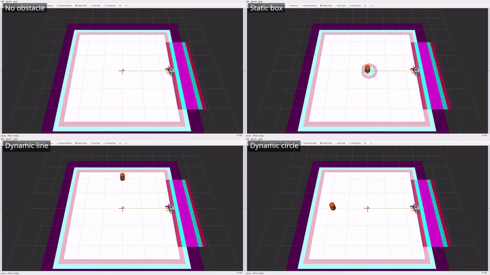
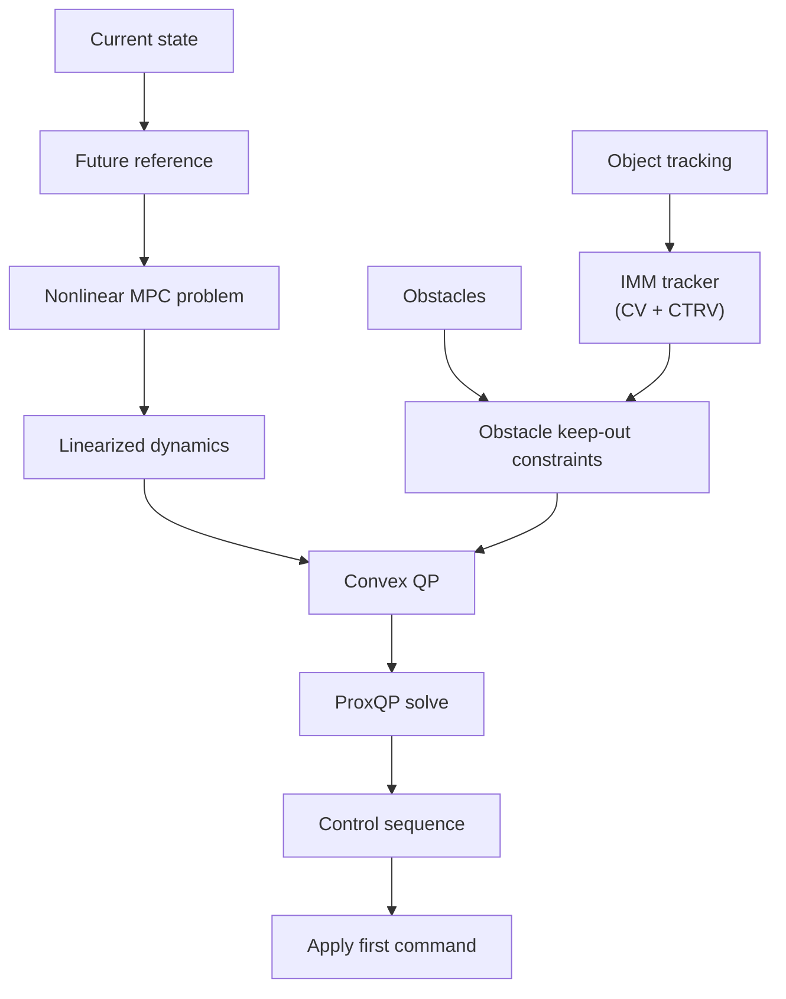

# ProxMPC

[](https://github.com/simone-contorno/prox_mpc/actions/workflows/ci.yaml)
[](https://docs.ros.org/en/jazzy/)
[](LICENSE)

Nonlinear Model Predictive Control for ROS 2, packaged as a reusable core and a
[Nav2](https://docs.nav2.org/) controller plugin.

The controller solves the nonlinear optimal-control problem with a Sequential
Quadratic Programming (SQP) scheme that repeatedly builds and solves a Quadratic
Program with the [ProxQP](https://github.com/Simple-Robotics/proxsuite) solver,
using Eigen for linear algebra.
The same engine handles linear models for free: with linear dynamics the SQP
converges in a single QP solve.

## Table of Contents

- [Demonstration](#demonstration)
- [Where it stands](#where-it-stands)
  - [Strengths](#strengths)
  - [Where it is weaker](#where-it-is-weaker)
- [Known limits and future work](#known-limits-and-future-work)
  - [Validation beyond the kinematic plant](#validation-beyond-the-kinematic-plant)
- [Packages](#packages)
- [Architecture and docs](#architecture-and-docs)
  - [Per-cycle control loop](#per-cycle-control-loop)
- [Requirements](#requirements)
- [Build](#build)
  - [Target tuning (packaging)](#target-tuning-packaging)
- [Test and lint](#test-and-lint)
- [Provenance](#provenance)
- [License](#license)

## Demonstration

[](doc/media/prox_mpc_demo_grid.mp4)

The predictive ProxMPC controller reaching the goal in the four benchmark scenarios
(no obstacle, static box, dynamic line, dynamic circle) on the kinematic plant,
shown in RViz. Each obstacle is drawn as a ground-truth body (the orange cylinder)
next to its costmap footprint. The GIF loops inline and links to the
full-resolution mp4.

Regenerate it - the per-scenario clips land in `prox_mpc_benchmark/results/`
(gitignored), and the combiner writes the committed grid mp4 + inline GIF to
`doc/media/` (see [prox_mpc_benchmark/doc/videos.md](prox_mpc_benchmark/doc/videos.md)
for the Xvfb/display note on Wayland and every parameter):

```bash
ros2 run prox_mpc_benchmark record_scenarios.py
ros2 run prox_mpc_benchmark combine_grid.sh --output doc/media/prox_mpc_demo_grid.mp4
```

## Where it stands

ProxMPC is benchmarked head-to-head against the four stock Nav2 Jazzy local
controllers - DWB, MPPI, Regulated Pure Pursuit, and Graceful - plus Vector
Pursuit, the one external community controller included as a fair peer
(Apache-2.0). Every controller drives the same plant from the same start to the
same goal, at a matched 0.5 m/s speed cap and a shared 2.0 s prediction horizon,
and perceives obstacles through the same costmaps. The full method and every
number are in [doc/controller-comparison-results.md](doc/controller-comparison-results.md);
the summary is below.

> These are simulation results on a kinematic plant, measured on an x86-64
> dev host (Intel Core i7-10750H, 6 cores / 12 threads, 31 GiB RAM,
> Ubuntu 24.04.4) - not on physical robot hardware and not contact-dynamics.
> A collision is a *would-be* overlap of the robot and obstacle discs, scored
> identically for every controller. **Every figure here was measured on that host
> and on no other.** Gazebo validation is a single open-cell gate (5 runs, all
> reaching the goal), not a cross-controller comparison; hardware validation
> remains open.

| Controller | Tracking RMS (open) | Compute p50 / p95 (open) | Static clearance | Multi-obstacle margin | Collisions (10 cells) |
| --- | --- | --- | --- | --- | --- |
| **ProxMPC** | 0.0001 m | **0.30 / 1.02 ms** | **+0.382 m** | -0.023 m, **+0.151 m predictive** | 32 %, **6 % predictive** |
| DWB | 0.0001 m | 2.96 / 4.41 ms | +0.090 m | +0.057 m | 30 % |
| MPPI | 0.0029 m | 3.11 / 4.05 ms | +0.208 m | +0.063 m | 18 % |
| Regulated Pure Pursuit | 0.0000 m | 0.23 / 0.36 ms | +0.213 m | +0.113 m | 16 % |
| Vector Pursuit | 0.0000 m | 0.23 / 0.38 ms | +0.247 m (stops short) | +0.020 m | 26 % |
| Graceful | 0.0000 m | 0.18 / 0.32 ms | +0.211 m | +0.000 m | 36 % |

Multi-obstacle margin is the median closest approach over six two-mover cells (30
runs per controller, 60 for MPPI's 10 repeats); positive clears the obstacle.
Collisions are over all ten obstacle cells (50 runs per controller, 100 for MPPI).
Both are reported because neither alone is honest: those cells are deliberately
marginal, so 50-93 % of runs finish within 0.15 m of the threshold and per-cell
counts swing widely, while the median margin is stable across the same runs.
Every row comes from one 435-run campaign recorded back-to-back on one host, so
no comparison here spans measurement sessions; re-running the unchanged stock
peer binaries still moved them by up to 8 points, which is the noise floor to
read these counts against. Read the aggregate over 30-50 runs, not any single
cell. Per-cell counts are in
[doc/controller-comparison-results.md](doc/controller-comparison-results.md),
which is the source of truth.

### Strengths

- **Tracking on par with the best.** Sub-millimetre cross-track on an empty
  straight traverse (0.0001 m RMS, 5/5 success).
- **Lighter than the other optimising controllers.** 0.30 ms median per cycle
  on the open cell - **9.9x lighter than DWB and 10.4x than MPPI** at equal
  tracking accuracy - at 8.5 % CPU across all obstacle cells against their 9.4 %
  and 9.3 %. ProxMPC's cost scales with obstacle load while theirs does not, so
  the advantage narrows to ~2.5-3x on single-obstacle cells and ~1.3x on the
  hardest two-mover cells, but it never inverts. The geometric pursuit
  controllers are an order of magnitude lighter still, and collide 16-36 % of the
  time.
- **Bounded per-cycle latency.** Zero cycles above the 50 ms budget across 100
  runs, worst observed 33.5 ms. The previous release measured 300 ms worst cases
  on three separate cells, from an SQP loop that re-linearised up to 99 times
  after a failed solve and a QP workspace rebuilt from scratch every cycle.
  Both are fixed.
- **The largest static-obstacle margin.** It reaches the goal *and* holds
  +0.382 m clearance around a static box at its closest, the widest of the field
  - ahead of MPPI (+0.20 m) and DWB (+0.07 m) among the optimising controllers,
  and of RPP and Graceful (~+0.21 m) among the geometric ones.
- **Prediction yields by slowing, not swerving.** With its own obstacle tracker
  enabled (an IMM filter combining constant-velocity and constant-turn-rate
  models) and the obstacle-aware speed cap that ships with it, ProxMPC holds the
  field's largest worst-case margin on the single-mover cells (+0.212 m over 15
  runs) while cutting its detour to 0.376 m of cross-track - it slows for a
  closing mover instead of racing past it. DWB and Graceful collide on 5 runs of
  15 on those same cells.
- **Prediction gives the field's widest margin among two simultaneous movers.**
  ProxMPC holds a +0.151 m median closest approach across the six two-mover
  cells, ahead of every peer - RPP +0.113 m, MPPI +0.063 m, DWB +0.057 m,
  Vector Pursuit +0.020 m, Graceful +0.000 m - and collides on only 3 of 30 runs
  there against 6 for the next best, clearing five of the six cells outright.
- **Deterministic and model-agnostic.** The control law is a deterministic
  function of its inputs, unlike MPPI, which samples and exposes no seed in Nav2
  Jazzy. Note that this does not make a *closed-loop run* reproducible: control,
  costmap, and TF timing all vary with real-time scheduling, so trajectories
  differ between runs for every controller in the field. The same plugin drives a
  unicycle and a bicycle by configuration alone.

### Where it is weaker

- **The two-mover cells remain the real limit.** Reactive ProxMPC collides on
  16 of 30 runs across the six of them, predictive on 3 of 30 - two close movers
  force a non-convex "which side of each obstacle" choice that the linearised
  keep-out constraint cannot represent. Widening the keep-out was measured and
  makes both *worse*, so the limitation is the constraint's form rather than its
  size. The reactive path is additionally limited by its perception: the
  costmap-only fill constrains each obstacle where it *was*, an error of up to a
  metre at the far end of a 2 s horizon, which is why it should be treated as a
  single-obstacle configuration and why `predict_obstacles` now defaults to
  true.
- **Reactive ProxMPC runs closer to the obstacles than its peers** on the
  two-mover cells (median margin -0.023 m, the field's narrowest). Prediction
  reverses this completely, so the tracker is not optional if the environment has
  two or more simultaneous movers.
- The compute advantage is smallest exactly where compute matters most. On the
  dense two-mover cells the per-cycle median rises to ~2.2-2.7 ms against the
  samplers' flat ~3.0-3.2 ms, so ~1.3x rather than the ~10x of the open cell.
  **Every figure here was measured on the x86-64 host named above**, and Gazebo
  validation is a single open-cell gate rather than a comparison.

**In short:** ProxMPC delivers constrained, model-agnostic optimal control that
tracks as well as the best of the field, computes a command 10x faster than the
sampling controllers on an open cell, and - with its own dynamic-obstacle tracker
enabled - is **the most reliable avoider measured here: 6 % collisions across 50
obstacle runs against 16 % for the next best**. Every cycle in 100 runs stayed
inside the 50 ms budget, which was not true of the previous release.

That predictive configuration is the one to deploy. Only prediction itself is on
by default (`predict_obstacles: true`): the result above also relies on the
obstacle-aware yield and its speed cap (`obstacle_yield_band_m`,
`obstacle_yield_caps_speed`) and on `allow_reversing`, all off by default and set
in the [predictive preset](prox_mpc_benchmark/config/controllers/proxmpc_pred.yaml).
The costmap-only path should be treated as a single-obstacle configuration: it
constrains obstacles where they were rather than where they will be, which one
free corridor absorbs and two closing movers do not. Neither variant is
collision-free among two simultaneous movers, so an environment with several
independent movers still needs a safety layer this controller does not
provide.

## Known limits and future work

What has been investigated and where the remaining headroom is. Contributions are
welcome on any of it.

### Validation beyond the kinematic plant

The reported comparison runs on a kinematic plant. Gazebo Harmonic coverage is
five runs of one open-world cell rather than the full scenario matrix, and there
is no physical-hardware validation yet. Extending both is planned; hardware results in
particular would firm up the compute and clearance numbers, which are currently
x86-64 dev-host measurements.

## Packages

| Package | What it is |
| --- | --- |
| [prox_mpc_core](prox_mpc_core) | The math core (`prox_mpc::MPC` / `ProxQP` / `Model`) - the reusable SQP/QP library, no ROS node. |
| [prox_mpc_controller](prox_mpc_controller) | A Nav2 `nav2_core::Controller` plugin built on the core, verified in simulation under a full Nav2 stack. |
| [prox_mpc_obstacle_tracker](prox_mpc_obstacle_tracker) | An in-house 2D-lidar dynamic-obstacle detector and IMM (CV+CTRV) tracker; feeds the controller's predictive avoidance. |
| [prox_mpc_msgs](prox_mpc_msgs) | The three-message interface-only package: the `Obstacle` / `ObstacleArray` contract that carries tracked obstacles from the tracker to the controller, plus `SolverDiagnostics`, the per-control-cycle solver telemetry consumed by the benchmarking tooling. |
| [prox_mpc_demo](prox_mpc_demo) | Runnable demos: a standalone closed-loop simulation and a full Nav2 + Gazebo Harmonic bring-up. |
| [prox_mpc_test_models](prox_mpc_test_models) | Fault-injection `prox_mpc::Model` plugins for the controller's tests (not for production). |
| [prox_mpc_benchmark](prox_mpc_benchmark) | The scenario-driven benchmarking harness that measures accuracy, precision, and real-time behaviour across the scenario x model x controller x mode matrix, and compares ProxMPC against the stock Nav2 controllers. |

## Architecture and docs

[doc/architecture.md](doc/architecture.md) is the full-stack overview: how the
packages depend on and communicate with each other, and the runtime data flow for
the standalone, Nav2, and predictive paths.

Each package keeps its own `doc/`:

- core: [architecture](prox_mpc_core/doc/architecture.md),
  [NMPC/SQP/QP math](prox_mpc_core/doc/nmpc.md), and
  [obstacle avoidance](prox_mpc_core/doc/obstacle-avoidance.md);
- controller: [architecture](prox_mpc_controller/doc/architecture.md) and
  [control law](prox_mpc_controller/doc/control-law.md);
- obstacle tracker: [architecture](prox_mpc_obstacle_tracker/doc/architecture.md);
- demo: [standalone simulation](prox_mpc_demo/doc/simulation.md) and the
  [Nav2 + Gazebo guide](prox_mpc_demo/doc/nav2-simulation.md);
- benchmark: [harness README](prox_mpc_benchmark/README.md) and the
  [controller-comparison results](doc/controller-comparison-results.md).

A single top-to-bottom reading path across every package is in
[doc/prox-mpc.md](doc/prox-mpc.md).

### Per-cycle control loop

[doc/architecture.md](doc/architecture.md) stays the canonical, full-stack
diagram (package dependencies and runtime data flow); the diagram below is a
distinct, narrower illustration of what happens inside a single control cycle,
from the current state to the command that is actually applied:



The formulation is written out, with every symbol defined, in
[prox_mpc_core/doc/nmpc.md](prox_mpc_core/doc/nmpc.md) (the linearization and the
QP the SQP builds each cycle),
[prox_mpc_core/doc/obstacle-avoidance.md](prox_mpc_core/doc/obstacle-avoidance.md)
(the signed-distance half-planes and the discrete-time CBF coupling), and
[prox_mpc_obstacle_tracker/doc/architecture.md](prox_mpc_obstacle_tracker/doc/architecture.md)
(the IMM filter).

## Requirements

- ROS 2 (developed and tested on **Jazzy**; the code uses only standard ROS 2 APIs).
- Eigen 3: `sudo apt install libeigen3-dev`.
- ProxQP / proxsuite: see the
  [proxsuite install guide](https://github.com/Simple-Robotics/proxsuite).
- Nav2 (`nav2_core`, `nav2_costmap_2d`, `nav2_util`) - only for `prox_mpc_controller`.

## Build

Build in an overlay workspace, never inside the package source tree.

```bash
# msgs + core + demo (no Nav2 required)
colcon build --symlink-install --packages-select prox_mpc_msgs prox_mpc_core prox_mpc_demo
source install/setup.bash

# default: bicycle model, no RViz
ros2 launch prox_mpc_demo simulation.launch.py

# unicycle model with RViz
ros2 launch prox_mpc_demo simulation.launch.py model:=unicycle rviz:=true
```

Building `prox_mpc_controller` (and, for predictive avoidance, the obstacle
tracker) additionally requires Nav2:

```bash
colcon build --symlink-install --packages-select \
  prox_mpc_msgs prox_mpc_core prox_mpc_controller prox_mpc_obstacle_tracker prox_mpc_demo
source install/setup.bash

# baseline, headless (no Gazebo GUI, no RViz)
ros2 launch prox_mpc_demo nav2_simulation.launch.py

# Gazebo GUI + RViz + predictive path
ros2 launch prox_mpc_demo nav2_simulation.launch.py predictive:=True headless:=False use_rviz:=True

# send a goal into the running demo
ros2 run prox_mpc_benchmark goal_sender.py --points 2.0,-0.5,0.0 --timeout 120
```

See each package README and [doc/architecture.md](doc/architecture.md) for the
dependency graph.

### Target tuning (packaging)

The portable high-optimization default is `CMAKE_BUILD_TYPE=Release` (GCC `-O3
-DNDEBUG`), set in each package behind an `if(NOT CMAKE_BUILD_TYPE)` guard, plus
`EIGEN_NO_DEBUG`. Keep architecture and link-time tuning **out of the source** and
apply it at build/packaging time so the tree stays portable across x86 CI and
your deployment hardware:

- Per-CPU tuning via a CMake toolchain file or `--cmake-args`, e.g. an explicit
  `-mcpu=<cpu-name>` flag,
  `-DCMAKE_CXX_FLAGS_RELEASE="-O3 -DNDEBUG -mcpu=<cpu-name>"`, or the
  bloom/debian `rules` flags. Never hardcode `-march=native` / `-mcpu=native`
  (it bakes the build host CPU into the binary and breaks cross/CI builds).
- LTO via `-DCMAKE_INTERPROCEDURAL_OPTIMIZATION=ON`, guarded by
  `check_ipo_supported()` and measured - not hardcoded.
- **Never** `-Ofast` / `-ffast-math` for the solver: it breaks the IEEE-754
  semantics the SQP/QP convergence and the NaN / `isfinite` guards rely on.

Verify the loop meets `1/dt` on your deployment hardware with the demo's
solve-time logger.

## Test and lint

```bash
colcon test --packages-select prox_mpc_core prox_mpc_demo
colcon test-result --all --verbose
```

`prox_mpc_core` ships GoogleTest suites that cover the model interface and its
analytic Jacobians, an obstacle-off regression against recorded reference values,
a custom model driven through the interface, the obstacle-avoidance constraints,
and the ROS-facing helpers `optimPath` and `normalizeAngle`.
`prox_mpc_controller` drives every `nav2_core::Controller` method and fail-safe
branch through the plugin's public surface, and `prox_mpc_obstacle_tracker`
unit-tests its ROS-free clustering and tracking core and drives its lifecycle
node - the transition ladder and the scan-to-publish path - through
`test_obstacle_tracker_node`.
The C++ style is enforced by `uncrustify` (the ROS 2 default formatter); `cpplint`
and `ament_copyright` are disabled (single enforced formatter, and a short SPDX
header per file with the full text in [LICENSE](LICENSE)).

## Provenance

The math core originates from the author's EMARO+ master thesis (University of
Genoa / École Centrale de Nantes, LS2N), released as the
[mynmpc](https://github.com/simone-contorno/mynmpc) repository. ProxMPC is a fresh
repository that reuses that proven core and builds a Nav2 controller plugin around
it; the SQP/QP solver, cost function, constraints, and numerical results are
carried over unchanged from that validated implementation.

## License

[Apache-2.0](LICENSE) - chosen for ROS 2 ecosystem alignment (ROS 2 and Nav2 are
Apache-2.0) and its explicit patent grant. Each source file carries a short
`SPDX-License-Identifier: Apache-2.0` header; the full text is in
[LICENSE](LICENSE) and attribution in [NOTICE](NOTICE). To cite this work:

```bibtex
@misc{ProxMPC,
  title  = {ProxMPC: Nonlinear Model Predictive Control for ROS 2},
  author = {Simone Contorno},
  year   = {2026},
  note   = {Core from the MyNMPC master thesis},
  url    = {https://github.com/simone-contorno/mynmpc}
}
```

This package also uses the ProxQP solver from ProxSuite; if you use it, please
also cite:

```bibtex
@inproceedings{bambade2022proxqp,
  title     = {ProxQP: Yet another Quadratic Programming Solver for Robotics and beyond},
  author    = {Bambade, Antoine and El-Kazdadi, Sarah and Taylor, Adrien and Carpentier, Justin},
  booktitle = {Robotics: Science and Systems (RSS)},
  year      = {2022}
}
```
