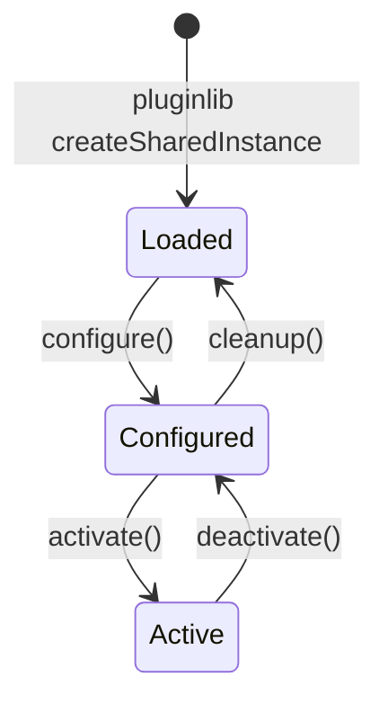
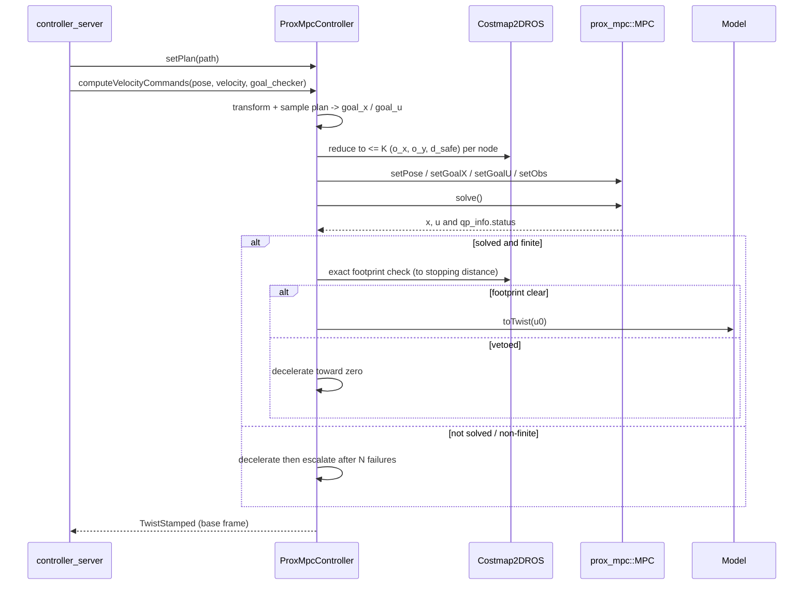

# ProxMpcController - Architecture

This document describes the design of `prox_mpc_controller`, the
[Nav2](https://docs.nav2.org/) controller plugin that drives the
[prox_mpc_core](../../prox_mpc_core) engine.
The controller-side math (reference construction, costmap reduction, predictive
propagation, and the failure fallback) is in [control-law.md](control-law.md).
The engine's math is in the core documents:
[NMPC/SQP/QP](../../prox_mpc_core/doc/nmpc.md) and
[obstacle avoidance](../../prox_mpc_core/doc/obstacle-avoidance.md).

The plugin is verified in simulation under a live Nav2 stack in Gazebo Harmonic;
the scenarios and results are in
[../../prox_mpc_demo/doc/nav2-simulation.md](../../prox_mpc_demo/doc/nav2-simulation.md).

## Responsibility split

The engine and the controller have disjoint, deliberate responsibilities.

`prox_mpc_core` is the frozen math plus a stable extension contract.
It owns the SQP/QP assembly, the cost, the constraints, the linearization, the
disc-based obstacle math, and the `Model` interface.
It is a library with no ROS node and never needs editing to gain a new model.

`prox_mpc_controller` owns model selection and the Nav2 integration.
It loads and configures a concrete model, builds the reference from the global
plan, reduces the local costmap and tracked obstacles to obstacle triples for the
core, maps the optimal control to a `Twist`, handles solver failure, and runs an
exact footprint safety check.
None of that touches the engine's math.

## The Nav2 controller interface

The plugin implements the `nav2_core::Controller` methods.

| Method | Role |
| --- | --- |
| `configure(parent, name, tf, costmap_ros)` | load and configure the model, size the MPC, create publishers and the optional tracked-obstacle subscription |
| `activate()` / `deactivate()` | enable/disable the publishers and clear cached perception |
| `cleanup()` | release the MPC, model, costmap, TF, and interface handles |
| `setPlan(path)` | store the global plan and reset the projection index |
| `computeVelocityCommands(pose, velocity, goal_checker)` | run one control cycle |
| `setSpeedLimit(limit, percentage)` | cache a runtime speed limit, applied at the top of the next control cycle |
| `cancel()` | ramp to a stop and report when stationary |
| `reset()` | clear runtime state between tasks, keeping owned handles |

The class is exported to `nav2_core` through
[../prox_mpc_controller_plugin.xml](../prox_mpc_controller_plugin.xml).

## Plugin lifecycle

The plugin has no standalone executable; the `controller_server` lifecycle node
owns it and drives the transitions.

- `configure()` reads every parameter under the plugin-instance namespace (for
  example `FollowPath.*`), loads the model with a
  `pluginlib::ClassLoader<prox_mpc::Model>`, reads the model's speed and
  deceleration bounds from its declared constraints, sizes the MPC once
  (`init()` builds and sizes the QP), creates the predicted-trajectory publisher,
  and - only when `predict_obstacles` is set - creates the tracked-obstacle
  subscription and the RViz marker publisher.
  An unknown model name escalates to `nav2_core::ControllerException`.
- `activate()` / `deactivate()` toggle the lifecycle publishers.
  `activate()` also clears the runtime counters; `deactivate()` drops cached
  tracked obstacles so a re-activated controller resumes costmap-only until a
  fresh message arrives.
- `cleanup()` releases the solver, model, model loader, publishers,
  subscription, costmap, and TF handles.

## Per-cycle control (`computeVelocityCommands`)

Each cycle the controller performs the following steps.

1. **Validate the pose** in the costmap global frame; a non-finite pose is a
   transient fault (decelerate).
2. **Transform and sample the plan.** Transform the global plan into the costmap
   global frame, project the current pose onto it (forward-only) for the
   arc-length offset, and sample the state/control reference `goal_x` / `goal_u`
   over the horizon. The cruise speed is tapered near the plan end, reduced on
   path curvature (optional), and clamped by any active speed limit and the
   goal-checker tolerance. Inside the goal-checker xy tolerance the reference is
   pinned to the goal pose instead of tracking the projection, and travel
   direction is a latched mode that changes only from rest - see
   [Terminal settle and travel direction](#terminal-settle-and-travel-direction).
3. **Fill the obstacle triples.** When obstacles are enabled (`K > 0`), fill the
   per-node `(o_x, o_y, d_safe)` matrix: predictive + hybrid when enabled and
   fresh tracking data is available, otherwise costmap-only.
4. **Solve** one SQP cycle and read `qp_info.status`.
5. **Guard and veto.** Reject a non-finite iterate, then run an exact
   polygon-footprint check over the predicted stopping distance; a veto
   decelerates.
6. **Command or brake.** On success, map the first control with
   `model->toTwist(...)`; on failure, decelerate and escalate after
   `max_solver_failures` consecutive failures.
7. **Publish** the predicted NMPC trajectory (and predicted-obstacle markers when
   predictive) for visualization, when a subscriber is connected.

### Terminal settle and travel direction

Two properties of the reference are decided across cycles rather than within
one, because both are discrete choices that a per-cycle rule leaves free to
alternate.

**Terminal settle.** The reference is sampled at `v_ref * k * dt` ahead of the
robot's own projection onto the plan, and `v_ref` is tapered to zero across the
goal-checker xy tolerance. Composing the two makes the horizon's arc reach
`remaining^2 / xy_tol`, which is shorter than `remaining` at every point inside
the tolerance: in the goal region the tracked reference collapses to a stub a few
millimetres ahead of the projection, and the projection carries it along as the
robot moves. Such a reference has no fixed point - any motion re-projects the
robot and re-centres the stub, so a small tracking error can be traded down as
cheaply one way as the other - and its horizon never reaches the plan end, so the
goal's own orientation never enters it, which is exactly when that orientation is
the only error left. Inside the tolerance the reference is therefore pinned to
the goal pose, turning the last stretch from tracking a receding stub into
regulation about a fixed setpoint: one minimiser, and a standing yaw error the
solver can act on. The speed reference keeps its taper, so the approach profile
is unchanged and entering the mode introduces no step in the commanded speed. The
mode is latched and released only past `goal_settle_hysteresis_m`, so a remaining
distance hovering about the tolerance cannot flip the reference mode to mode; it
is never entered on a reference truncated at a cusp, whose end is not the goal.

**Travel direction.** Direction is a discrete mode of a switched system. Deciding
it afresh each cycle from the plan geometry, at no cost and with no dwell, is
what leaves it free to alternate. It is held instead, and a change is accepted
only once the platform is at or below `direction_switch_standstill_speed_mps` and
`direction_switch_dwell_s` has elapsed since the last change - the first being
the constraint a drivetrain already imposes on a gear shift, the second bounding
the switching rate. While a change is pending the reference is held at the arc
length under the robot, so `v_ref` falls to zero and the deceleration ramp brings
the platform to the standstill the change is waiting on. A cusp is then driven
the way a vehicle drives one: arrive, stop, shift, pull away. Both gates are
inert unless `allow_reversing` and `reverse_from_plan_orientation` are set, since
only then can the reference be signed into reverse at all.

## Safety layers

Obstacle avoidance is split across two layers.
The engine keeps a fast, convex, disc-based margin inside the optimization, which
shapes the trajectory away from obstacles
(see [obstacle avoidance](../../prox_mpc_core/doc/obstacle-avoidance.md)).
A separate, outline-only footprint check, evaluated with
`nav2_costmap_2d::FootprintCollisionChecker` on each predicted pose until their
cumulative arc length passes the distance the robot needs to stop
(`v^2 / (2a)`, from the commanded speed and the model's declared deceleration
rate), is a backstop rather than a guarantee: it rasterises only the footprint perimeter and reports the maximum
edge cost, with no interior fill and no sweep between the current and the next
commanded pose. It vetoes the command when that pose's footprint reaches
`LETHAL_OBSTACLE`, treating unknown space as non-colliding when the local
costmap tracks it - matching `nav2_regulated_pure_pursuit_controller` and
`nav2_mppi_controller`'s own collision checks rather than the stricter
`INSCRIBED_INFLATED_OBSTACLE` threshold used before. A vetoed command is
replaced by the deceleration ramp without consuming the solver-failure budget.
The veto keeps its own counter and escalates to `nav2_core::NoValidControl`
once it exceeds the same `max_solver_failures` budget, so a robot stuck behind
a static obstacle reaches a recovery instead of braking forever.
The veto is skipped when the costmap exposes fewer than three footprint
points, and it is an effective backstop only when costmap inflation is sized
to the robot's real footprint and the local costmap's unknown-space tracking
matches the deployment: the in-loop keep-out half-planes above are what cover
a lethal cell adjoining unknown space that the veto's own masking may miss.

## Solver-failure handling

`MPC::solve` never commands a stop on its own; it reports convergence through
`qp_info.status` and otherwise returns the last non-converged iterate unchanged.
The controller therefore detects failure and reacts: it decelerates toward zero at
the model's control-rate (`du`) limit and escalates to `nav2_core::NoValidControl`
after `max_solver_failures` consecutive failures, so the Nav2 behavior tree stops
and replans rather than crawling on a decaying command.
The same deceleration ramp serves the cancel, footprint-veto, non-finite-pose, and
non-finite-command paths.
The math is in [control-law.md](control-law.md).

## Predictive obstacle subsystem

When `predict_obstacles` is set, the controller subscribes to a
`prox_mpc_msgs/ObstacleArray` (default topic `tracked_obstacles`, typically from
[prox_mpc_obstacle_tracker](../../prox_mpc_obstacle_tracker)).
Each cycle it snapshots the latest message under a mutex, and if the message is
fresh (within `obstacle_timeout`) it propagates every moving track over the
horizon along its tracker-sampled predicted trajectory - falling back to a
constant-velocity ray when the message carries no prediction samples - binds each
to a fixed obstacle slot across nodes, and fills the remaining slots from the
costmap (hybrid).
A stale or missing message, or a missing transform, degrades to the costmap-only
fill for that cycle, so the feature is a clean enable/disable switch.

The costmap-only fill scans one present-time costmap around every predicted node,
so a moving obstacle enters the horizon at the position it currently occupies -
an error of `v_obs * t_node`, up to a metre at the far end of a 2 s horizon.
It is validated for single-obstacle environments, where the free corridor
absorbs the resulting late reaction. With more than one mover that corridor
closes, and the tracker is required rather than optional.

### Keep-out enforcement against a crossing mover

The obstacle row carries a slack variable, so the keep-out is a soft constraint:
the solver may buy its way through it. Against a mover crossing the path this is
not a corner case. Measured on an isolated crossing encounter (0.3 m/s mover,
0.26 m/s cruise, the shipped weights and bounds, aggregated over nine meeting
times spanning +/- 2 s), the predicted trajectory breaches the keep-out in about
27% of control cycles, and the realised clearance consumes the whole safety
margin - at worst a few centimetres of physical gap remain. An independent
Gazebo measurement over the demo walker put the same figure at 27.7%, which is
the cross-check that the two agree.

The breach is not a tuning matter, and this is worth stating precisely because
the obvious levers look like they should work:

- `w_weight` has no effect. Swept from 1e3 to 1e6 - a thousandfold - the breach
  rate moves from 26.8% to 27.2%. The solver is not trading the constraint away
  for tracking cost; a larger penalty buys nothing.
- `max_iter_sqp` has no effect. Rates are identical at 1, 2 and 4 iterations, so
  the single real-time iteration is not the limitation either.
- Compute is not the constraint. p95 solve time stays between 8 and 14 ms
  against a 50 ms budget at 20 Hz across every arm.
- Easing the cruise speed on a predicted breach - giving the reference an
  obstacle term it does not have - cuts the breach *rate* to about 19% but
  roughly doubles the worst-case depth. It trades frequent shallow breaches for
  rarer deep ones, which is not an improvement.

What remains is the formulation. With the linear control bound and a reference
that demands full cruise straight through the crossing, no admissible trajectory
both tracks the reference and clears the mover; the slack absorbs the
difference. Treat the keep-out as advisory against a crossing mover rather than
as a guarantee, and put a velocity-directed backstop (Nav2's Collision Monitor)
behind it where a breach matters. This extends to a single mover the limitation
previously recorded only for multi-obstacle fields.
The propagation and the wall-rejection guard are derived in
[control-law.md](control-law.md).

## Interfaces

All names are relative to the `controller_server` node.
The command itself is the `TwistStamped` returned from `computeVelocityCommands`
(in the costmap base frame); the server publishes it downstream.

| Interface | Type | QoS | Direction | When | Description |
| --- | --- | --- | --- | --- | --- |
| `prox_mpc_local_plan` | `nav_msgs/msg/Path` | depth 1 | Published | always | Predicted NMPC trajectory (`Np+1` poses, costmap global frame), distinct from the Nav2 global plan; sent only when a subscriber is connected. |
| `tracked_obstacles` (configurable) | `prox_mpc_msgs/msg/ObstacleArray` | reliable, depth 5 | Subscribed | `predict_obstacles` only | Tracked dynamic obstacles for predictive avoidance. |
| `prox_mpc_predicted_obstacles` | `visualization_msgs/msg/MarkerArray` | depth 1 | Published | `predict_obstacles` only | Predicted dynamic-obstacle trajectories for RViz; sent only when a subscriber is connected, and cleared by `reset()` when a task ends. |
| `<plugin>/diagnostics` (e.g. `FollowPath/diagnostics`) | `prox_mpc_msgs/msg/SolverDiagnostics` | reliable, depth 10 | Published | `publish_diagnostics` only | Per-cycle NMPC/QP solver telemetry for benchmarking; sent only when a subscriber is connected. |

The published topics `prox_mpc_local_plan`, `prox_mpc_predicted_obstacles`, and
`<plugin>/diagnostics` are all emitted only when at least one subscriber is
connected, so an unwatched controller carries no serialization cost.

The plugin also reads the local costmap and the robot footprint through the
`Costmap2DROS` handle, and uses the `tf2` buffer to transform the plan and the
tracked obstacles into the costmap global frame.

## Parameters

All parameters are declared under the plugin-instance namespace (for example
`FollowPath.`) and mirror
[../config/prox_mpc_controller.yaml](../config/prox_mpc_controller.yaml).
Per the project type rules they are `double`, `int`, `string`, or `bool` only.
Each is declared with `nav2_util::declare_parameter_if_not_declared` and then
read back: the `controller_server` destroys the plugin instance on `cleanup()`
while its node keeps the parameters declared, so a plain declaration would throw
`rclcpp::exceptions::ParameterAlreadyDeclaredException` on the next `configure()`
and fail the lifecycle transition.

### Model and horizons

| Parameter | Type | Default | Unit | Description |
| --- | --- | --- | --- | --- |
| `model_plugin` | string | `prox_mpc_core/Unicycle` | - | `prox_mpc::Model` plugin loaded by name. Bundled: `prox_mpc_core/Unicycle`, `prox_mpc_core/BicycleFrontAxle`, `prox_mpc_core/BicycleRearAxle`, and `prox_mpc_core/Bicycle` as a deprecated alias for the front-axle model. |
| `model_params.L` | double | 1.6 | m | Wheelbase forwarded to `Model::configure`. The steering reference is built on the wheelbase the loaded model declares back through `getPlanarMapping()`, not on this value directly. |
| `model_params.v_max` | double | 0.0 | m/s | Optional forward-speed bound on the model's `u[0]` input. Forwarded to `Model::configure` only when `> 0.0`; the default 0.0 keeps the model's built-in limit. |
| `model_params.v_min` | double | 0.0 | m/s | Reverse-speed bound. A negative value is forwarded on its own, or alongside a positive `v_max`; with `v_max > 0.0` and a non-negative `v_min` the bound is set to `-v_max`. `allow_reversing: false` narrows it to `0.0` afterwards regardless; `allow_reversing: true` with this left unset caps it at `-0.15`. Naming it is how a platform with rear sensing states its real reverse envelope. |
| `np` | int | 20 | nodes | Prediction horizon. |
| `nc` | int | 20 | nodes | Control horizon. |
| `dt` | double | 0.1 | s | Step size and control period. |

### Reference tracking

| Parameter | Type | Default | Unit | Description |
| --- | --- | --- | --- | --- |
| `desired_linear_vel` | double | 1.0 | m/s | Cruise speed the plan is sampled at; clamped to the model's speed bound. |
| `curvature_gain` | double | 0.0 | - | Cruise reduction on path curvature; 0.0 disables it. |
| `allow_reversing` | bool | false | - | Whether the solver may plan reverse travel. Off narrows the model's linear control bound to `[0, v_max]`. On without an explicit `model_params.v_min` caps reverse at **0.15 m/s**: both guards follow the predicted trajectory and so do cover a reversing one, but they see only what the costmap holds, and whether the platform sweeps behind itself is a property of its sensor rather than of this plugin (see [Robot-specific tuning](#robot-specific-tuning)), so an unverified manoeuvre is kept slow. A platform that turns in place reaches every pose forward-only, so the bound is opt-in rather than a default. Inside the goal region an open reverse half used to give the solver a second, equally cheap way to trade down a small tracking error, which it alternated with the first; the terminal settle below removes that by pinning the reference to the goal pose, so the last stretch has one minimiser. |
| `reverse_from_plan_orientation` | bool | false | - | Whether the plan's pose orientations are trusted to say which way to travel along it, signing the reference speed and truncating the reference at the first direction change. Requires `allow_reversing`. Set true only with a planner that sets those orientations (Smac Hybrid-A*, State Lattice). NavFn and Smac 2D leave every pose at the identity quaternion, which reads as a reverse plan for every path running against that one fixed heading - the robot then drives the whole path backwards rather than turning around, and a path whose heading component changes sign flips the reference cycle to cycle. A plan cannot report which planner produced it, so this is declared, not inferred. |
| `direction_switch_standstill_speed_mps` | double | 0.05 | m/s | Speed at or below which the platform counts as stopped for a travel-direction change. Travel direction is a latched mode; a change is taken only from rest, which is the constraint a drivetrain imposes on a gear shift and the one that keeps the mode from alternating. While a change is pending the reference is held at the arc length under the robot, so the commanded speed falls to zero and the platform stops first. |
| `direction_switch_dwell_s` | double | 0.5 | s | Minimum time between two accepted direction changes. A discrete mode re-chosen every cycle with no dwell is free to chatter however cheap each switch looks; this bounds the switching rate. |
| `goal_settle_hysteresis_m` | double | 0.10 | m | Band beyond the goal-checker xy tolerance that the robot must re-cross before the terminal settle releases back to path tracking. Entry and release on one threshold would flip the reference mode to mode on a remaining distance hovering about the tolerance. |

### Cost weights

| Parameter | Type | Default | Description |
| --- | --- | --- | --- |
| `q_pos` | double | 10.0 | Position tracking weight (state diagonal, x and y). |
| `q_theta` | double | 1.0 | Heading (and remaining state) tracking weight. |
| `s_factor` | double | 2.0 | Terminal-weight factor: `S = s_factor * Q`. |
| `r_weight` | double | 0.1 | Control-effort weight. |
| `w_weight` | double | 1000.0 | Obstacle-slack penalty. |

### Solver limits

| Parameter | Type | Default | Description |
| --- | --- | --- | --- |
| `max_int_iter_qp` | int | 1500 | ProxQP internal-iteration cap. Must be `>= 1`; a lower value fails `configure()`. |
| `max_ext_iter_qp` | int | 10000 | ProxQP external-iteration cap. Must be `>= 1`; a lower value fails `configure()`. |
| `max_iter_sqp` | int | 1 | SQP-iteration cap per cycle. Must be `>= 1`; a lower value fails `configure()`. The caps reach the core as `size_t`, so a negative value would wrap to an effectively unbounded loop, and ProxQP rejects a zero cap outright, so both are fatal rather than clamped. |
| `max_solve_time` | double | 0.0 | Wall-clock budget in seconds for the whole SQP loop; 0.0 disables it (the iteration caps are then the only bound). Tested only between SQP sub-problem solves, so it cannot interrupt one already in flight and does not bound worst-case cycle latency in either direction; a loop that exceeds it stops with whatever status the last QP returned, which is `PROXQP_SOLVED` when that QP itself converged. The bound that genuinely holds every cycle is the iteration caps (`max_iter_sqp = 1` gives a bounded real-time iteration). Floored at 0.0. |
| `qp_type` | bool | false | QP backend: false = sparse, true = dense. |
| `guess` | bool | true | ProxQP initial-guess strategy. With `warm_start` on this selects `WARM_START` (`true`) or none (`false`); with it off, the equality-constrained guess (`true`) or none. See [nmpc.md](../../prox_mpc_core/doc/nmpc.md). |
| `warm_start` | bool | true | Reuse the ProxQP workspace and the previous primal/dual iterate across cycles, updating in place instead of re-initializing the solver every cycle. |
| `max_solver_failures` | int | 3 | Consecutive non-converged solves before escalating to a recovery. |
| `brake_period_s` | double | 0.0 | Step [s] the deceleration ramp advances by on a braking cycle. 0.0 measures the inter-cycle period instead (clamped between `dt` and twice `dt`, so a slow server still brakes at the model's declared rate and a stale measurement cannot collapse the ramp into one step); a positive value overrides the measurement and is used as-is. |

`max_solve_time` defaults to `0.0` (disabled) in
[config/prox_mpc_controller.yaml](../config/prox_mpc_controller.yaml), so the
iteration caps are the only bound unless a stack sets a positive budget.

### Obstacle avoidance (costmap)

| Parameter | Type | Default | Unit | Description |
| --- | --- | --- | --- | --- |
| `max_obstacles` | int | 1 | slots | Obstacle-slot capacity `K` per node; 0 disables the in-loop term. |
| `safety_margin` | double | 0.1 | m | Folded into `d_safe`. |
| `robot_radius` | double | 0.5 | m | Robot disc radius, folded into `d_safe`. |
| `cbf_gamma` | double | 1.0 | - | Discrete-time CBF rate `h(x_{k+1}) >= (1-gamma) h(x_k)`; 1.0 = pointwise. |
| `costmap_cost_threshold` | int | 200 | cost | Cells at or above this count as occupied. |
| `obstacle_cluster_radius` | double | 0.3 | m | Groups adjacent occupied cells into one representative. |
| `max_obstacle_scan_cells` | int | 50 | cells | Cap on the per-node costmap scan half-window. |

### Predictive (dynamic) obstacle avoidance

| Parameter | Type | Default | Unit | Description |
| --- | --- | --- | --- | --- |
| `predict_obstacles` | bool | true | - | False reproduces the costmap-only behavior. With no tracker publishing, or a stale message, the fill degrades to costmap-only regardless. |
| `obstacle_topic` | string | `tracked_obstacles` | - | `ObstacleArray` input topic. |
| `obstacle_timeout` | double | 0.5 | s | Staleness before falling back to costmap-only. |
| `dynamic_speed_threshold` | double | 0.1 | m/s | Speed above which a track is propagated (static is left to the costmap). |
| `prediction_uncertainty_growth` | double | 0.0 | m/s | Extra `d_safe` per second of prediction. |
| `prediction_forward_shadow_s` | double | 0.0 | s | Forward shadow cast along a tracked obstacle's own heading. The keep-out is a disc about the predicted position and the constraint normal runs from the obstacle to the robot, so the formulation does not distinguish the space a mover is about to occupy from the space it is vacating; passing in front and passing behind cost the same, and because the reference carries no obstacle term, the front is the side that does not require lagging it. This biases the disc forward by that many seconds of the track's own travel and grows the radius by the same distance, so the obstacle's own position stays covered while the disc reaches further ahead than behind. `0.0` disables it. Left at `0.0` by default: the mechanism is sound and unit-tested, but an A/B on the demo walker (n=4 per arm) was directionally favourable and statistically inconclusive. |
| `obstacle_yield_band_m` | double | 0.0 | m | Obstacle-aware cruise, off by default. When where the robot is heading would breach a tracked mover's predicted keep-out, the cruise is scaled toward zero over this depth of breach, so the robot waits for the mover rather than racing it. Where it is heading is checked twice and the deeper breach wins: the plan at this cycle's intended cruise, which cannot restore full cruise by clearing the breach a reduction caused, and the trajectory the solver planned last cycle, which is what the robot actually drives when the solver strays from the plan. The release back to full cruise is rate-limited (`1 / s`), so a breach that seems to clear for one cycle cannot snap the cruise back. On `dynamic_circle` over ten runs with reversing on, `0.5` passed behind the mover 6/10 against 1/10 with the best closest approach (+0.100 m against +0.070 m) and no collisions, and with two movers it was no worse than off (3/30 collisions either way). Enable it together with `allow_reversing`: waiting is safe when the robot can back off. With reversing off a waiting robot is boxed in by a second mover - over thirty two-mover runs it doubled the passes closer than 0.15 m (15/30 against 7/30) - so it stays off by default. Keep the stage weights at their defaults: light stage weights (`q_pos` 1, `s_factor` 30) collided 1/10 with or without it. The figures above are for the band on its own; pair it with `obstacle_yield_caps_speed` for the shipped behaviour, which is what the predictive preset and the Gazebo demo enable. |
| `obstacle_yield_caps_speed` | bool | false | - | Makes the obstacle-aware yield a speed limit rather than a request. On its own the yield lowers the cruise target, which carries the lightest weight in the cost (`r_weight`, against `q_pos` and `w_weight`), so when a mover is closing the obstacle term overrides it and the solver swerves at full speed instead of slowing - measured, the cruise target was cut to a tenth while the robot held 0.5 m/s. With this on, the forward bound of the speed control is capped by the same factor, the way a Nav2 speed limit is applied to it. The cap never falls below the command last applied less the model's deceleration times `dt`, since the solver bounds the first control to that and a lower cap would leave it no feasible first control; and the reverse bound is left alone, so a robot capped to a crawl can still back away. Needs `obstacle_yield_band_m > 0`. |
| `max_dynamic_obstacles` | int | 2 | slots | Slot budget reserved for dynamic tracks. |
| `max_dynamic_obstacle_radius` | double | 0.0 | m | Skip tracks larger than this (walls); 0 = no limit. |

Out-of-range predictive values are clamped (non-fatal) with a warning so the
controller stays available.

### Logging and diagnostics

| Parameter | Type | Default | Description |
| --- | --- | --- | --- |
| `log_level` | string | `info` | Plugin logger level: `debug`, `info`, `warn`, `error`, or `fatal`. |
| `publish_diagnostics` | bool | false | Opt-in per-cycle solver telemetry on `<plugin>/diagnostics` (`prox_mpc_msgs/msg/SolverDiagnostics`); off by default and published only when a subscriber is connected. |

`publish_diagnostics` defaults to `false` in
[config/prox_mpc_controller.yaml](../config/prox_mpc_controller.yaml); set it to
`true` to emit per-cycle solver telemetry (published only when a subscriber is
connected).

## Robot-specific tuning

The velocity envelope is the one deployment setting to establish per robot; the
remaining behaviors below are fixed in the plugin, so a deployment adapts to them
through the model plugin and the costmap configuration rather than through
controller parameters.

- **Reverse travel needs rear sensing.** Obstacles behind the robot are guarded
  exactly as far as the platform observes them: a 360-degree scanner marks them
  in the local costmap, where the keep-out fill and the footprint veto both act
  on them, while a forward-facing sensor leaves the manoeuvre blind. Neither
  guard covers genuinely unobserved space - the fill skips `NO_INFORMATION`
  cells and the veto treats them as clear - so occlusions and anything beyond
  the rolling window stay unseen in every direction. `allow_reversing: true`
  therefore caps reverse at 0.15 m/s unless `model_params.v_min` names a bound;
  raise it once the platform's rear coverage is established, and consider
  Nav2's Collision Monitor as a velocity-directed backstop.
- `desired_linear_vel`, together with the `model_params.v_max` and
  `model_params.v_min` overrides, should follow the vehicle's real envelope
  rather than the simulation defaults. `model_params` carries only `L`, `v_max`,
  and `v_min`; no acceleration key is declared or forwarded, so the acceleration
  and deceleration limits - including the ones that shape the deceleration ramp -
  come from the loaded model's declared control-rate (`du`) bounds. A platform
  with different limits needs a model plugin that declares them. The bounds are
  mandatory: a model that declares no `u[0]` bound (the speed cap) or no `du`
  bound for the linear or angular channel (the deceleration ramp) fails
  `configure()` with a `nav2_core::ControllerException` naming the missing bound,
  because a controller that cannot brake must not come up.
- `NO_INFORMATION` (255) costmap cells never count as obstacles: the per-node
  costmap scan skips them along with cells below `costmap_cost_threshold`, so
  unknown space does not hard-block the optimizer. Where unknown space must be
  treated as blocking, that belongs to the costmap and planner configuration.
- The footprint veto evaluates the polygon from `getRobotFootprint()` through
  `footprintCostAtPose(...)` at each predicted pose within the stopping
  distance; the pre-oriented
  `getOrientedFootprint(...)` is not used. Publishing an accurate robot footprint
  of at least three points keeps the check active, because a smaller footprint is
  not a valid polygon and the veto is skipped for that cycle with a throttled
  warning, leaving the in-loop keep-out half-planes as the obstacle guard.
- `cancel()` completes once both last-commanded velocities fall below a fixed
  0.01 stop epsilon (m/s and rad/s); it is a compile-time constant, and no
  `deceleration_limit` parameter exists to override the model-derived limits.
