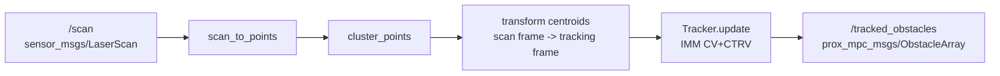

# prox_mpc_obstacle_tracker - Architecture

This document describes the design of `prox_mpc_obstacle_tracker`: the per-scan
pipeline, the clustering and tracking algorithms, the ROS interfaces and QoS, the
lifecycle behavior, and the full parameter reference.
The package produces the [prox_mpc_msgs/ObstacleArray](../../prox_mpc_msgs) feed
that [prox_mpc_controller](../../prox_mpc_controller) consumes for predictive
obstacle avoidance.

## Layering

The package is split into a ROS-free core and a thin ROS node, so the algorithms
are unit-testable without a running graph.

- `prox_mpc_obstacle_tracker_core` - an Eigen-only library: `clustering`
  (scan -> points -> clusters) and `Tracker` (the IMM (CV+CTRV) multi-object
  filter). No ROS dependency.
- `prox_mpc_obstacle_tracker_component` - the `ObstacleTrackerNode` lifecycle
  node, registered as an `rclcpp_components` node so it can be loaded into a
  shared-process container as well as run standalone.
- `obstacle_tracker` - the standalone driver (`main`) that links the component,
  brings the node up, spins, and tears it down on a signal.

## Per-scan pipeline

Each scan callback:

1. Applies the range cutoffs (`min_detection_range`, `max_detection_range`, both
   intersected with the scan's own `range_min`/`range_max`) and converts the
   beams to planar points, dropping non-finite and out-of-range returns.
2. Segments the scan-ordered points into clusters.
3. Looks up one rigid transform `tracking_frame <- scan_frame` at the scan stamp
   (with `transform_timeout`) and transforms every cluster centroid. A TF gap
   skips the scan (the controller's staleness fallback covers the gap).
4. Updates the tracker with the transformed centroids and the scan stamp.
5. Publishes the confirmed tracks as an `ObstacleArray` stamped with the scan
   time and the tracking frame.

## Clustering

`scan_to_points` converts one LaserScan ring to planar points in bearing order,
rejecting non-finite returns and those outside `[range_min, range_max)` (so
maximum-range and invalid beams are dropped).

`cluster_points` segments the scan-ordered points by Euclidean adjacency: a gap
larger than `cluster_gap` between consecutive points closes the current cluster.
Each cluster carries its centroid, an enclosing radius (max member distance from
the centroid), and a member count.
Three filters apply:

- clusters with fewer than `min_cluster_points` members are dropped;
- clusters whose enclosing radius exceeds `max_cluster_radius` are dropped
  (the **wall-rejection** guard; `max_cluster_radius <= 0` disables it);
- the result is capped to the `max_clusters` largest clusters (by member count)
  to bound downstream cost.

The scan is angularly cyclic, so the seam (last-to-first wrap) is merged: if the
sweep's first and last returns are within `cluster_gap` of each other, the
trailing segment is spliced onto the leading one and the pair is closed as a
single cluster whose centroid, enclosing radius, and member count span both
halves. Without the splice an object straddling the ±π bearing would yield two
half-arc clusters - two duplicate tracks with centroids displaced off the object.
The splice is skipped when the end points are farther apart than `cluster_gap`,
which is the ordinary case of two unrelated clusters happening to sit at the two
ends of the sweep.

## Tracking

`Tracker` is a multi-object filter with one estimator per object, all running in
the tracking frame. By default (`imm_enabled: true`) each track is an
**Interacting Multiple Model (IMM)** estimator that runs two motion models in
parallel and blends them each cycle by model probability: a **constant-velocity
(CV)** linear Kalman filter over the state $[x, y, v_x, v_y]$ and a
**constant-turn-rate-and-velocity (CTRV)** EKF over the state
$[x, y, v, \theta, \omega]$. The combined output is moment-matched into CV space,
so association gating and the published position/velocity/covariance fields read
the same whichever model dominates. Setting `imm_enabled: false` selects a legacy
single-CV Kalman path (a single-switch rollback, no rebuild) - the only purely
constant-velocity configuration.

- **Predict.** Every track advances by the time since the previous scan. On the
  IMM path the cycle mixes the two model states (a Markov transition set by
  `imm_p_cv_stay` / `imm_p_ctrv_stay`, with moment-matched mixed priors) and then
  runs both model predicts: the CV model uses a discrete white-noise-acceleration
  process covariance scaled by the spectral density `process_noise`, and the CTRV
  EKF uses its closed-form turn transition with linear- and yaw-acceleration
  process noise (`ctrv_process_noise_accel`, `ctrv_process_noise_yaw_accel`). The
  legacy path runs the CV transition alone. Non-monotonic stamps hold the position
  with no prediction.
- **Associate.** Gated greedy nearest-neighbour: all track-measurement pairs
  within `association_gate` are formed and assigned closest-first, one
  measurement per track.
- **Update.** Matched tracks take a linear position update with measurement
  variance `measurement_noise`. On the IMM path both models are updated and the
  model probabilities are refreshed from their Gaussian measurement likelihoods; a
  missed scan is a predict-only cycle that leaves the probabilities unchanged. The
  radius is smoothed (`0.5*old + 0.5*new`).
- **Birth / confirm / death.** An unmatched measurement spawns a tentative track
  (initial velocity variance `initial_velocity_variance`, up to `max_tracks`); a
  track is confirmed and published after `confirm_count` consecutive hits, and
  dropped after `drop_count` consecutive misses. Confirmation requires
  *consecutive* hits (a miss resets the hit count).

Only confirmed tracks are published.
Each published `Obstacle` carries the track id, the estimated position and
velocity, the smoothed radius, the 2x2 position and velocity covariance blocks
read from the filter covariance, and `prediction_steps` sampled predicted
positions at `prediction_dt` spacing along the track's estimated path - the
model-probability-weighted CV+CTRV blend on the IMM path (a curved arc for a
turning object), or a straight constant-velocity ray on the legacy path - which
the controller follows for predictive avoidance.

## Interfaces

| Interface | Type | QoS | Direction | Description |
| --- | --- | --- | --- | --- |
| `scan` (`scan_topic`) | `sensor_msgs/msg/LaserScan` | `SensorDataQoS` (best-effort, depth 1, volatile) | Subscribed | Input lidar scan; the subscription is created on activate and dropped on deactivate. |
| `tracked_obstacles` (`output_topic`) | `prox_mpc_msgs/msg/ObstacleArray` | reliable, `KeepLast(5)` | Published | Confirmed tracks in the tracking frame; a lifecycle publisher (emits only while active). |

The node looks up TF `tracking_frame <- scan.frame_id` with a dedicated TF listener
thread, so the scan callback can perform a timed lookup at the scan stamp.

## Lifecycle behavior

The node follows the standard managed-node lifecycle.

- `on_configure` declares and validates every parameter (a bad value fails
  configure rather than corrupting the loop), constructs the tracker, the TF
  buffer/listener, and the publisher. No subscription yet.
- `on_activate` activates the publisher, resets the tracker (fresh velocity
  estimate), and subscribes to the scan so processing begins.
- `on_deactivate` drops the subscription and deactivates the publisher (fail-safe:
  output stops).
- `on_cleanup` / `on_shutdown` release the publisher, TF, and tracker through one
  idempotent teardown path.

The standalone driver installs its own async-signal-safe `SIGINT`/`SIGTERM`
handler, cancels the spin, and runs a single checked finalize ladder
(`deactivate -> cleanup -> shutdown`); a second signal force-quits.

## Parameters

All parameters are `double`, `int`, `bool`, or `string` per the project type rules
and mirror [../config/obstacle_tracker.yaml](../config/obstacle_tracker.yaml).
The defaults below are the values declared in the node, and the shipped config
repeats them, so an invocation without a params file runs the same detector.

### Logging

| Parameter | Type | Default | Description |
| --- | --- | --- | --- |
| `log_level` | string | `info` | Node-only logger level: `debug`, `info`, `warn`, `error`, or `fatal`. Applied to this node's logger, and parsed by the launch file to set only this node's verbosity. |

### Interface parameters

| Parameter | Type | Default | Description |
| --- | --- | --- | --- |
| `scan_topic` | string | `scan` | Input `LaserScan` topic. |
| `output_topic` | string | `tracked_obstacles` | Output `ObstacleArray` topic. |
| `tracking_frame` | string | `odom` | Fixed, non-rotating frame velocity is estimated in. |
| `transform_timeout` | double | 0.1 s | TF lookup timeout for scan -> tracking frame. |

### Detection and clustering

| Parameter | Type | Default | Unit | Description |
| --- | --- | --- | --- | --- |
| `cluster_gap` | double | 0.3 | m | Euclidean gap that closes a cluster. |
| `min_cluster_points` | int | 3 | count | Drop clusters with fewer member returns. |
| `max_clusters` | int | 20 | count | Cap clusters per scan (largest kept). |
| `max_cluster_radius` | double | 0.6 | m | Drop clusters whose enclosing radius exceeds this (wall rejection); 0 disables it. |
| `min_detection_range` | double | 0.0 | m | Lower range cutoff (0 uses the scan `range_min`). |
| `max_detection_range` | double | 3.0 | m | Upper range cutoff (0 uses the scan `range_max`); any other value must exceed `min_detection_range`. The default matches the benchmark costmap `obstacle_max_range` (3.0), giving equal perception range there; the demo's predictive costmaps use 2.5, so the tracker sees 0.5 m farther in that stack. |
| `cluster_center_offset_gain` | double | 0.5 | - | Arc-centroid -> disc-centre correction on `[0, 1]`: the centroid is pushed away from the sensor along its ray by this fraction of the enclosing cluster radius. A lidar sees only the near arc of a compact obstacle, so the raw centroid is biased toward the sensor and slides around the disc as the viewpoint changes, adding a fake tangential velocity during close passes. `0.5` is exact for the close-range half-disc arc and under-corrects thin far arcs (conservative); 0 disables it. |

The two range cutoffs are validated as a pair: `max_detection_range` must be
greater than `min_detection_range`, or `0.0` for "no cap".
A reversed or degenerate pair fails `on_configure`, because it would otherwise
configure and activate a tracker whose every scan yields an empty range window.
The scan callback keeps the same guard for the sensor-driven case (the scan's own
`range_min`/`range_max` overlap the cutoffs to nothing) and logs a throttled
warning naming both values instead of skipping silently.

### Association and filter

| Parameter | Type | Default | Unit | Description |
| --- | --- | --- | --- | --- |
| `association_gate` | double | 0.5 | m | Max track-to-cluster gating distance. |
| `process_noise` | double | 0.1 | m²/s⁴ | Acceleration spectral density. |
| `measurement_noise` | double | 0.002 | m² | Position measurement variance. The default is calibrated to the centroid noise of the benchmark scan simulator; re-calibrate per sensor on real hardware. |
| `initial_velocity_variance` | double | 1.0 | m²/s² | Initial vx/vy variance for a new track. |

### IMM and prediction

| Parameter | Type | Default | Unit | Description |
| --- | --- | --- | --- | --- |
| `imm_enabled` | bool | true | - | Run the IMM (CV+CTRV) filter; `false` selects the legacy single-CV Kalman path (single-switch rollback, no rebuild). |
| `imm_p_cv_stay` | double | 0.95 | - | Markov `P(CV -> CV)` on `(0, 1)`; the off-diagonal is `1 -` this. |
| `imm_p_ctrv_stay` | double | 0.99 | - | Markov `P(CTRV -> CTRV)` on `(0, 1)`; the off-diagonal is `1 -` this. The `0.99` default keeps the turning model sticky on sustained orbits. |
| `ctrv_process_noise_accel` | double | 1.0 | m²/s⁴ | CTRV linear-acceleration noise variance `σ_a²` (discrete white-noise form). |
| `ctrv_process_noise_yaw_accel` | double | 1.0 | rad²/s⁴ | CTRV yaw-acceleration noise variance `σ_ω̇²` (drives the `ω` random walk). |
| `ctrv_init_omega_variance` | double | 1.0 | rad²/s² | `ω` variance at track birth and in the CV -> CTRV mixing conversion. |
| `prediction_steps` | int | 25 | count | Sampled predicted positions published per track; `0` publishes none (the controller falls back to a straight constant-velocity ray). |
| `prediction_dt` | double | 0.1 | s | Spacing between predicted samples. |

### Track lifecycle

| Parameter | Type | Default | Description |
| --- | --- | --- | --- |
| `confirm_count` | int | 3 | Consecutive hits before a track is published. |
| `drop_count` | int | 3 | Consecutive misses tolerated before a track is dropped. |
| `max_tracks` | int | 10 | Cap on simultaneously held tracks. |

## Design decisions

- **TF listener spin thread.** The TF listener runs its own thread so the scan
  callback can perform a timed `lookupTransform` at the scan stamp; without it the
  timed lookup always fails and logs per scan.
- **Wall rejection lives in the tracker.** An extended wall's cluster centroid is
  not a stable physical point and drifts at roughly robot speed, so it would be
  tracked as a phantom fast-moving obstacle. The `max_cluster_radius` cap keeps
  walls out of the dynamic feed; static structure remains the costmap's job. The
  controller carries a matching `max_dynamic_obstacle_radius` guard as a backstop.
- **Pure core.** Keeping clustering and tracking ROS-free makes the algorithms
  unit-testable and license-clean (no third-party tracker).
