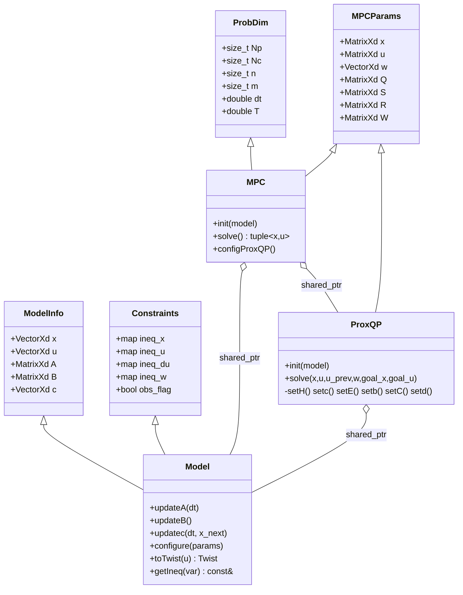

# ProxMPC - Architecture and Technical Reference

This document explains the design of ProxMPC, whose math lives in the
`prox_mpc_core` package: a C++17 nonlinear Model Predictive Control (NMPC)
library.
The controller solves the nonlinear optimal-control problem with a Sequential
Quadratic Programming (SQP) scheme that repeatedly builds and solves a Quadratic
Program (QP) using the ProxQP solver from `proxsuite`, with Eigen for linear
algebra.
All public types live in the `prox_mpc` C++ namespace.

This document is the design overview.
The mathematics is split into two companion documents: [nmpc.md](nmpc.md) for the
NMPC problem, the SQP loop, and the QP sub-problem, and
[obstacle-avoidance.md](obstacle-avoidance.md) for the obstacle constraints.

## Scope

`prox_mpc_core` is a **library only**: it contains no ROS 2 node, `main()`,
publisher, subscriber, topic, or launch file.
The only ROS-coupled function is `optimPath()`, which converts an optimal state
trajectory into a `nav_msgs/msg/Path` for visualization.
Sibling packages consume the core: `prox_mpc_demo` (a self-contained closed-loop
simulation and benchmark), `prox_mpc_controller` (a Nav2 `nav2_core::Controller`
plugin, verified in simulation), and `prox_mpc_test_models` (fault-injection
`Model` plugins for the controller tests).

## Source layout

```text
prox_mpc_core/include/prox_mpc/
  structs.hpp  ProbDim, MPCParams, ModelInfo, Constraints (plain data)
  model.hpp    Model: vehicle interface (kinematics + constraints)
  proxqp.hpp   ProxQP: QP assembly and solve wrapper
  mpc.hpp      MPC: SQP driver and configuration
  utils.hpp    free functions, Eigen/ROS aliases
  models/      Bicycle and Unicycle reference kinematic models
prox_mpc_core/src/
  model.cpp    Model getters/setters
  mpc.cpp      MPC::init, MPC::solve (SQP loop), configuration
  proxqp.cpp   ProxQP::init, ProxQP::solve, setH/setc/setE/setb/setC/setd
  plugins.cpp  pluginlib registration of the bundled models
  utils.cpp    normalizeAngle, optimPath
```

The bundled models are also exported as `pluginlib` plugins of the
`prox_mpc::Model` base type (`prox_mpc_core_plugins.xml`), so a consumer can load
a model by name without depending on its concrete type.

## Class structure

`Model`, `MPC`, and `ProxQP` compose the plain-data structs by inheritance.
`Model` describes one vehicle; `MPC` owns the SQP loop and a `ProxQP`; `ProxQP`
assembles and solves a single QP sub-problem.



## The vehicle model interface

A concrete model derives from `Model` and overrides three pure virtual functions
that supply the first-order (Euler) linearization of the continuous dynamics
$\dot{x} = f(x, u)$ about the current operating point:

- `updateA(dt)` fills $A_k = \partial x_{k+1} / \partial x_k$, the discrete state
  Jacobian.
- `updateB()` fills $B_k = \partial f / \partial u$, the input Jacobian (the
  assembly multiplies it by `dt`).
- `updatec(dt, x_next)` fills the residual $c_k$ of the Euler step.

Because the functions are pure virtual, a model that omits one does not compile,
so the interface cannot be partially implemented by accident. `Model` also
declares a virtual destructor, since it is owned through `shared_ptr<Model>` and
by the plugin loader.

Two further virtual hooks let a model be loaded and used generically:

- `configure(params)` sets the model constants by name after construction (the
  default constructor required for plugin loading cannot take parameters). The
  default reads no keys; an overriding model applies any present key and keeps
  its constructor value otherwise.
- `toTwist(u)` maps a control vector to a `geometry_msgs/msg/Twist`. The default
  is the identity mapping (first control to `linear.x`, second to `angular.z`);
  a model whose control is not a body twist overrides it. The bicycle, for
  example, derives the yaw rate as $\omega = v \sin(\delta) / L$.

### Model selection

`prox_mpc::Model` is a `pluginlib` base type, and `Bicycle` and `Unicycle` are
registered as plugins named `prox_mpc_core/Bicycle` and `prox_mpc_core/Unicycle`.
A consumer loads a model with a `pluginlib::ClassLoader<prox_mpc::Model>`, calls
`configure(...)`, and passes the instance to `MPC::init(...)`. Adding a new model
therefore requires no change to this library: a model only needs to derive from
`Model`, implement the three Jacobian hooks, and be registered as a plugin.

The residual and Jacobian formulas for the bundled models are given in
[nmpc.md](nmpc.md).

## Mathematical formulation

Each control cycle the SQP builds and solves one convex QP about the current
trajectory iterate:

$$
\min_{z}\; \tfrac{1}{2} z^\top H z + c^\top z
\quad \text{s.t.} \quad E z = b, \quad d_{\text{low}} \le C z \le d_{\text{upp}},
$$

where the decision vector $z$ stacks the state, control, and obstacle-slack
increments over the horizon.
$H$ and $c$ carry the doubled tracking weights $Q$, $S$, $R$ (and $W$ for the
slacks); $E$ and $b$ pin the initial state and the Euler dynamics; and $C$ and $d$
hold the state, control, and control-rate bounds together with the obstacle
half-planes.
`MPC::solve` slides the previous solution forward, pins the first state to the
current pose, solves the QP, and applies the increments.
It reports convergence through `qp_info.status` and takes no safety action on
failure, leaving the fallback to the caller (see [nmpc.md](nmpc.md)).

The full derivation - the optimal-control problem, the decision-variable layout,
the QP objective and constraints, the SQP loop with its solve data flow, and the
ProxQP settings - is in [nmpc.md](nmpc.md).
The obstacle-avoidance constraints are derived in
[obstacle-avoidance.md](obstacle-avoidance.md).

## Key interfaces

| Symbol | Type | Meaning |
| --- | --- | --- |
| `MPC::solve()` | `tuple<MatrixXd, MatrixXd>` | optimal state and control trajectories |
| `MPC::qp_info.status` | `proxqp::QPSolverOutput` | `PROXQP_SOLVED` on success; check after each `solve()` |
| `MPC::setPose(pose)` | `VectorXd` | current measured vehicle state |
| `MPC::setGoalX/GoalU` | `MatrixXd` | reference trajectories |
| `MPC::setMaxObs(K)` | `size_t` | obstacle-slot capacity per node (0 disables); sizes the QP |
| `MPC::setObs(obs)` | `MatrixXd` (Np*K x 3) | per (node, slot) triples `[o_x, o_y, d_safe]` |
| `Model::configure(params)` | `map<string,double>` | set model constants by name |
| `Model::toTwist(u)` | `geometry_msgs/msg/Twist` | map a control vector to a body twist |
| `optimPath(x, now)` | `nav_msgs/msg/Path` | trajectory as a ROS path message |

## Numerical and resource notes

- All MPC quantities use `double`; the step size `dt`/`T` are `double` to avoid
  silent narrowing.
- The QP assembly runs every SQP iteration and every control step; Eigen
  matrices are passed by `const&` and the constraint maps are returned by
  `const&` to avoid per-iteration heap copies on this hot path.
- `EIGEN_NO_DEBUG` removes Eigen's internal assertions in the Release build.
- The obstacle constraint is numerically sensitive: a coincident robot/obstacle
  position is guarded with an epsilon to avoid injecting `NaN` into the QP.
