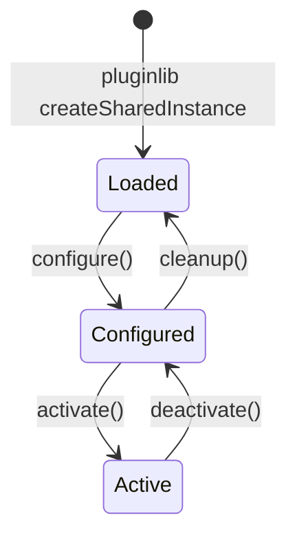

# ProxMpcController - Architecture

This document describes the design of `prox_mpc_controller`, the
[Nav2](https://docs.nav2.org/) controller plugin that drives the
[prox_mpc_core](../../prox_mpc_core) engine.
The controller-side math (reference construction, costmap reduction, predictive
propagation, and the failure fallback) is in [control-law.md](control-law.md).
The engine's math is in the core documents:
[NMPC/SQP/QP](../../prox_mpc_core/doc/nmpc.md) and
[obstacle avoidance](../../prox_mpc_core/doc/obstacle-avoidance.md).

The plugin is verified in simulation under a live Nav2 stack in Gazebo Harmonic;
the scenarios and results are in
[../../prox_mpc_demo/doc/nav2-simulation.md](../../prox_mpc_demo/doc/nav2-simulation.md).

## Responsibility split

The engine and the controller have disjoint, deliberate responsibilities.

`prox_mpc_core` is the frozen math plus a stable extension contract.
It owns the SQP/QP assembly, the cost, the constraints, the linearization, the
disc-based obstacle math, and the `Model` interface.
It is a library with no ROS node and never needs editing to gain a new model.

`prox_mpc_controller` owns model selection and the Nav2 integration.
It loads and configures a concrete model, builds the reference from the global
plan, reduces the local costmap and tracked obstacles to obstacle triples for the
core, maps the optimal control to a `Twist`, handles solver failure, and runs an
exact footprint safety check.
None of that touches the engine's math.

## The Nav2 controller interface

The plugin implements the `nav2_core::Controller` methods.

| Method | Role |
| --- | --- |
| `configure(parent, name, tf, costmap_ros)` | load and configure the model, size the MPC, create publishers and the optional tracked-obstacle subscription |
| `activate()` / `deactivate()` | enable/disable the publishers and clear cached perception |
| `cleanup()` | release the MPC, model, costmap, TF, and interface handles |
| `setPlan(path)` | store the global plan and reset the projection index |
| `computeVelocityCommands(pose, velocity, goal_checker)` | run one control cycle |
| `setSpeedLimit(limit, percentage)` | cache a runtime speed limit, applied at the top of the next control cycle |
| `cancel()` | ramp to a stop and report when stationary |
| `reset()` | clear runtime state between tasks, keeping owned handles |

The class is exported to `nav2_core` through
[../prox_mpc_controller_plugin.xml](../prox_mpc_controller_plugin.xml).

## Plugin lifecycle

The plugin has no standalone executable; the `controller_server` lifecycle node
owns it and drives the transitions.

- `configure()` reads every parameter under the plugin-instance namespace (for
  example `FollowPath.*`), loads the model with a
  `pluginlib::ClassLoader<prox_mpc::Model>`, reads the model's speed and
  deceleration bounds from its declared constraints, sizes the MPC once
  (`init()` builds and sizes the QP), creates the predicted-trajectory publisher,
  and - only when `predict_obstacles` is set - creates the tracked-obstacle
  subscription and the RViz marker publisher.
  An unknown model name escalates to `nav2_core::ControllerException`.
- `activate()` / `deactivate()` toggle the lifecycle publishers.
  `activate()` also clears the runtime counters; `deactivate()` drops cached
  tracked obstacles so a re-activated controller resumes costmap-only until a
  fresh message arrives.
- `cleanup()` releases the solver, model, model loader, publishers,
  subscription, costmap, and TF handles.

## Per-cycle control (`computeVelocityCommands`)

Each cycle the controller performs the following steps.

1. **Validate the pose** in the costmap global frame; a non-finite pose is a
   transient fault (decelerate).
2. **Transform and sample the plan.** Transform the global plan into the costmap
   global frame, project the current pose onto it (forward-only) for the
   arc-length offset, and sample the state/control reference `goal_x` / `goal_u`
   over the horizon. The cruise speed is tapered near the plan end, reduced on
   path curvature (optional), and clamped by any active speed limit and the
   goal-checker tolerance.
3. **Fill the obstacle triples.** When obstacles are enabled (`K > 0`), fill the
   per-node `(o_x, o_y, d_safe)` matrix: predictive + hybrid when enabled and
   fresh tracking data is available, otherwise costmap-only.
4. **Solve** one SQP cycle and read `qp_info.status`.
5. **Guard and veto.** Reject a non-finite iterate, then run an exact
   polygon-footprint check on the pose one step ahead; a veto decelerates.
6. **Command or brake.** On success, map the first control with
   `model->toTwist(...)`; on failure, decelerate and escalate after
   `max_solver_failures` consecutive failures.
7. **Publish** the predicted NMPC trajectory (and predicted-obstacle markers when
   predictive) for visualization, when a subscriber is connected.

## Safety layers

Obstacle avoidance is split across two layers.
The engine keeps a fast, convex, disc-based margin inside the optimization, which
shapes the trajectory away from obstacles
(see [obstacle avoidance](../../prox_mpc_core/doc/obstacle-avoidance.md)).
A separate exact polygon-footprint check, evaluated on the pose one step ahead
with `nav2_costmap_2d::FootprintCollisionChecker`, is the conservative last line
of defense: if that pose's footprint reaches an inscribed-inflated cost, the
command is vetoed and replaced by the deceleration ramp without consuming the
solver-failure budget. The veto keeps its own counter and escalates to
`nav2_core::NoValidControl` once it exceeds the same `max_solver_failures`
budget, so a robot stuck behind a static obstacle reaches a recovery instead of
braking forever.
The veto is skipped when the costmap exposes fewer than three footprint points.

## Solver-failure handling

`MPC::solve` never commands a stop on its own; it reports convergence through
`qp_info.status` and otherwise returns the last non-converged iterate unchanged.
The controller therefore detects failure and reacts: it decelerates toward zero at
the model's control-rate (`du`) limit and escalates to `nav2_core::NoValidControl`
after `max_solver_failures` consecutive failures, so the Nav2 behavior tree stops
and replans rather than crawling on a decaying command.
The same deceleration ramp serves the cancel, footprint-veto, non-finite-pose, and
non-finite-command paths.
The math is in [control-law.md](control-law.md).

## Predictive obstacle subsystem

When `predict_obstacles` is set, the controller subscribes to a
`prox_mpc_msgs/ObstacleArray` (default topic `tracked_obstacles`, typically from
[prox_mpc_obstacle_tracker](../../prox_mpc_obstacle_tracker)).
Each cycle it snapshots the latest message under a mutex, and if the message is
fresh (within `obstacle_timeout`) it propagates every moving track over the
horizon along its tracker-sampled predicted trajectory - falling back to a
constant-velocity ray when the message carries no prediction samples - binds each
to a fixed obstacle slot across nodes, and fills the remaining slots from the
costmap (hybrid).
A stale or missing message, or a missing transform, degrades to the costmap-only
fill for that cycle, so the feature is a clean enable/disable switch.
The propagation and the wall-rejection guard are derived in
[control-law.md](control-law.md).

## Interfaces

All names are relative to the `controller_server` node.
The command itself is the `TwistStamped` returned from `computeVelocityCommands`
(in the costmap base frame); the server publishes it downstream.

| Interface | Type | QoS | Direction | When | Description |
| --- | --- | --- | --- | --- | --- |
| `prox_mpc_local_plan` | `nav_msgs/msg/Path` | depth 1 | Published | always | Predicted NMPC trajectory (`Np+1` poses, costmap global frame), distinct from the Nav2 global plan; sent only when a subscriber is connected. |
| `tracked_obstacles` (configurable) | `prox_mpc_msgs/msg/ObstacleArray` | reliable, depth 5 | Subscribed | `predict_obstacles` only | Tracked dynamic obstacles for predictive avoidance. |
| `prox_mpc_predicted_obstacles` | `visualization_msgs/msg/MarkerArray` | depth 1 | Published | `predict_obstacles` only | Predicted dynamic-obstacle trajectories for RViz; sent only when a subscriber is connected. |
| `<plugin>/diagnostics` (e.g. `FollowPath/diagnostics`) | `prox_mpc_msgs/msg/SolverDiagnostics` | reliable, depth 10 | Published | `publish_diagnostics` only | Per-cycle NMPC/QP solver telemetry for benchmarking; sent only when a subscriber is connected. |

The published topics `prox_mpc_local_plan`, `prox_mpc_predicted_obstacles`, and
`<plugin>/diagnostics` are all emitted only when at least one subscriber is
connected, so an unwatched controller carries no serialization cost.

The plugin also reads the local costmap and the robot footprint through the
`Costmap2DROS` handle, and uses the `tf2` buffer to transform the plan and the
tracked obstacles into the costmap global frame.

## Parameters

All parameters are declared under the plugin-instance namespace (for example
`FollowPath.`) and mirror
[../config/prox_mpc_controller.yaml](../config/prox_mpc_controller.yaml).
Per the project type rules they are `double`, `int`, `string`, or `bool` only.
Each is declared with `nav2_util::declare_parameter_if_not_declared` and then
read back: the `controller_server` destroys the plugin instance on `cleanup()`
while its node keeps the parameters declared, so a plain declaration would throw
`rclcpp::exceptions::ParameterAlreadyDeclaredException` on the next `configure()`
and fail the lifecycle transition.

### Model and horizons

| Parameter | Type | Default | Unit | Description |
| --- | --- | --- | --- | --- |
| `model_plugin` | string | `prox_mpc_core/Bicycle` | - | `prox_mpc::Model` plugin loaded by name. |
| `model_params.L` | double | 1.6 | m | Wheelbase forwarded to `Model::configure`; pre-positions the bicycle steering reference. |
| `model_params.v_max` | double | 0.0 | m/s | Optional forward-speed bound on the model's `u[0]` input. Forwarded to `Model::configure` only when `> 0.0`; the default 0.0 keeps the model's built-in limit. |
| `model_params.v_min` | double | 0.0 | m/s | Reverse-speed bound, forwarded only alongside a positive `v_max`. A negative value is used as given; otherwise the bound is set to `-v_max`. |
| `np` | int | 20 | nodes | Prediction horizon. |
| `nc` | int | 20 | nodes | Control horizon. |
| `dt` | double | 0.1 | s | Step size and control period. |

### Reference tracking

| Parameter | Type | Default | Unit | Description |
| --- | --- | --- | --- | --- |
| `desired_linear_vel` | double | 1.0 | m/s | Cruise speed the plan is sampled at; clamped to the model's speed bound. |
| `curvature_gain` | double | 0.0 | - | Cruise reduction on path curvature; 0.0 disables it. |

### Cost weights

| Parameter | Type | Default | Description |
| --- | --- | --- | --- |
| `q_pos` | double | 10.0 | Position tracking weight (state diagonal, x and y). |
| `q_theta` | double | 1.0 | Heading (and remaining state) tracking weight. |
| `s_factor` | double | 2.0 | Terminal-weight factor: `S = s_factor * Q`. |
| `r_weight` | double | 0.1 | Control-effort weight. |
| `w_weight` | double | 100.0 | Obstacle-slack penalty. |

### Solver limits

| Parameter | Type | Default | Description |
| --- | --- | --- | --- |
| `max_int_iter_qp` | int | 1500 | ProxQP internal-iteration cap. Must be `>= 1`; a lower value fails `configure()`. |
| `max_ext_iter_qp` | int | 10000 | ProxQP external-iteration cap. Must be `>= 1`; a lower value fails `configure()`. |
| `max_iter_sqp` | int | 100 | SQP-iteration cap per cycle. Must be `>= 1`; a lower value fails `configure()`. The caps reach the core as `size_t`, so a negative value would wrap to an effectively unbounded loop, and ProxQP rejects a zero cap outright, so both are fatal rather than clamped. |
| `max_solve_time` | double | 0.0 | Wall-clock budget in seconds for the whole SQP loop; 0.0 disables it (the iteration caps are then the only bound). On timeout the solve reports non-convergence and the cycle brakes. Floored at 0.0. |
| `qp_type` | bool | false | QP backend: false = sparse, true = dense. |
| `guess` | bool | true | ProxQP initial-guess strategy: equality-constrained (`true`) or none (`false`). The QP is not seeded with the previous increment; see [nmpc.md](../../prox_mpc_core/doc/nmpc.md). |
| `max_solver_failures` | int | 3 | Consecutive non-converged solves before escalating to a recovery. |

`max_solve_time` defaults to `0.0` (disabled) in
[config/prox_mpc_controller.yaml](../config/prox_mpc_controller.yaml), so the
iteration caps are the only bound unless a stack sets a positive budget.

### Obstacle avoidance (costmap)

| Parameter | Type | Default | Unit | Description |
| --- | --- | --- | --- | --- |
| `max_obstacles` | int | 1 | slots | Obstacle-slot capacity `K` per node; 0 disables the in-loop term. |
| `safety_margin` | double | 0.1 | m | Folded into `d_safe`. |
| `robot_radius` | double | 0.5 | m | Robot disc radius, folded into `d_safe`. |
| `cbf_gamma` | double | 1.0 | - | Discrete-time CBF rate `h(x_{k+1}) >= (1-gamma) h(x_k)`; 1.0 = pointwise. |
| `costmap_cost_threshold` | int | 200 | cost | Cells at or above this count as occupied. |
| `obstacle_cluster_radius` | double | 0.3 | m | Groups adjacent occupied cells into one representative. |
| `max_obstacle_scan_cells` | int | 50 | cells | Cap on the per-node costmap scan half-window. |

### Predictive (dynamic) obstacle avoidance

| Parameter | Type | Default | Unit | Description |
| --- | --- | --- | --- | --- |
| `predict_obstacles` | bool | false | - | Opt-in; false reproduces the costmap-only behavior. |
| `obstacle_topic` | string | `tracked_obstacles` | - | `ObstacleArray` input topic. |
| `obstacle_timeout` | double | 0.5 | s | Staleness before falling back to costmap-only. |
| `dynamic_speed_threshold` | double | 0.1 | m/s | Speed above which a track is propagated (static is left to the costmap). |
| `prediction_uncertainty_growth` | double | 0.0 | m/s | Extra `d_safe` per second of prediction. |
| `max_dynamic_obstacles` | int | 2 | slots | Slot budget reserved for dynamic tracks. |
| `max_dynamic_obstacle_radius` | double | 0.0 | m | Skip tracks larger than this (walls); 0 = no limit. |

Out-of-range predictive values are clamped (non-fatal) with a warning so the
controller stays available.

### Logging and diagnostics

| Parameter | Type | Default | Description |
| --- | --- | --- | --- |
| `log_level` | string | `info` | Plugin logger level: `debug`, `info`, `warn`, `error`, or `fatal`. |
| `publish_diagnostics` | bool | false | Opt-in per-cycle solver telemetry on `<plugin>/diagnostics` (`prox_mpc_msgs/msg/SolverDiagnostics`); off by default and published only when a subscriber is connected. |

`publish_diagnostics` defaults to `false` in
[config/prox_mpc_controller.yaml](../config/prox_mpc_controller.yaml); set it to
`true` to emit per-cycle solver telemetry (published only when a subscriber is
connected).

## Robot-specific tuning

The velocity envelope is the one deployment setting to establish per robot; the
remaining behaviors below are fixed in the plugin, so a deployment adapts to them
through the model plugin and the costmap configuration rather than through
controller parameters.

- `desired_linear_vel`, together with the `model_params.v_max` and
  `model_params.v_min` overrides, should follow the vehicle's real envelope
  rather than the simulation defaults. `model_params` carries only `L`, `v_max`,
  and `v_min`; no acceleration key is declared or forwarded, so the acceleration
  and deceleration limits - including the ones that shape the deceleration ramp -
  come from the loaded model's declared control-rate (`du`) bounds. A platform
  with different limits needs a model plugin that declares them. The bounds are
  mandatory: a model that declares no `u[0]` bound (the speed cap) or no `du`
  bound for the linear or angular channel (the deceleration ramp) fails
  `configure()` with a `nav2_core::ControllerException` naming the missing bound,
  because a controller that cannot brake must not come up.
- `NO_INFORMATION` (255) costmap cells never count as obstacles: the per-node
  costmap scan skips them along with cells below `costmap_cost_threshold`, so
  unknown space does not hard-block the optimizer. Where unknown space must be
  treated as blocking, that belongs to the costmap and planner configuration.
- The footprint veto evaluates the polygon from `getRobotFootprint()` through
  `footprintCostAtPose(...)` at the pose one step ahead; the pre-oriented
  `getOrientedFootprint(...)` is not used. Publishing an accurate robot footprint
  of at least three points keeps the check active, because a smaller footprint is
  not a valid polygon and the veto is skipped for that cycle with a throttled
  warning, leaving the in-loop keep-out half-planes as the obstacle guard.
- `cancel()` completes once both last-commanded velocities fall below a fixed
  0.01 stop epsilon (m/s and rad/s); it is a compile-time constant, and no
  `deceleration_limit` parameter exists to override the model-derived limits.
