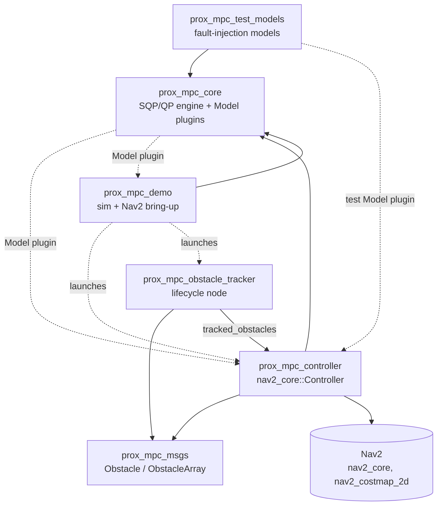
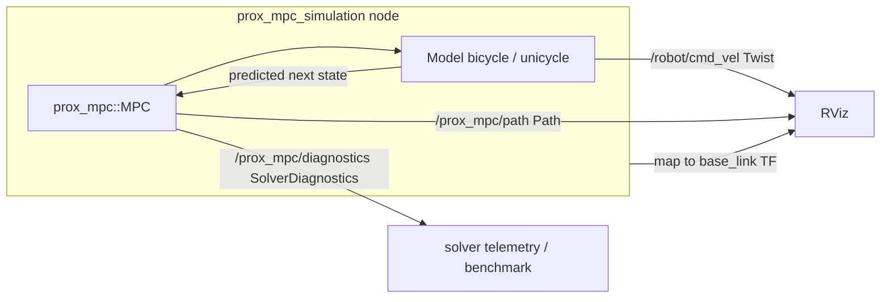
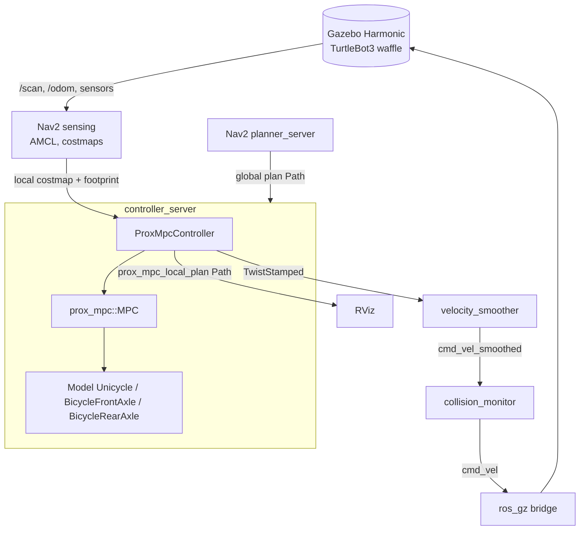
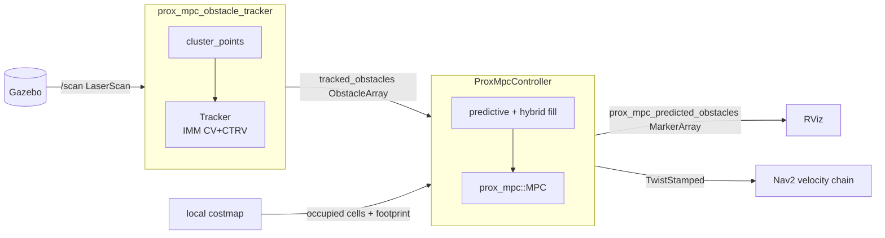

# ProxMPC - Full-Stack Architecture

This document is the system-level overview of the ProxMPC workspace: how the
packages depend on and communicate with each other, and the runtime data flow for
each way the stack is run.
Per-package design lives in each package's own `doc/`; this document ties them
together.

- Engine: [prox_mpc_core/doc/architecture.md](../prox_mpc_core/doc/architecture.md)
- Controller: [prox_mpc_controller/doc/architecture.md](../prox_mpc_controller/doc/architecture.md)
- Obstacle tracker: [prox_mpc_obstacle_tracker/doc/architecture.md](../prox_mpc_obstacle_tracker/doc/architecture.md)
- Demos: [prox_mpc_demo/doc/simulation.md](../prox_mpc_demo/doc/simulation.md),
  [prox_mpc_demo/doc/nav2-simulation.md](../prox_mpc_demo/doc/nav2-simulation.md)

## Table of Contents

- [Packages at a glance](#packages-at-a-glance)
- [Build and plugin dependencies](#build-and-plugin-dependencies)
- [Runtime: standalone simulation](#runtime-standalone-simulation)
- [Runtime: Nav2 + Gazebo](#runtime-nav2--gazebo)
- [Runtime: predictive (dynamic) obstacle avoidance](#runtime-predictive-dynamic-obstacle-avoidance)
- [Operating envelope](#operating-envelope)
- [Cross-cutting conventions](#cross-cutting-conventions)
- [License](#license)

## Packages at a glance

| Package | Kind | Role |
| --- | --- | --- |
| `prox_mpc_core` | C++ library + `Model` plugins | The SQP/QP NMPC engine and the vehicle-model interface. No ROS node. |
| `prox_mpc_msgs` | `rosidl` interfaces | `Obstacle` / `ObstacleArray` contract between tracker and controller. |
| `prox_mpc_controller` | Nav2 controller plugin | Wraps the engine behind `nav2_core::Controller`. |
| `prox_mpc_obstacle_tracker` | Lifecycle node + ROS-free core | 2D-lidar dynamic-obstacle detector and IMM (CV+CTRV) tracker. |
| `prox_mpc_demo` | Executables + launch/config/assets | Standalone benchmark and Nav2 + Gazebo bring-up. |
| `prox_mpc_test_models` | `Model` plugins | Fault-injection models for controller tests. |
| `prox_mpc_benchmark` | Metrics node + Python tooling + kinematic plant + scan simulator | Measures accuracy / precision / real-time across the scenario x model x controller x mode matrix; hosts the mode (b2) Nav2 plant and a scan simulator so every controller (DWB, MPPI, RPP, Graceful, Vector Pursuit, ProxMPC) perceives the scenario obstacles through the same costmap. See [prox_mpc_benchmark/README.md](../prox_mpc_benchmark/README.md) and the [comparison results](controller-comparison-results.md). |

## Build and plugin dependencies

Solid arrows are build/runtime package dependencies; dashed arrows are `pluginlib`
load relationships (resolved by name at runtime, not a link dependency).

The `Model` interface is the extension seam: `prox_mpc_core` registers
`BicycleFrontAxle`, `BicycleRearAxle` and `Unicycle` (plus `Bicycle` as a
deprecated alias for the front-axle model), and `prox_mpc_test_models`
registers its fault-injection models, all against the same `prox_mpc::Model`
base.
The controller and the demo load a model by name, so adding a vehicle model needs
no change to the consumers.

## Runtime: standalone simulation

The `prox_mpc_simulation` node closes the loop on the engine with no external
simulator: it solves, commands, and advances the simulated pose to the model's own
prediction each step.

Details and parameters: [prox_mpc_demo/doc/simulation.md](../prox_mpc_demo/doc/simulation.md).

## Runtime: Nav2 + Gazebo

Under Nav2, the controller plugin is loaded by `controller_server` and drives the
engine each control step.
The command flows through the stock Nav2 velocity chain to Gazebo; the local
costmap and the robot footprint feed obstacle avoidance and the footprint veto.

The baseline configuration runs the in-loop obstacle term off
(`max_obstacles: 0`) and delegates avoidance to Nav2's planner and costmaps; the
controller tracks the rerouted collision-free path.
Scenarios, configuration rationale, and verified results are in
[prox_mpc_demo/doc/nav2-simulation.md](../prox_mpc_demo/doc/nav2-simulation.md).

## Runtime: predictive (dynamic) obstacle avoidance

The opt-in predictive mode adds the obstacle tracker and turns on the controller's
in-loop obstacle term.
The tracker clusters the lidar, runs an IMM (CV+CTRV) filter per object, and
publishes confirmed tracks with sampled predicted positions; the controller follows
each track's predicted trajectory over the horizon and binds it to a constraint
slot, filling the rest from the costmap (hybrid).

The `prox_mpc_msgs/ObstacleArray` header carries the scan stamp (used to age the
prediction) and the tracking frame (used to transform the obstacles into the
costmap global frame).
With predictions off, stale, or missing, the controller falls back to the
costmap-only fill, so the feature is a clean enable/disable switch.

## Operating envelope

What the stack supports today, stated plainly rather than left implicit.

- **Direction of travel.** The reference is forward-only by default: multi-pose
  plan orientations collapse into a reconstructed path tangent, and the
  reference speed is non-negative.
  `allow_reversing` (controller parameter, default `false`) is what opens the
  reverse half of the control box, and `reverse_from_plan_orientation` (default
  `false`) is what lets the plan's own pose orientations sign the reference into
  reverse, truncating it at the first direction change rather than following
  every cusp - the same bounded strategy `regulated_pure_pursuit_controller`
  uses. The second is separate because only a planner that sets pose
  orientations means anything by them: NavFn and Smac 2D leave every pose at the
  identity quaternion, which is indistinguishable from a genuine straight
  reverse plan, so trusting them would read any path running against that fixed
  heading as a reverse traverse.
  Past the plan end the reference pose is the goal pose, orientation included,
  when the goal checker publishes a yaw tolerance it enforces; without one it
  holds the final segment's tangent. Direction is a latched mode: a change is
  accepted only from rest and only once a dwell has elapsed, so a cusp is driven
  the way a vehicle drives one - arrive, stop, shift, pull away - rather than
  being re-decided from the plan geometry every control cycle.
- **The goal region.** Inside the goal-checker xy tolerance the reference is
  pinned to the goal pose rather than tracking the robot's own projection onto
  the plan, which the cruise taper would otherwise reduce to a stub a few
  millimetres ahead of the projection that moves along with it. Once the
  checker's xy condition is met and only the heading is outstanding, a platform
  with no steering channel holds station and turns on the spot; a steering model
  cannot, and manoeuvres out of the heading error instead.
- **Model state layout.** Any `prox_mpc::Model` may order its state as it
  likes, with or without obstacle avoidance: every consumer of a state index,
  the obstacle-constraint assembly in `prox_mpc_core` included, reads it from
  the model's declared `getPlanarMapping()` (see
  [prox_mpc_core/doc/architecture.md](../prox_mpc_core/doc/architecture.md)).
  A model that declares a position index outside its own state vector, or the
  same index twice, is rejected when the solver is initialised.
- **Weight matrices.** `MPC::init()` requires `Q`, `S`, `R` and `W` to be
  finite, symmetric, and positive semidefinite, and throws otherwise; a direct
  `prox_mpc_core` consumer does not have to enforce this itself.
- **Steering state.** The bicycle plugins' steering angle is a virtual state,
  advanced internally from the previous solve and never measured from the
  plant.
  The controller's sole output is a `geometry_msgs/msg/Twist`, as
  `nav2_core::Controller` requires; a physically steered platform needs a
  Twist-to-steering (Ackermann) converter supplied downstream by the
  integrator - ProxMPC ships none.
- **`cbf_gamma` range.** The parameter stays public over `(0, 1]`. Below `1.0`
  the coupled obstacle constraint is guarded against a sentinel-value blow-up
  in the core and against cross-node obstacle-slot churn in the controller's
  costmap fill, both within one control cycle; nothing yet holds a slot stable
  across cycles (see
  [prox_mpc_core/doc/obstacle-avoidance.md](../prox_mpc_core/doc/obstacle-avoidance.md)).
- **Obstacle-slot capacity.** `max_obstacles` (`K`) defaults to `1` and is the
  tuning knob for a cluttered field. At the shipped horizon (`Np = Nc = 20`),
  raising it to 2 costs +16% decision variables and +33% inequality rows in the
  QP; raising it to 4 costs +49% and +100%.
- **Control-horizon bound.** `Nc` must not exceed `Np`; `MPC::setNc` rejects a
  larger value.
- **Footprint-veto backstop.** The endpoint footprint veto (see
  [Cross-cutting conventions](#cross-cutting-conventions) below and
  [prox-mpc.md](prox-mpc.md#4-prox_mpc_controller---the-nav2-plugin)) checks
  the rasterised footprint perimeter at one predicted pose, and applies
  upstream Nav2's own collision policy: unknown space is not a collision when
  the costmap tracks it, and everything else is judged at `LETHAL_OBSTACLE`.
  Nav2's doc comment describes `footprintCostAtPose` as returning the maximum
  cost under the footprint, which would let an adjoining unknown cell (255)
  mask a lethal one (254). Measured against the installed `nav2_costmap_2d`
  (1.3.12+) it does not: a footprint spanning both reports the lethal cost and
  the veto still fires, which the regression test
  `FootprintVetoStillFiresWhenLethalAdjoinsUnknown` pins so a future Nav2
  release that reintroduces the masking shows up as a failure rather than a
  silent divergence. It is still only a backstop - it checks one predicted
  pose, so it is useful only when costmap inflation is sized to the robot's
  real footprint and the local costmap's unknown-space tracking matches the
  deployment, and the in-loop keep-out half-planes are what constrain every
  node of the horizon.
- **`prox_mpc_core/Bicycle`.** A deprecated alias for `BicycleFrontAxle` that
  warns once per process, naming the replacement plugins and the two behaviours
  that changed with the rename; removed in a future major release, whose exact
  number is fixed against the landed diff rather than pre-announced (see
  [prox_mpc_core/doc/migration.md](../prox_mpc_core/doc/migration.md)).

## Cross-cutting conventions

- **Frames.** REP-103 conventions; the tracker estimates velocity in a fixed,
  non-rotating frame (for example `odom`), and the controller transforms plans and
  obstacles into the costmap global frame via `tf2`.
- **Safety split.** The engine keeps a fast convex disc constraint inside the
  optimization; the controller adds an outline-only, single-endpoint footprint
  veto as a backstop - not a guarantee - and decelerates within the model's
  limits on any fault. The veto is effective only when costmap inflation is
  sized to the robot's real footprint and the local costmap's unknown-space
  tracking matches the deployment.
- **Types.** All MPC quantities are `double`; ROS parameters are `double` / `int`
  / `bool` / `string` only.
- **License.** Apache-2.0 across the workspace, with a short SPDX header per file.

## License

[Apache-2.0](../LICENSE).
