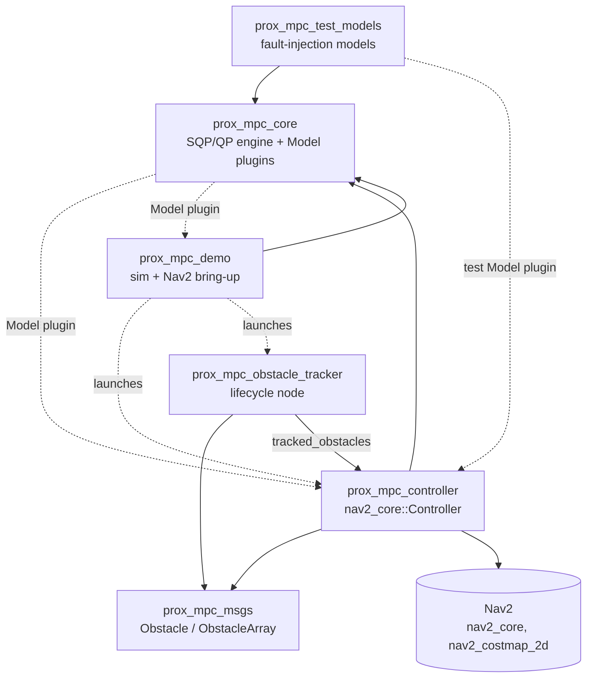
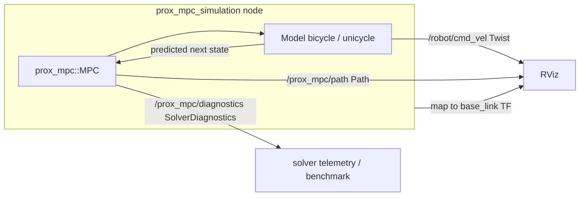
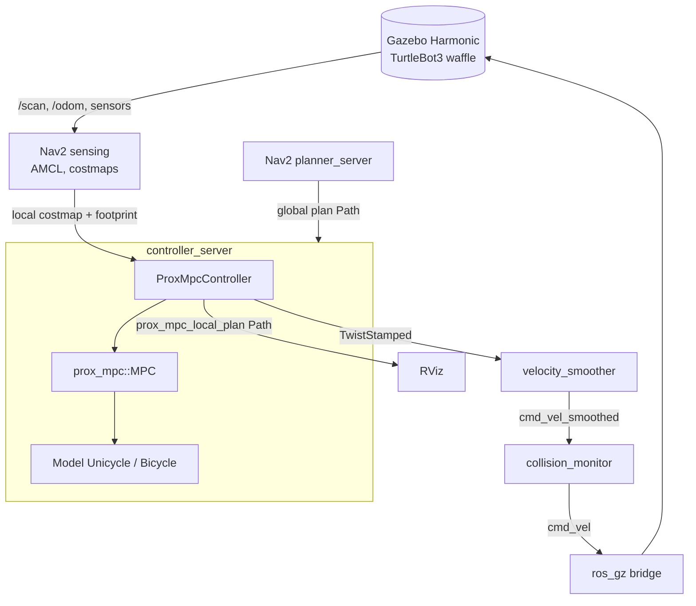
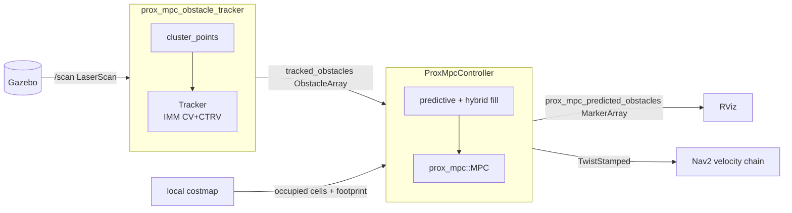

# ProxMPC - Full-Stack Architecture

This document is the system-level overview of the ProxMPC workspace: how the
packages depend on and communicate with each other, and the runtime data flow for
each way the stack is run.
Per-package design lives in each package's own `doc/`; this document ties them
together.

- Engine: [prox_mpc_core/doc/architecture.md](../prox_mpc_core/doc/architecture.md)
- Controller: [prox_mpc_controller/doc/architecture.md](../prox_mpc_controller/doc/architecture.md)
- Obstacle tracker: [prox_mpc_obstacle_tracker/doc/architecture.md](../prox_mpc_obstacle_tracker/doc/architecture.md)
- Demos: [prox_mpc_demo/doc/simulation.md](../prox_mpc_demo/doc/simulation.md),
  [prox_mpc_demo/doc/nav2-simulation.md](../prox_mpc_demo/doc/nav2-simulation.md)

## Table of Contents

- [Packages at a glance](#packages-at-a-glance)
- [Build and plugin dependencies](#build-and-plugin-dependencies)
- [Runtime: standalone simulation](#runtime-standalone-simulation)
- [Runtime: Nav2 + Gazebo](#runtime-nav2--gazebo)
- [Runtime: predictive (dynamic) obstacle avoidance](#runtime-predictive-dynamic-obstacle-avoidance)
- [Cross-cutting conventions](#cross-cutting-conventions)
- [License](#license)

## Packages at a glance

| Package | Kind | Role |
| --- | --- | --- |
| `prox_mpc_core` | C++ library + `Model` plugins | The SQP/QP NMPC engine and the vehicle-model interface. No ROS node. |
| `prox_mpc_msgs` | `rosidl` interfaces | `Obstacle` / `ObstacleArray` contract between tracker and controller. |
| `prox_mpc_controller` | Nav2 controller plugin | Wraps the engine behind `nav2_core::Controller`. |
| `prox_mpc_obstacle_tracker` | Lifecycle node + ROS-free core | 2D-lidar dynamic-obstacle detector and IMM (CV+CTRV) tracker. |
| `prox_mpc_demo` | Executables + launch/config/assets | Standalone benchmark and Nav2 + Gazebo bring-up. |
| `prox_mpc_test_models` | `Model` plugins | Fault-injection models for controller tests. |
| `prox_mpc_benchmark` | Metrics node + Python tooling + kinematic plant + scan simulator | Measures accuracy / precision / real-time across the scenario x model x controller x mode matrix; hosts the mode (b2) Nav2 plant and a scan simulator so every controller (DWB, MPPI, RPP, Graceful, Vector Pursuit, ProxMPC) perceives the scenario obstacles through the same costmap. See [prox_mpc_benchmark/README.md](../prox_mpc_benchmark/README.md) and the [comparison results](controller-comparison-results.md). |

## Build and plugin dependencies

Solid arrows are build/runtime package dependencies; dashed arrows are `pluginlib`
load relationships (resolved by name at runtime, not a link dependency).

The `Model` interface is the extension seam: `prox_mpc_core` registers `Bicycle`
and `Unicycle`, and `prox_mpc_test_models` registers a fault-injection model, all
against the same `prox_mpc::Model` base.
The controller and the demo load a model by name, so adding a vehicle model needs
no change to the consumers.

## Runtime: standalone simulation

The `prox_mpc_simulation` node closes the loop on the engine with no external
simulator: it solves, commands, and advances the simulated pose to the model's own
prediction each step.

Details and parameters: [prox_mpc_demo/doc/simulation.md](../prox_mpc_demo/doc/simulation.md).

## Runtime: Nav2 + Gazebo

Under Nav2, the controller plugin is loaded by `controller_server` and drives the
engine each control step.
The command flows through the stock Nav2 velocity chain to Gazebo; the local
costmap and the robot footprint feed obstacle avoidance and the footprint veto.

The baseline configuration runs the in-loop obstacle term off
(`max_obstacles: 0`) and delegates avoidance to Nav2's planner and costmaps; the
controller tracks the rerouted collision-free path.
Scenarios, configuration rationale, and verified results are in
[prox_mpc_demo/doc/nav2-simulation.md](../prox_mpc_demo/doc/nav2-simulation.md).

## Runtime: predictive (dynamic) obstacle avoidance

The opt-in predictive mode adds the obstacle tracker and turns on the controller's
in-loop obstacle term.
The tracker clusters the lidar, runs an IMM (CV+CTRV) filter per object, and
publishes confirmed tracks with sampled predicted positions; the controller follows
each track's predicted trajectory over the horizon and binds it to a constraint
slot, filling the rest from the costmap (hybrid).

The `prox_mpc_msgs/ObstacleArray` header carries the scan stamp (used to age the
prediction) and the tracking frame (used to transform the obstacles into the
costmap global frame).
With predictions off, stale, or missing, the controller falls back to the
costmap-only fill, so the feature is a clean enable/disable switch.

## Cross-cutting conventions

- **Frames.** REP-103 conventions; the tracker estimates velocity in a fixed,
  non-rotating frame (for example `odom`), and the controller transforms plans and
  obstacles into the costmap global frame via `tf2`.
- **Safety split.** The engine keeps a fast convex disc constraint inside the
  optimization; the controller adds an exact polygon-footprint veto as the
  conservative backstop, and decelerates within the model's limits on any fault.
- **Types.** All MPC quantities are `double`; ROS parameters are `double` / `int`
  / `bool` / `string` only.
- **License.** Apache-2.0 across the workspace, with a short SPDX header per file.

## License

[Apache-2.0](../LICENSE).
