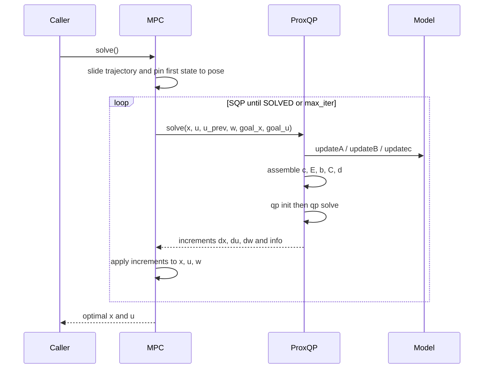

# ProxMPC - NMPC, SQP, and the QP Sub-problem

This document covers the nonlinear MPC formulation, its sequential convex
(SQP) solution, and how each QP sub-problem is assembled and solved with ProxQP.
Obstacle constraints are derived separately in
[obstacle-avoidance.md](obstacle-avoidance.md); the overall design is in
[architecture.md](architecture.md).

## The nonlinear optimal-control problem

Over a horizon of $N_p$ prediction nodes and $N_c$ control nodes, the controller
minimizes a quadratic tracking cost subject to the discretized dynamics and the
state/control bounds:

$$
\min_{x,\,u}\;
\sum_{k=0}^{N_p-1} (x_k - x_k^{\text{goal}})^\top Q\, (x_k - x_k^{\text{goal}}) +
(x_{N_p} - x_{N_p}^{\text{goal}})^\top S\, (x_{N_p} - x_{N_p}^{\text{goal}}) +
\sum_{k=0}^{N_c-1} (u_k - u_k^{\text{goal}})^\top R\, (u_k - u_k^{\text{goal}})
$$

subject to $x_0 = x_\text{pose}$, the dynamics $x_{k+1} = F(x_k, u_k)$, and the
inequality bounds on states, controls, and control rates.
$Q$, $S$, and $R$ weight the intermediate state, terminal state, and control
errors.
The dynamics $F$ are nonlinear, so this problem is non-convex and is solved by
sequential convexification.

## Model linearization

A concrete model supplies the first-order (forward-Euler) linearization of the
continuous dynamics $\dot{x} = f(x, u)$ about the current operating point through
three hooks (`updateA`, `updateB`, `updatec`):

- `updateA(dt)` fills $A_k = \partial x_{k+1} / \partial x_k$, the discrete state
  Jacobian.
- `updateB()` fills $B_k = \partial f / \partial u$, the input Jacobian (the
  assembly multiplies it by `dt`).
- `updatec(dt, x_next)` fills the residual $c_k$ of the Euler step,
  $c_k = x_k - x_{k+1} + \Delta t\, f(x_k, u_k)$.

`prox_mpc_core` ships two internally-consistent bicycle plugins that differ in
which point of the vehicle the state $(p_x, p_y)$ refers to.

For `prox_mpc_core/BicycleFrontAxle`, with state
$x = [p_x, p_y, \theta, \delta]^\top$ and input $u = [v, \dot{\delta}]^\top$
(wheelbase $L$), $(p_x, p_y)$ is the **front-axle** centre and $v$ is the
front-wheel speed, so the front wheel travels along $\theta + \delta$ and the
residual is

$$
c_k =
\begin{bmatrix}
x_k^{(0)} - x_{k+1}^{(0)} + \Delta t\, v_k \cos(\theta_k + \delta_k) \\
x_k^{(1)} - x_{k+1}^{(1)} + \Delta t\, v_k \sin(\theta_k + \delta_k) \\
x_k^{(2)} - x_{k+1}^{(2)} + \Delta t\, v_k \sin(\delta_k) / L \\
x_k^{(3)} - x_{k+1}^{(3)} + \Delta t\, \dot{\delta}_k
\end{bmatrix},
$$

and $A_k$, $B_k$ are its analytic Jacobians.
With the position propagated as $v \cos(\theta + \delta)$,
$v \sin(\theta + \delta)$, the yaw-rate term $v_k \sin(\delta_k)/L$ is the
**exact** front-axle yaw rate of that same parameterization, not a small-angle
approximation of anything: the front wheel's own heading is $\theta + \delta$,
and $L$ is the distance from $(p_x, p_y)$ back to the point the yaw pivots
about.

`prox_mpc_core/BicycleRearAxle` instead references $(p_x, p_y)$ to the
**rear-axle** centre, so $v$ is the rear-axle (body) speed, the rear axle
travels along $\theta$ alone, and the residual uses $v_k \cos(\theta_k)$,
$v_k \sin(\theta_k)$, and the textbook $v_k \tan(\delta_k)/L$ - exact for that
parameterization by the same reasoning, with $\sin$ and $\tan$ swapped because
the reference point moved from the front axle to the rear.

Both plugins are internally consistent end to end: `getPlanarMapping()`
declares which physical point $(p_x, p_y)$ refers to (`ref_offset_x = L` for
the front axle, `0` for the rear axle), and `toTwist()` reports the resulting
`base_link` twist for that same point rather than mixing conventions.
A purely linear model returns constant $A$, $B$ and a trivial residual; the SQP
then converges in a single QP solve.

## Decision variables and indexing

Each SQP iteration solves a QP whose decision vector $z$ stacks the **state,
control, and slack increments** over the horizon, in this fixed order:

$$
z = \big[\, \underbrace{\Delta x_0, \dots, \Delta x_{N_p}}_{(N_p+1)\,n},\;
            \underbrace{\Delta u_0, \dots, \Delta u_{N_c-1}}_{N_c\,m},\;
            \underbrace{\Delta w_0, \dots, \Delta w_{N_p K - 1}}_{N_p K} \,\big]^\top .
$$

The block offsets into $z$ (`x_start`, `u_start`, `w_start` in the code) are

$$
0, \quad (N_p+1)\,n, \quad (N_p+1)\,n + N_c\,m,
$$

and the total dimension is $n_\text{dvars} = (N_p+1)\,n + N_c\,m + N_p K$, where
$K$ is the obstacle-slot capacity per node.
The slack block $\Delta w$ is present only when obstacle avoidance is enabled
(see [obstacle-avoidance.md](obstacle-avoidance.md)); with avoidance off it is
absent and $n_\text{dvars} = (N_p+1)\,n + N_c\,m$.

## The QP sub-problem

The SQP solves, at each iteration, a convex QP of the form

$$
\min_{z}\; \tfrac{1}{2} z^\top H z + c^\top z
\quad \text{s.t.} \quad E z = b, \quad d_{\text{low}} \le C z \le d_{\text{upp}}.
$$

### Objective (`setH`, `setc`)

The Hessian is block diagonal with the (doubled) weight matrices on the state,
terminal, control, and slack blocks:

$$
H = \mathrm{blkdiag}\big(
\underbrace{2Q, \dots, 2Q}_{N_p},\; 2S,\;
\underbrace{2R, \dots, 2R}_{N_c},\;
\underbrace{2W, \dots, 2W}_{N_p K} \big).
$$

The factor of two matches ProxQP's $\tfrac{1}{2} z^\top H z + c^\top z$ objective.
The linear term is the gradient of the tracking cost at the current iterate:

$$
c =
\begin{bmatrix}
2Q\,(x_k - x_k^{\text{goal}}) \\
2S\,(x_{N_p} - x_{N_p}^{\text{goal}}) \\
2R\,(u_k - u_k^{\text{goal}}) \\
2W\,w_k
\end{bmatrix}.
$$

### Equality constraints (`setE`, `setb`)

Two equality blocks pin the trajectory to the physics:

1. **Initial state.** $\Delta x_0$ is fixed so that $x_0$ equals the measured
   pose (identity block).
2. **Euler dynamics.** For each shooting node,
   $A_k \Delta x_k + (\Delta t\, B_k)\, \Delta u_k - \Delta x_{k+1} = -c_k$.

### Inequality constraints (`setC`, `setd`)

The inequality block enforces, per active constraint and step:

- a **first control-rate** bound that ties the first increment to the last applied
  input $u_{\text{prev}}$,
- **state** bounds (`x`), **control** bounds (`u`), and **control-rate** bounds
  (`du`) via finite differences $u_{k+1} - u_k$,
- the **obstacle-avoidance** half-planes and slack bounds when enabled.

All bounds are expressed relative to the linearization point, because the QP
solves for increments.
The inequality builder assembles exactly three model bound categories - `"x"`,
`"u"`, and `"du"`. The fourth category, `"w"`, is reserved and not assembled: a
model-declared `"w"` bound is ignored by the builder (the obstacle slack
lower-bound `s >= 0` is emitted by the obstacle block, not via `getIneq("w")`).

## The SQP scheme

`MPC::solve` slides the previous solution forward by one step (warm start), pins
the first state to the current pose, then enters a loop that builds and solves
the QP about the current iterate and applies the increments. The loop exits as
soon as the QP sub-problem reports `PROXQP_SOLVED`, so a cycle whose first
sub-problem converges performs exactly one linearize-solve-update pass; further
passes re-linearize about the updated iterate only when the previous QP did not
converge.

$$
x \mathrel{+}= \Delta x, \quad
u \mathrel{+}= \Delta u, \quad
w \mathrel{+}= \Delta w,
\qquad \text{until } \texttt{status} = \text{SOLVED} \text{ or } k \ge k_{\max}.
$$

The retry count is bounded by `max_iter_sqp` (1 by default, the real-time
iteration) and, when set, by the `max_solve_time` wall-clock budget.
A retry cap above 1 multiplies the cost of a non-converged sub-problem by that
cap within the one cycle, because the loop re-solves rather than deferring to
the next control period.
The budget is tested only between SQP sub-problem solves, never while one is in
flight, so it cannot interrupt a slow QP and does not bound worst-case cycle
latency in either direction: a loop that exceeds it simply stops early with
whatever status the last QP returned, which is `PROXQP_SOLVED` when that QP
itself converged.
The bound that genuinely holds every cycle is the iteration caps, not the
wall-clock budget.
Because the loop terminates on the first converged QP **sub-problem** rather
than on a nonlinear increment-norm, KKT, or merit-function test, the nominal
cycle described above - one linearize-solve-update pass - is a real-time-
iteration scheme: each such cycle contributes one linearization, and a
nonlinear model refines its linearization across successive control cycles
through the warm start rather than within a single call.
`max_iter_sqp = 1` makes that scheme unconditional, independent of
`max_solve_time`: exactly one QP sub-problem per cycle, whether or not it
converges.

### Convergence and failure reporting

After the loop, `qp_info.status` equals `PROXQP_SOLVED` when the last QP
**sub-problem** converged - a statement about that one convex QP, not about
nonlinear convergence of the original problem.
No nonlinear residual, KKT, merit-function, or increment-norm test exists
anywhere in the loop, so `PROXQP_SOLVED` is the only convergence signal the
caller can observe.
It is also what `prox_mpc_msgs/SolverDiagnostics`'s `converged` field is
derived from, gated further by the controller's own finiteness and
command-acceptance checks before publication (see
[`prox_mpc_controller/doc/architecture.md`](../../prox_mpc_controller/doc/architecture.md)).
`sqp_iter` and `qp_iter_ext` report the iteration counts.
On non-convergence `MPC::solve` takes **no safety action**: it returns the last
(non-converged) iterate, keeps the previous command as the warm-start reference,
and leaves the fallback to the caller.
The caller must therefore check `qp_info.status` each cycle and, on failure,
apply its own policy - the recommended one is a deceleration ramp toward zero that
respects the robot's acceleration limits, never an instantaneous stop.
Keeping this policy out of the math library lets each consumer choose the safe
behavior appropriate to its platform.

## ProxQP solver configuration

The QP is solved in **sparse** mode by default (`qp_type = false`); a dense path
exists for small problems (`qp_type = true`).
There are two warm starts, at different levels, and they are independent.

The **trajectory-level** warm start in `MPC::solve` slides the previous solution
forward one step before re-linearizing.
It is always on and is what makes the real-time iteration scheme work.

The **solver-level** warm start is `warm_start` (`true` by default).
With it on, the ProxQP workspace is built once and updated in place, so the
factorization and the previous primal/dual iterate survive between cycles and
ProxQP starts from the previous solution rather than from scratch.
With it off, the QP is re-initialized with fresh matrices each solve and only
ProxQP's own cheap starts apply, which is what `guess` selects between: the
equality-constrained guess (`true`, the default) or no initial guess (`false`).
`guess` also selects the policy on the update path, where `true` means
`WARM_START` and `false` still means no guess.

`WARM_START` is used rather than `WARM_START_WITH_PREVIOUS_RESULT` because the
latter also carries the proximal step sizes across solves; unused obstacle slots
are padded with a far sentinel whose rows are ~1e6 in magnitude, so step sizes
tuned against that scaling would cripple the next solve.

In-place update requires the sparsity structure to stay fixed - ProxQP silently
ignores an update whose pattern moved, which would drop the keep-out rows.
The structure is therefore declared once at `init()` from the positions `setE`
and `setC` write, and the values are written into it each cycle, structural
zeros included.
A pattern taken from `sparseView()` would not do: the half-plane normals and the
model Jacobians pass through zero as the trajectory evolves.
