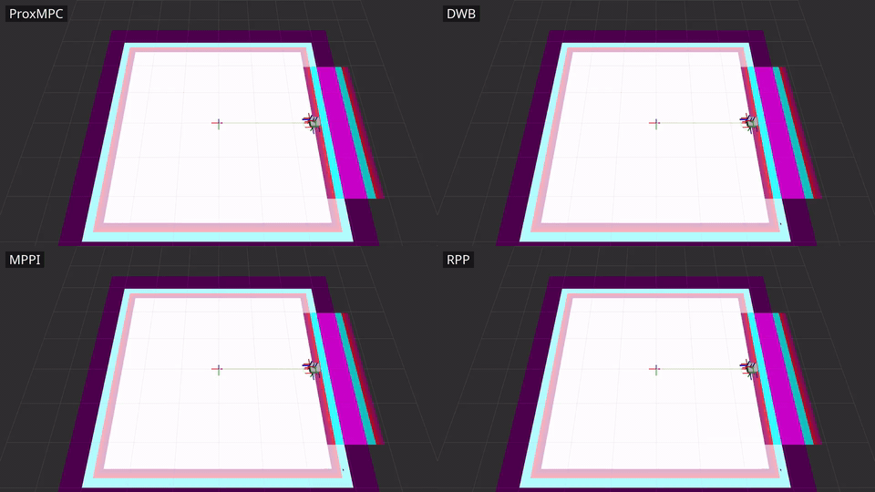
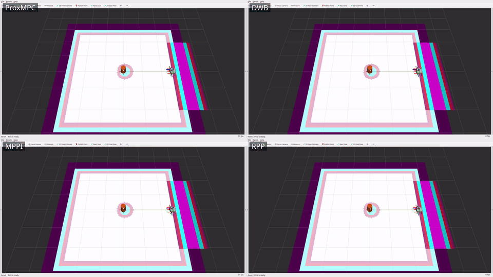
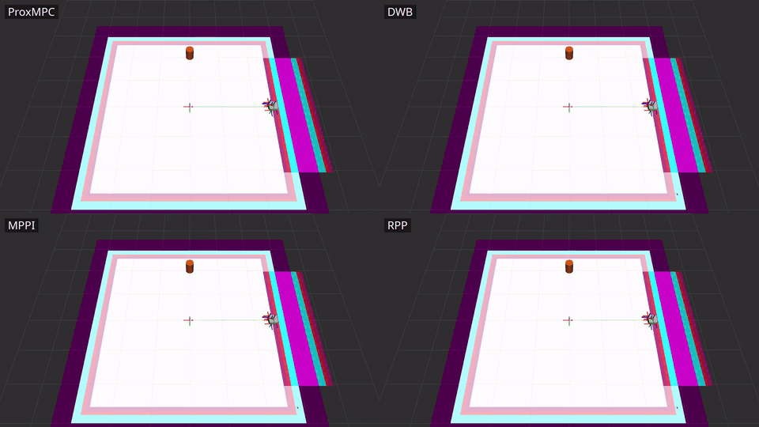
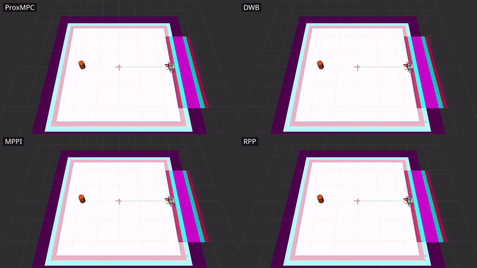

# prox_mpc_benchmark

Scenario-driven benchmarking harness for the ProxMPC stack.
It measures three metric classes - **accuracy** (cross-track / goal error),
**precision** (mean ± std over repeats), and **real-time / feasibility** (solver
diagnostics) - across a matrix of *scenario x model x controller x run mode*.

## Table of Contents

- [Overview](#overview)
- [Prerequisites](#prerequisites)
- [Build](#build)
- [Project Structure](#project-structure)
- [Run modes](#run-modes)
- [Coverage and status](#coverage-and-status)
- [Notes on the metrics](#notes-on-the-metrics)
- [Configuration](#configuration)
- [Usage](#usage)
  - [Quick start](#quick-start)
  - [Standalone matrix (b1)](#standalone-matrix-b1)
  - [Cross-controller comparison (b2)](#cross-controller-comparison-b2)
  - [Aggregate the tables](#aggregate-the-tables)
- [Demonstration videos](#demonstration-videos)
- [Results](#results)
- [License](#license)

## Overview

The package contains a controller-agnostic **C++ live metrics node**
([src/metrics_node.cpp](src/metrics_node.cpp)) plus installed **Python tooling**
([scripts/](scripts/)) for orchestration, map generation, goal sending, bag
reduction, and aggregation. It **reuses** the demo worlds/maps/models rather
than duplicating them, and **owns the result artifacts**, which stay local and
gitignored - the framework performs no git operations.

The narrative companion - how ProxMPC compares against the stock Nav2 controllers
and what the suite concluded - is in
[doc/controller-comparison-results.md](../doc/controller-comparison-results.md).

## Prerequisites

- **Operating system:** Ubuntu 24.04 (Noble).
- **ROS 2 distribution:** Jazzy.
- **Build system:** `ament_cmake`.
- **Always needed:** `prox_mpc_core`, `prox_mpc_msgs`, and `prox_mpc_demo` (the
  reused worlds, maps, and models).
- **Modes a / b2:** additionally Nav2 and the stock Nav2 controllers under
  comparison (DWB, MPPI, Regulated Pure Pursuit, Graceful, and Vector Pursuit -
  the one external community peer), plus `prox_mpc_controller`;
  mode a also needs Gazebo Harmonic and `ros_gz`.

ROS dependencies are declared in `package.xml` and resolved by `rosdep install`.

## Build

Build the harness and its dependencies in an overlay workspace:

```bash
colcon build --symlink-install --packages-select \
  prox_mpc_msgs prox_mpc_core prox_mpc_controller prox_mpc_demo prox_mpc_benchmark
source install/setup.bash
```

## Project Structure

- `config/scenarios/` - eleven scenarios, one YAML each. The four single-obstacle
  motion cells driven by the standalone matrix (`static_box`, `dynamic_circle`,
  `dynamic_line_forward`, `dynamic_line_backward`); `nav2_open`, the obstacle-free
  cross-controller cell; and the six multi-obstacle cells that carry the
  simultaneous two-mover collision comparison - `dynamic_multi`,
  `dynamic_multi_noise`, and `blind_multi_0` through `blind_multi_3`
  (generated by `gen_blind_multi.py`).
- `config/controllers/` - one preset per Nav2 controller under test: `proxmpc`,
  `proxmpc_pred` (the predictive ProxMPC variant), `dwb`, `mppi`,
  `regulated_pure_pursuit`, `graceful`, and `vector_pursuit`.
- `config/robots/` - robot <-> prox_mpc model pairing (`waffle`->Unicycle,
  `ackermann`->Bicycle).
- `config/metrics.yaml` - metric set, pass thresholds, repeats, shared control params.
- `config/nav2_b2_base.yaml` - the shared Nav2 stack the mode-b2 launch injects each controller preset into.
- `src/metrics_node.cpp` - live cross-track/goal-error + SolverDiagnostics tap; writes a per-run JSON.
- `src/kinematic_plant.cpp` - mode (b2) plant: integrates `/cmd_vel` as a unicycle, publishes `/odom` + TF.
- `src/scan_simulator.cpp` - synthesises the `LaserScan` the mode (b2) costmaps and the
  obstacle tracker perceive, so every controller sees the same sensor stream without Gazebo.
- `src/timing_controller_wrapper.cpp` - a `nav2_core::Controller` decorator that wall-clock times the
  wrapped controller's `computeVelocityCommands` so every controller's per-cycle compute is measured identically.
- `timing_controller_plugin.xml` - the `pluginlib` export for that decorator.
- `include/prox_mpc_benchmark/` - `metrics_math.hpp` (the ROS-free metric math),
  `obstacle_field.hpp` (scenario obstacle geometry), and `timing_controller_wrapper.hpp`.
- `test/` - GoogleTest suites `test_metrics.cpp` and `test_obstacle_field.cpp`.
- `launch/benchmark.launch.py` - standalone (b1) sim + metrics node for one scenario x model.
- `launch/benchmark_nav2.launch.py` - mode (b2) Nav2 + kinematic plant with the selected controller preset.
- `launch/interactive.launch.py` - the click-a-goal interactive Nav2 bring-up on the kinematic plant (no Gazebo).
- `scripts/run_matrix.py` - orchestrate the standalone (b1) matrix x repeats.
- `scripts/run_nav2.py` - orchestrate the mode (b2) cross-controller comparison (Nav2 + plant, no Gazebo).
- `scripts/resource_sampler.py` - sample the controller_server process CPU/RSS + `/cmd_vel` rate (b2).
- `scripts/generate_map.py` - world+map generation for the scale presets (7/15/30 m).
- `scripts/gen_blind_multi.py` - generate the `blind_multi_*` two-mover scenario YAMLs.
- `scripts/goal_sender.py` - auto-send NavigateToPose / NavigateThroughPoses (modes a/b2).
- `scripts/gt_obstacle_publisher.py` - publish the scenario's ground-truth obstacle states
  (the `--oracle` feed and the collision scoring reference).
- `scripts/obstacle_markers.py` - ground-truth obstacle markers for RViz and the recorded videos.
- `scripts/space_time_feasible.py` - offline space-time check that a two-mover cell is solvable at all.
- `scripts/record_scenarios.py` - record one controller through the scenarios for the video grids.
- `scripts/combine_grid.sh` - combine per-controller clips into a labelled comparison grid.
- `scripts/compute_metrics.py` - bag -> per-run JSON (modes a/b2).
- `scripts/aggregate.py` - per-run JSON -> mean ± std tables -> this README.
- `models/ackermann_robot/` - the Ackermann robot model used by the bicycle cells.
- `worlds/prox_mpc_scalable.sdf.xacro` - the scalable benchmark world (7/15/30 m presets).
- `rviz/recording.rviz` - the RViz configuration the video recordings use.
- `doc/` - [videos.md](doc/videos.md) (recording workflow) and `doc/media/` (the committed grids and posters).
- `init.sh` - one-command reproducible build + single-scenario (b1) run.
- `CHANGELOG.rst` - release notes for the package.
- `results/` - per-run JSON, the `scenarios.json` index, progress files (gitignored).

## Run modes

- **(b1) standalone core sim** - the deterministic, ProxMPC-only regression path
  (the core drives its own model; no Gazebo). Both models. Fully wired and exercised.
- **(a) Gazebo + Nav2** - full stack, ground-truth accuracy, real-time/feasibility
  telemetry from the controller plugin's `<plugin>/diagnostics`.
- **(b2) Nav2 without Gazebo** - a kinematic-plant node (`kinematic_plant`) +
  Nav2 controller_server for controller-agnostic comparison without Gazebo physics
  cost. Wired (`benchmark_nav2.launch.py`, `run_nav2.py`) and exercised.

## Coverage and status

Harness coverage (ROS 2 Jazzy, Gazebo Harmonic, full Nav2 with the seven
controllers compared):

| Mode / capability | Coverage |
| --- | --- |
| Solver telemetry (`SolverDiagnostics`, core slack getter, standalone + plugin publishers) | live diagnostics; plugin tap under Nav2 |
| Mode **b1** - standalone core sim | both models x the 4 single-obstacle scenarios x 5 repeats |
| Mode **a** - Gazebo Harmonic + full Nav2 | waffle / Unicycle + ProxMPC, open world, goal -> `SUCCEEDED` |
| Mode **b2** - Nav2 + kinematic plant + scan simulator, no Gazebo (`run_nav2.py`) | **the reported comparison**: 7 controllers x 11 scenarios x 5 repeats (10 for MPPI on obstacle cells) |
| Map scaling (`generate_map.py` 7/15/30 m + scalable world xacro) | maps matched to world geometry |
| Ackermann robot SDF + gz AckermannSteering bridge | mode-a bicycle bringup |

The cross-controller comparison runs in mode **b2** via `run_nav2.py`: each of the
seven controllers has a preset in
`config/controllers/`, `benchmark_nav2.launch.py` injects it into `FollowPath`, and
every controller drives the *identical* kinematic plant from the same start to the
same goal. On the obstacle scenarios the `scan_simulator` ray-casts the scenario
obstacles into `/scan` and a costmap `obstacle_layer` marks them, so every
controller perceives the *same* obstacle through the *same* costmap; the
controller-agnostic metrics node adds a min-clearance / collision metric. The
narrative and the conclusion on ProxMPC are in
[doc/controller-comparison-results.md](../doc/controller-comparison-results.md).

## Notes on the metrics

<details>
<summary>How the metrics are defined and why (precision, deadline-miss, obstacle placement, resources, fair tuning)</summary>

- **Precision.** Mode b1 is deterministic, so the geometric metrics (path,
  goal error, cross-track) have ~0 std across repeats - the precision signal is
  exact reproducibility; only wall-clock timing jitters. Mode a shows small real
  variance (Gazebo non-determinism), which **is** the precision signal there.
- **`deadline_missed`.** A pure compute-overrun signal: `solve_time_ms > 1000*dt`
  (the solve did not fit the cycle budget). The measured `control_period_ms` is
  published as a separate field but is deliberately not folded into the flag - the
  nominal period equals the budget by construction, so any period threshold would
  need an arbitrary slack. The actionable real-time signal is the
  `solve_p50/p95/max` distribution.
- **Non-finite timing samples.** A non-finite `solve_time_ms` is dropped at
  ingestion and counted rather than fed to the quantile code (a NaN breaks the
  sort's ordering). The percentile definition is unchanged and `num_diag_samples`
  still counts every diagnostics message received.
- **Scenario obstacle placement.** Obstacles are offset off the dead-centre line:
  a perfectly head-on symmetric point obstacle gives a soft-constraint avoider no
  lateral preference and stalls it (not a meaningful avoidance test). The offset
  gives a clear side to pass while still forcing a measurable detour.
- **Standalone goal-stop.** The b1 sim holds at its final goal (a waypoint
  follower stops rather than driving through), so `goal_error_m` reflects the
  stopping accuracy; the solver keeps running so telemetry still flows.
- **Process-resource metrics (mode b2).** `resource_sampler.py` reads the
  `controller_server` process's CPU (% of one core) and RSS from `/proc`, the
  achieved `/cmd_vel` rate, and - via the timing decorator - each controller's
  per-cycle `computeVelocityCommands` time, so the cross-controller comparison
  includes `control_rate_hz`, `cpu_mean_pct`/`cpu_peak_pct`, `rss_peak_mb`, and
  `compute_ms_p50`/`p95`/`max` (`n/a` for b1 / mode a). Process CPU/RSS are
  per-process (the identical local costmap is included); `compute_ms_*` is the
  cleaner controller-only measure. Measured on the x86 dev host (Intel Core
  i7-10750H, 6C/12T, 31 GiB RAM, Ubuntu 24.04.4) - the ranking transfers,
  absolutes are indicative.
- **Fair tuning (cross-controller).** The predictive controllers share a **2.0 s
  prediction horizon** (ProxMPC `np*dt`, DWB `sim_time`, MPPI `time_steps*model_dt`),
  a **genuine matched hard 0.5 m/s cap** (enforced in every controller's
  solver/sampler - for ProxMPC via the model's `v_max` input bound, sourced from
  the robot config), 20 Hz rate, and a
  0.24 m goal checker strictly inside the 0.25 m scored tolerance. Each method's
  intrinsic sampling (MPPI `batch_size`, DWB sample grid) stays at its upstream
  default. Every controller received a good-faith tuning pass on its own
  documented avoidance/completion knobs within ProxMPC's iteration budget;
  `regulated_pure_pursuit`/`graceful` kept genuine wins, `dwb`/`mppi` reverted to
  stock obstacle costs after harder settings only regressed them. MPPI (the one
  unseeded stochastic controller) runs n=10 per obstacle cell; the rest n=5.
- **Result summary** (matched 0.5 m/s cap, `d_safe = 0.320 m`; one 435-run
  campaign on 2026-09-12, all seven controllers recorded back-to-back).
  Reactive ProxMPC holds the largest static-obstacle margin in the field
  (+0.382 m against RPP's +0.211 and MPPI's +0.204), and the **predictive**
  preset now holds the largest worst-case margin on the three single moving-
  obstacle cells (+0.212 m against reactive's +0.186 and MPPI's +0.136), all
  three cleared collision-free by both presets.
  On the six simultaneous two-mover cells the honest discriminator is the
  **median closest approach** rather than the collision count: those cells are
  deliberately marginal, and 50-93 % of runs finish within 0.15 m of the
  threshold, so a few centimetres of jitter flips a near-miss either way.
  By that measure predictive ProxMPC leads at **+0.151 m** (RPP +0.113,
  MPPI +0.063, DWB +0.057, Vector Pursuit +0.020, Graceful +0.000, reactive
  ProxMPC -0.023), and it is also the fewest-collision controller on those cells
  at 3/30 against 6/30 for the next best, clearing five of the six outright.
  Reactive ProxMPC's weakest cells are `blind_multi_2` and `blind_multi_3` (5/5
  collisions each): the linearised keep-out cannot make the non-convex
  per-obstacle side-choice, and the costmap-only fill constrains each obstacle
  where it *was* rather than where it will be - an error of `v_obs * t_node`, up
  to a metre at the far end of a 2 s horizon. That is the limitation prediction
  exists to remove, and it is why `predict_obstacles` now defaults to true. The
  predictive preset clears both of those cells 0/5 and has one weak cell left,
  `blind_multi_0` at 3/5.
- **Per-cycle compute.** ProxMPC's cost scales with obstacle load while the
  sampling controllers' does not, so the ratio narrows as cells get harder: the
  reactive preset is **9.9x lighter than DWB and 10.4x than MPPI** on the open
  cell (0.30 ms against 2.96 and 3.11), ~2.5-3x lighter on the single-obstacle
  cells, and ~1.3x lighter on the multi-mover cells (2.47 ms against 3.16 and
  3.05). Across all obstacle cells it draws 8.5 % CPU (predictive 7.5 %) against
  DWB's 9.4 % and MPPI's 9.3 %, at 59 MB peak RSS (predictive 60) against
  60 and 63; the predictive preset's tracker adds 0.96 % of a core and 38.3 MB in
  its own process. The three geometric pursuit controllers remain an order of
  magnitude cheaper at 0.17-0.23 ms and ~4.0 % CPU, and collide on 16-36 % of
  obstacle runs against predictive ProxMPC's 6 %.
  The full method, per-cell numbers, and conclusion are in
  [doc/controller-comparison-results.md](../doc/controller-comparison-results.md).

</details>

> These are simulation results on a kinematic plant, measured on an x86-64
> dev host (Intel Core i7-10750H, 6 cores / 12 threads, 31 GiB RAM,
> Ubuntu 24.04.4) - not on physical robot hardware and not contact-dynamics.
> A collision is a *would-be* overlap of the robot and obstacle discs, scored
> identically for every controller. Gazebo validation is five runs of one open
> cell; the full Gazebo matrix and hardware validation remain open.

## Configuration

Every run is configured from the YAML files in `config/`, which are the single
source of truth for the harness.
`config/metrics.yaml` holds the metric set, pass thresholds, repeat count, and the
shared control parameters; `config/scenarios/<name>.yaml` defines each scenario's
geometry, reference polyline, and obstacles; `config/controllers/<name>.yaml`
holds one preset per Nav2 controller under comparison; and
`config/robots/<name>.yaml` pairs a robot with its prox_mpc model.
The mode-b2 launch injects the selected controller preset into the shared
`config/nav2_b2_base.yaml` stack so every controller runs against an identical Nav2
configuration.

The orchestration scripts select from these files by name.
`run_matrix.py` accepts `--scenarios`, `--models`, `--modes` (b1 here),
`--controller`, `--repeats`, and `--results-dir`; `run_nav2.py` accepts
`--scenario`, `--controllers`, `--robot`, `--repeats`, `--repeat-indices`,
`--warmup`, `--results-dir`, and `--oracle`.
`--repeat-indices` takes a comma-separated list of repeat indices and overrides
`--repeats`, so a single run lost to a transient bring-up failure can be redone
without repeating the cell; `--oracle` feeds `proxmpc_pred` ground-truth obstacles
instead of the IMM tracker, which separates a perception limit from a
controller-formulation limit.
The launch files parametrise a single cell: `benchmark.launch.py` takes
`scenario`, `model`, `mode`, and `summary_json`; `benchmark_nav2.launch.py` takes
`controller`, `robot`, `timing`, `map_yaml`, `start_x`, `start_y`, `start_theta`,
`scan_params_file` (override the simulated scan's parameters; empty uses the
default), and `obstacle_tracker` (start the tracker alongside the stack; default
`false`).

## Usage

### Quick start

Run one scenario end to end - the script sources the overlay, builds the affected
packages in `~/ros2_ws`, runs the standalone (b1) cell, and prints the per-run
summary JSON.
`init.sh` lives in the package root, so run it from there:

```bash
cd ~/ros2_ws/src/prox_mpc/prox_mpc_benchmark
./init.sh static_box bicycle
```

Its usage is `./init.sh [scenario] [model]`, where `scenario` is one of
`static_box`, `dynamic_circle`, `dynamic_line_forward`, `dynamic_line_backward`
(default `static_box`) and `model` is `unicycle` or `bicycle` (default `bicycle`).
Override the workspace path with the `ROS2_WS` environment variable if the
workspace is not at `~/ros2_ws`.

### Standalone matrix (b1)

Run the whole deterministic standalone matrix (both models x the four motion
scenarios x repeats):

```bash
ros2 run prox_mpc_benchmark run_matrix.py --modes b1
```

Narrow the run to specific cells with `--scenarios` and `--models`, for example
`--scenarios static_box --models bicycle`.

### Cross-controller comparison (b2)

Compare ProxMPC against the stock Nav2 controllers on the open-world cell, Nav2 +
kinematic plant, no Gazebo:

```bash
# full peer set, one scenario
ros2 run prox_mpc_benchmark run_nav2.py --controllers proxmpc,dwb,mppi,regulated_pure_pursuit,graceful,vector_pursuit --scenario static_box

# single-scenario reproduce
ros2 run prox_mpc_benchmark run_nav2.py --scenario <nav2_open|static_box|dynamic_circle|dynamic_line_forward|dynamic_line_backward>
```

`goal_sender.py` (used internally by `run_nav2.py` and mode a) can also send a
one-off goal into a running stack:

```bash
ros2 run prox_mpc_benchmark goal_sender.py --points 2.0,-0.5,0.0 --timeout 120
```

### Aggregate the tables

Reduce the per-run JSONs into the mean ± std tables and render them into the
[Results](#results) block below:

```bash
ros2 run prox_mpc_benchmark aggregate.py
```

## Demonstration videos

Per-scenario **four-controller** comparison grids: ProxMPC (predictive), DWB,
MPPI, and Regulated Pure Pursuit driving the *same* mode (b2) scenario side by side
(RViz on the kinematic plant), so the avoidance behaviours are directly comparable.
The ProxMPC cell is the `proxmpc_pred` preset - the predictive variant, which is
what `record_scenarios.py` records by default. Each obstacle is drawn as a
ground-truth cylinder next to its costmap footprint. Every GIF loops inline and
links to the full-resolution mp4. Cell order: ProxMPC (predictive)
(top-left), DWB (top-right), MPPI (bottom-left), RPP (bottom-right).

### No obstacle

[](doc/media/nav2_open_controllers.mp4)

### Static box (dead-centre)

[](doc/media/static_box_controllers.mp4)

### Dynamic line

[](doc/media/dynamic_line_forward_controllers.mp4)

### Dynamic circle

[](doc/media/dynamic_circle_controllers.mp4)

The single-controller ProxMPC-across-scenarios grid is in the
[root README](../README.md#demonstration). Full workflow, parameters, and the
Wayland/Xvfb note are in [doc/videos.md](doc/videos.md). In short - record each
controller into its own folder, then combine per scenario:

```bash
for c in proxmpc_pred dwb mppi regulated_pure_pursuit; do
  ros2 run prox_mpc_benchmark record_scenarios.py --controller "$c" \
    --display :0 --resolution 2560x1440 --fullscreen --gpu-offload \
    --out-dir results/videos/"$c"
done
ros2 run prox_mpc_benchmark combine_grid.sh \
  --inputs results/videos/proxmpc_pred/static_box.mp4,results/videos/dwb/static_box.mp4,results/videos/mppi/static_box.mp4,results/videos/regulated_pure_pursuit/static_box.mp4 \
  --labels ProxMPC,DWB,MPPI,RPP --output doc/media/static_box_controllers.mp4
```

Per-controller clips land under `results/videos/<controller>/` (gitignored); the
committed grids + posters are under `doc/media/`.

## Results

> Simulation results on a kinematic plant, not physical hardware and not
> contact-dynamics; a collision is a *would-be* overlap of the robot and obstacle
> discs, scored identically for every controller; Gazebo validation is five runs
> of one open cell, with the full Gazebo matrix and hardware validation still
> open. The full
> statement is in the [Notes on the metrics](#notes-on-the-metrics) above and in
> the [root README](../README.md).

<!-- BENCHMARK_RESULTS_START -->

*Auto-generated by `aggregate.py` from `results/scenarios.json` (475 runs). Values are mean±std (population) over repeats - the precision signal. Not committed.*

### Mode `b1`

| scenario | model | controller | n | success | t_goal[s] | path[m] | goal_err[m] | ct_rms[m] | ct_max[m] | obs_gap[m] | coll | solve_p50[ms] | solve_p95[ms] | solve_max[ms] | miss | sqp | qp_ext | infeas | slack[m] | rate[Hz] | cpu[%] | rss[MB] | cmp_p50[ms] | cmp_p95[ms] |
|---|---|---|---|---|---|---|---|---|---|---|---|---|---|---|---|---|---|---|---|---|---|---|---|---|
| dynamic_circle | bicycle | proxmpc | 5 | 100% | 4.58±0.04 | 4.85±0.00 | 0.141±0.000 | 0.007±0.000 | 0.014±0.000 | n/a | n/a | 5.926±0.227 | 12.200±2.154 | 13.532±2.185 | 0.0±0.0% | 1.00±0.00 | 9.46±0.00 | 0.0±0.0% | 0.000±0.000 | n/a | n/a | n/a | n/a | n/a |
| dynamic_circle | unicycle | proxmpc | 5 | 100% | 4.56±0.08 | 4.85±0.00 | 0.141±0.000 | 0.007±0.000 | 0.015±0.000 | n/a | n/a | 4.723±0.379 | 8.385±0.696 | 10.106±2.178 | 0.0±0.0% | 1.00±0.00 | 9.48±0.00 | 0.0±0.0% | 0.000±0.000 | n/a | n/a | n/a | n/a | n/a |
| dynamic_line_backward | bicycle | proxmpc | 5 | 100% | 4.56±0.05 | 4.85±0.00 | 0.152±0.000 | 0.044±0.000 | 0.105±0.000 | n/a | n/a | 6.481±0.464 | 12.794±0.482 | 15.599±1.806 | 0.0±0.0% | 1.00±0.00 | 9.62±0.01 | 0.0±0.0% | 0.225±0.000 | n/a | n/a | n/a | n/a | n/a |
| dynamic_line_backward | unicycle | proxmpc | 5 | 100% | 4.54±0.05 | 4.85±0.00 | 0.154±0.000 | 0.048±0.000 | 0.111±0.000 | n/a | n/a | 4.825±0.449 | 9.681±0.192 | 33.535±2.112 | 0.0±0.0% | 1.00±0.00 | 9.90±0.01 | 0.0±0.0% | 0.194±0.000 | n/a | n/a | n/a | n/a | n/a |
| dynamic_line_forward | bicycle | proxmpc | 5 | 100% | 4.58±0.04 | 4.85±0.00 | 0.153±0.000 | 0.058±0.000 | 0.125±0.000 | n/a | n/a | 6.347±0.790 | 12.743±0.651 | 17.741±1.591 | 0.0±0.0% | 1.00±0.00 | 9.58±0.00 | 0.0±0.0% | 0.375±0.000 | n/a | n/a | n/a | n/a | n/a |
| dynamic_line_forward | unicycle | proxmpc | 5 | 100% | 4.56±0.05 | 4.85±0.00 | 0.155±0.000 | 0.045±0.000 | 0.105±0.000 | n/a | n/a | 5.321±0.657 | 11.377±1.675 | 15.580±1.121 | 0.0±0.0% | 1.00±0.00 | 9.64±0.01 | 0.0±0.0% | 0.222±0.000 | n/a | n/a | n/a | n/a | n/a |
| static_box | bicycle | proxmpc | 5 | 100% | 4.56±0.05 | 4.85±0.00 | 0.140±0.000 | 0.000±0.000 | 0.000±0.000 | n/a | n/a | 3.336±0.102 | 6.062±0.071 | 7.356±1.247 | 0.0±0.0% | 1.00±0.00 | 9.92±0.01 | 0.0±0.0% | 2.454±0.982 | n/a | n/a | n/a | n/a | n/a |
| static_box | unicycle | proxmpc | 5 | 100% | 4.49±0.15 | 4.84±0.03 | 0.140±0.000 | 0.000±0.000 | 0.000±0.000 | n/a | n/a | 2.470±0.142 | 5.176±0.620 | 6.529±1.446 | 0.0±0.0% | 1.00±0.00 | 9.93±0.03 | 0.0±0.0% | 2.454±0.982 | n/a | n/a | n/a | n/a | n/a |

### Mode `b2`

| scenario | model | controller | n | success | t_goal[s] | path[m] | goal_err[m] | ct_rms[m] | ct_max[m] | obs_gap[m] | coll | solve_p50[ms] | solve_p95[ms] | solve_max[ms] | miss | sqp | qp_ext | infeas | slack[m] | rate[Hz] | cpu[%] | rss[MB] | cmp_p50[ms] | cmp_p95[ms] |
|---|---|---|---|---|---|---|---|---|---|---|---|---|---|---|---|---|---|---|---|---|---|---|---|---|
| blind_multi_0 | unicycle | dwb | 5 | 100% | 16.31±0.81 | 4.79±0.01 | 0.236±0.001 | 0.052±0.017 | 0.128±0.021 | 0.024±0.073 | 20% | n/a | n/a | n/a | 0.0±0.0% | 0.00±0.00 | 0.00±0.00 | 0.0±0.0% | 0.000±0.000 | 20.08±0.02 | 9.55±0.37 | 59.86±0.10 | 3.057±0.157 | 4.505±0.677 |
| blind_multi_0 | unicycle | graceful | 5 | 100% | 17.04±0.93 | 4.84±0.08 | 0.212±0.010 | 0.057±0.015 | 0.115±0.012 | 0.027±0.047 | 20% | n/a | n/a | n/a | 0.0±0.0% | 0.00±0.00 | 0.00±0.00 | 0.0±0.0% | 0.000±0.000 | 20.05±0.04 | 4.09±0.17 | 55.82±0.04 | 0.170±0.011 | 0.307±0.050 |
| blind_multi_0 | unicycle | mppi | 10 | 100% | 18.31±3.69 | 5.36±0.70 | 0.233±0.004 | 0.087±0.012 | 0.184±0.032 | -0.152±0.105 | 80% | n/a | n/a | n/a | 0.0±0.0% | 0.00±0.00 | 0.00±0.00 | 0.0±0.0% | 0.000±0.000 | 20.07±0.01 | 9.49±0.33 | 63.23±0.49 | 3.091±0.166 | 4.297±0.504 |
| blind_multi_0 | unicycle | proxmpc | 5 | 100% | 18.09±1.97 | 5.20±0.38 | 0.194±0.050 | 0.143±0.038 | 0.344±0.096 | -0.053±0.127 | 80% | 2.542±0.525 | 8.140±1.242 | 13.497±1.888 | 0.0±0.0% | 1.00±0.00 | 8.13±0.23 | 0.4±0.5% | 0.334±0.067 | 20.03±0.04 | 10.36±1.22 | 58.61±0.08 | 2.726±0.642 | 8.657±1.546 |
| blind_multi_0 | unicycle | proxmpc_pred | 5 | 100% | 23.77±4.71 | 6.05±1.09 | 0.219±0.021 | 0.152±0.093 | 0.359±0.220 | 0.005±0.126 | 60% | 1.945±0.382 | 6.536±0.837 | 15.165±2.570 | 0.0±0.0% | 1.00±0.00 | 7.78±0.38 | 0.0±0.0% | 0.475±0.111 | 20.01±0.09 | 8.96±0.61 | 59.99±0.04 | 2.060±0.376 | 6.612±0.877 |
| blind_multi_0 | unicycle | regulated_pure_pursuit | 5 | 100% | 16.30±0.43 | 4.85±0.03 | 0.235±0.002 | 0.071±0.002 | 0.144±0.016 | 0.059±0.056 | 20% | n/a | n/a | n/a | 0.0±0.0% | 0.00±0.00 | 0.00±0.00 | 0.0±0.0% | 0.000±0.000 | 18.97±0.63 | 4.05±0.06 | 55.39±0.07 | 0.228±0.010 | 0.378±0.009 |
| blind_multi_0 | unicycle | vector_pursuit | 5 | 100% | 18.46±0.75 | 4.89±0.07 | 0.238±0.002 | 0.081±0.021 | 0.184±0.036 | -0.077±0.037 | 100% | n/a | n/a | n/a | 0.0±0.0% | 0.00±0.00 | 0.00±0.00 | 0.0±0.0% | 0.000±0.000 | 18.26±0.40 | 3.87±0.06 | 55.21±0.07 | 0.208±0.015 | 0.356±0.044 |
| blind_multi_1 | unicycle | dwb | 5 | 100% | 14.81±1.29 | 4.77±0.01 | 0.238±0.001 | 0.050±0.029 | 0.111±0.068 | 0.223±0.055 | 0% | n/a | n/a | n/a | 0.0±0.0% | 0.00±0.00 | 0.00±0.00 | 0.0±0.0% | 0.000±0.000 | 20.08±0.00 | 9.48±0.38 | 59.79±0.06 | 3.123±0.116 | 5.038±0.958 |
| blind_multi_1 | unicycle | graceful | 5 | 100% | 15.26±0.81 | 4.86±0.04 | 0.221±0.005 | 0.082±0.033 | 0.182±0.076 | 0.146±0.080 | 0% | n/a | n/a | n/a | 0.0±0.0% | 0.00±0.00 | 0.00±0.00 | 0.0±0.0% | 0.000±0.000 | 20.08±0.00 | 4.05±0.10 | 55.89±0.09 | 0.177±0.013 | 0.286±0.034 |
| blind_multi_1 | unicycle | mppi | 10 | 100% | 15.54±1.46 | 4.81±0.11 | 0.232±0.006 | 0.059±0.020 | 0.129±0.047 | 0.081±0.182 | 30% | n/a | n/a | n/a | 0.0±0.0% | 0.00±0.00 | 0.00±0.00 | 0.0±0.0% | 0.000±0.000 | 20.07±0.00 | 9.32±0.34 | 63.04±0.09 | 3.071±0.111 | 4.089±0.357 |
| blind_multi_1 | unicycle | proxmpc | 5 | 100% | 19.34±1.88 | 5.01±0.10 | 0.234±0.003 | 0.131±0.057 | 0.278±0.085 | -0.049±0.142 | 20% | 2.456±0.683 | 7.449±2.269 | 11.464±4.221 | 0.0±0.0% | 1.00±0.00 | 7.92±0.20 | 0.0±0.0% | 0.321±0.087 | 20.05±0.04 | 9.49±1.07 | 58.57±0.13 | 2.559±0.684 | 7.323±1.926 |
| blind_multi_1 | unicycle | proxmpc_pred | 5 | 100% | 16.46±0.87 | 5.19±0.31 | 0.234±0.007 | 0.111±0.027 | 0.218±0.047 | 0.140±0.061 | 0% | 1.219±0.135 | 5.597±1.133 | 11.537±2.834 | 0.0±0.0% | 1.00±0.00 | 6.86±0.23 | 0.0±0.0% | 0.255±0.144 | 20.07±0.00 | 7.66±0.44 | 59.91±0.09 | 1.343±0.133 | 5.737±1.153 |
| blind_multi_1 | unicycle | regulated_pure_pursuit | 5 | 100% | 14.37±0.71 | 4.84±0.03 | 0.234±0.003 | 0.108±0.029 | 0.202±0.040 | 0.100±0.034 | 0% | n/a | n/a | n/a | 0.0±0.0% | 0.00±0.00 | 0.00±0.00 | 0.0±0.0% | 0.000±0.000 | 19.32±0.31 | 3.97±0.21 | 55.41±0.10 | 0.226±0.010 | 0.377±0.035 |
| blind_multi_1 | unicycle | vector_pursuit | 5 | 100% | 21.77±4.26 | 4.81±0.02 | 0.236±0.001 | 0.116±0.050 | 0.190±0.066 | 0.063±0.065 | 0% | n/a | n/a | n/a | 0.0±0.0% | 0.00±0.00 | 0.00±0.00 | 0.0±0.0% | 0.000±0.000 | 17.14±1.92 | 3.94±0.12 | 55.23±0.11 | 0.229±0.008 | 0.386±0.045 |
| blind_multi_2 | unicycle | dwb | 5 | 100% | 15.71±0.09 | 4.77±0.01 | 0.236±0.002 | 0.031±0.019 | 0.065±0.027 | -0.252±0.047 | 100% | n/a | n/a | n/a | 0.0±0.0% | 0.00±0.00 | 0.00±0.00 | 0.0±0.0% | 0.000±0.000 | 19.56±0.60 | 9.42±0.41 | 59.92±0.09 | 3.048±0.133 | 4.777±0.678 |
| blind_multi_2 | unicycle | graceful | 5 | 100% | 16.41±1.44 | 4.84±0.03 | 0.229±0.008 | 0.089±0.044 | 0.170±0.076 | -0.168±0.035 | 100% | n/a | n/a | n/a | 0.0±0.0% | 0.00±0.00 | 0.00±0.00 | 0.0±0.0% | 0.000±0.000 | 19.99±0.11 | 3.92±0.15 | 55.96±0.08 | 0.171±0.006 | 0.286±0.023 |
| blind_multi_2 | unicycle | mppi | 10 | 100% | 18.05±2.28 | 5.19±0.17 | 0.232±0.004 | 0.076±0.010 | 0.155±0.015 | 0.080±0.023 | 0% | n/a | n/a | n/a | 0.0±0.0% | 0.00±0.00 | 0.00±0.00 | 0.0±0.0% | 0.000±0.000 | 20.07±0.00 | 9.41±0.23 | 64.00±0.40 | 3.032±0.140 | 4.109±0.480 |
| blind_multi_2 | unicycle | proxmpc | 5 | 100% | 23.62±4.50 | 5.65±0.71 | 0.185±0.026 | 0.304±0.121 | 0.640±0.234 | -0.078±0.038 | 100% | 2.300±0.641 | 11.475±1.102 | 25.197±5.907 | 0.0±0.0% | 1.00±0.00 | 8.17±0.20 | 0.7±1.3% | 0.481±0.045 | 19.68±0.35 | 11.05±0.61 | 58.74±0.16 | 2.341±0.682 | 11.395±1.033 |
| blind_multi_2 | unicycle | proxmpc_pred | 5 | 100% | 17.86±1.47 | 5.02±0.17 | 0.234±0.007 | 0.097±0.023 | 0.205±0.035 | 0.180±0.049 | 0% | 1.176±0.137 | 4.363±0.253 | 9.394±2.288 | 0.0±0.0% | 1.00±0.00 | 6.98±0.38 | 0.1±0.2% | 0.207±0.068 | 20.06±0.00 | 7.30±0.14 | 60.00±0.15 | 1.304±0.137 | 4.493±0.270 |
| blind_multi_2 | unicycle | regulated_pure_pursuit | 5 | 100% | 18.41±2.26 | 4.87±0.07 | 0.236±0.003 | 0.139±0.067 | 0.244±0.101 | -0.166±0.102 | 100% | n/a | n/a | n/a | 0.0±0.0% | 0.00±0.00 | 0.00±0.00 | 0.0±0.0% | 0.000±0.000 | 17.62±2.08 | 3.99±0.12 | 55.39±0.08 | 0.227±0.006 | 0.380±0.045 |
| blind_multi_2 | unicycle | vector_pursuit | 5 | 100% | 23.50±5.16 | 5.05±0.28 | 0.237±0.002 | 0.076±0.024 | 0.163±0.037 | -0.050±0.018 | 100% | n/a | n/a | n/a | 0.0±0.0% | 0.00±0.00 | 0.00±0.00 | 0.0±0.0% | 0.000±0.000 | 15.30±3.64 | 3.97±0.18 | 55.13±0.09 | 0.230±0.013 | 0.394±0.048 |
| blind_multi_3 | unicycle | dwb | 5 | 100% | 14.62±0.76 | 4.76±0.06 | 0.237±0.002 | 0.056±0.011 | 0.122±0.020 | 0.258±0.045 | 0% | n/a | n/a | n/a | 0.0±0.0% | 0.00±0.00 | 0.00±0.00 | 0.0±0.0% | 0.000±0.000 | 20.07±0.00 | 9.68±0.42 | 59.73±0.09 | 3.142±0.126 | 5.034±1.014 |
| blind_multi_3 | unicycle | graceful | 5 | 100% | 15.50±1.32 | 4.86±0.03 | 0.232±0.005 | 0.103±0.039 | 0.212±0.067 | 0.107±0.054 | 0% | n/a | n/a | n/a | 0.0±0.0% | 0.00±0.00 | 0.00±0.00 | 0.0±0.0% | 0.000±0.000 | 20.00±0.14 | 4.01±0.13 | 55.83±0.09 | 0.174±0.009 | 0.285±0.042 |
| blind_multi_3 | unicycle | mppi | 10 | 100% | 16.37±1.57 | 4.79±0.10 | 0.233±0.004 | 0.081±0.034 | 0.149±0.053 | 0.028±0.126 | 60% | n/a | n/a | n/a | 0.0±0.0% | 0.00±0.00 | 0.00±0.00 | 0.0±0.0% | 0.000±0.000 | 20.12±0.13 | 9.27±0.26 | 63.18±0.27 | 3.031±0.074 | 4.131±0.449 |
| blind_multi_3 | unicycle | proxmpc | 5 | 100% | 18.67±0.58 | 4.92±0.02 | 0.235±0.002 | 0.125±0.019 | 0.252±0.028 | -0.041±0.006 | 100% | 2.094±0.165 | 5.706±0.324 | 12.232±4.729 | 0.0±0.0% | 1.00±0.00 | 7.82±0.03 | 0.1±0.1% | 0.308±0.008 | 20.06±0.00 | 8.58±0.07 | 58.52±0.10 | 2.230±0.172 | 5.850±0.327 |
| blind_multi_3 | unicycle | proxmpc_pred | 5 | 100% | 19.17±1.83 | 5.38±0.38 | 0.193±0.067 | 0.117±0.019 | 0.255±0.053 | 0.171±0.090 | 0% | 1.980±0.750 | 5.448±0.556 | 13.397±5.096 | 0.0±0.0% | 1.00±0.00 | 7.35±0.42 | 0.0±0.0% | 0.372±0.115 | 20.06±0.01 | 8.44±0.75 | 59.98±0.05 | 2.150±0.722 | 5.636±0.550 |
| blind_multi_3 | unicycle | regulated_pure_pursuit | 5 | 100% | 14.94±0.98 | 4.81±0.11 | 0.234±0.003 | 0.076±0.014 | 0.173±0.033 | 0.306±0.030 | 0% | n/a | n/a | n/a | 0.0±0.0% | 0.00±0.00 | 0.00±0.00 | 0.0±0.0% | 0.000±0.000 | 19.67±0.57 | 4.14±0.11 | 55.30±0.08 | 0.229±0.009 | 0.387±0.062 |
| blind_multi_3 | unicycle | vector_pursuit | 5 | 100% | 19.60±0.91 | 4.85±0.00 | 0.236±0.001 | 0.110±0.016 | 0.220±0.032 | 0.005±0.021 | 40% | n/a | n/a | n/a | 0.0±0.0% | 0.00±0.00 | 0.00±0.00 | 0.0±0.0% | 0.000±0.000 | 18.60±0.38 | 4.01±0.12 | 55.22±0.08 | 0.224±0.012 | 0.353±0.031 |
| dynamic_circle | unicycle | dwb | 5 | 100% | 15.23±0.97 | 4.78±0.01 | 0.236±0.002 | 0.037±0.017 | 0.072±0.030 | -0.243±0.075 | 100% | n/a | n/a | n/a | 0.0±0.0% | 0.00±0.00 | 0.00±0.00 | 0.0±0.0% | 0.000±0.000 | 20.08±0.00 | 9.49±0.30 | 59.83±0.11 | 3.143±0.097 | 4.762±0.690 |
| dynamic_circle | unicycle | graceful | 5 | 100% | 15.34±1.89 | 4.69±0.18 | 0.229±0.004 | 0.039±0.013 | 0.084±0.014 | -0.045±0.012 | 100% | n/a | n/a | n/a | 0.0±0.0% | 0.00±0.00 | 0.00±0.00 | 0.0±0.0% | 0.000±0.000 | 20.02±0.06 | 4.09±0.04 | 55.86±0.08 | 0.176±0.011 | 0.293±0.030 |
| dynamic_circle | unicycle | mppi | 10 | 100% | 17.91±1.06 | 5.07±0.06 | 0.232±0.005 | 0.046±0.027 | 0.105±0.062 | 0.172±0.025 | 0% | n/a | n/a | n/a | 0.0±0.0% | 0.00±0.00 | 0.00±0.00 | 0.0±0.0% | 0.000±0.000 | 20.06±0.00 | 9.37±0.16 | 63.09±0.12 | 3.071±0.111 | 4.089±0.302 |
| dynamic_circle | unicycle | proxmpc | 5 | 100% | 18.20±0.56 | 5.11±0.15 | 0.233±0.006 | 0.182±0.094 | 0.399±0.126 | 0.259±0.038 | 0% | 1.612±0.204 | 6.264±0.490 | 9.290±1.292 | 0.0±0.0% | 1.00±0.00 | 6.96±0.03 | 1.0±2.1% | 0.167±0.033 | 20.06±0.00 | 7.90±0.20 | 58.58±0.14 | 1.725±0.205 | 6.420±0.493 |
| dynamic_circle | unicycle | proxmpc_pred | 5 | 100% | 18.66±1.37 | 5.20±0.14 | 0.235±0.004 | 0.110±0.037 | 0.275±0.105 | 0.291±0.012 | 0% | 1.482±0.144 | 5.060±0.602 | 9.000±1.058 | 0.0±0.0% | 1.00±0.00 | 6.66±0.05 | 0.4±0.5% | 0.425±0.083 | 20.06±0.00 | 7.54±0.22 | 60.10±0.15 | 1.594±0.139 | 5.200±0.603 |
| dynamic_circle | unicycle | regulated_pure_pursuit | 5 | 100% | 18.13±2.07 | 4.83±0.02 | 0.237±0.002 | 0.086±0.029 | 0.169±0.036 | 0.040±0.052 | 40% | n/a | n/a | n/a | 0.0±0.0% | 0.00±0.00 | 0.00±0.00 | 0.0±0.0% | 0.000±0.000 | 17.25±2.98 | 3.98±0.13 | 55.34±0.12 | 0.236±0.008 | 0.403±0.051 |
| dynamic_circle | unicycle | vector_pursuit | 5 | 100% | 19.12±1.93 | 4.68±0.26 | 0.237±0.002 | 0.072±0.029 | 0.169±0.050 | 0.143±0.053 | 0% | n/a | n/a | n/a | 0.0±0.0% | 0.00±0.00 | 0.00±0.00 | 0.0±0.0% | 0.000±0.000 | 18.30±0.36 | 3.90±0.06 | 55.12±0.12 | 0.226±0.014 | 0.365±0.078 |
| dynamic_line_backward | unicycle | dwb | 5 | 100% | 13.86±0.47 | 4.77±0.00 | 0.235±0.002 | 0.032±0.012 | 0.063±0.019 | 0.481±0.009 | 0% | n/a | n/a | n/a | 0.0±0.0% | 0.00±0.00 | 0.00±0.00 | 0.0±0.0% | 0.000±0.000 | 20.09±0.00 | 8.90±0.12 | 59.77±0.14 | 2.836±0.038 | 4.163±0.621 |
| dynamic_line_backward | unicycle | graceful | 5 | 100% | 13.28±1.62 | 4.70±0.16 | 0.231±0.004 | 0.035±0.016 | 0.077±0.013 | 0.336±0.051 | 0% | n/a | n/a | n/a | 0.0±0.0% | 0.00±0.00 | 0.00±0.00 | 0.0±0.0% | 0.000±0.000 | 20.09±0.00 | 3.91±0.07 | 55.86±0.10 | 0.172±0.008 | 0.305±0.051 |
| dynamic_line_backward | unicycle | mppi | 10 | 100% | 14.40±1.93 | 4.78±0.01 | 0.233±0.004 | 0.039±0.011 | 0.071±0.018 | 0.605±0.026 | 0% | n/a | n/a | n/a | 0.0±0.0% | 0.00±0.00 | 0.00±0.00 | 0.0±0.0% | 0.000±0.000 | 20.09±0.00 | 9.22±0.23 | 63.01±0.06 | 3.073±0.133 | 4.273±0.554 |
| dynamic_line_backward | unicycle | proxmpc | 5 | 100% | 15.34±1.14 | 4.87±0.02 | 0.226±0.004 | 0.141±0.015 | 0.243±0.037 | 0.505±0.038 | 0% | 0.917±0.060 | 4.074±0.434 | 7.687±2.446 | 0.0±0.0% | 1.00±0.00 | 6.62±0.08 | 0.0±0.0% | 0.131±0.000 | 20.07±0.00 | 6.50±0.15 | 58.55±0.11 | 1.051±0.068 | 4.219±0.443 |
| dynamic_line_backward | unicycle | proxmpc_pred | 5 | 100% | 14.64±2.23 | 4.80±0.08 | 0.237±0.001 | 0.068±0.031 | 0.128±0.053 | 0.354±0.076 | 0% | 0.745±0.066 | 4.073±0.505 | 8.863±2.159 | 0.0±0.0% | 1.00±0.00 | 5.59±0.25 | 0.0±0.0% | 0.248±0.036 | 20.08±0.00 | 6.37±0.40 | 59.99±0.13 | 0.866±0.070 | 4.217±0.510 |
| dynamic_line_backward | unicycle | regulated_pure_pursuit | 5 | 100% | 13.22±0.98 | 4.80±0.02 | 0.235±0.002 | 0.065±0.027 | 0.111±0.041 | 0.402±0.020 | 0% | n/a | n/a | n/a | 0.0±0.0% | 0.00±0.00 | 0.00±0.00 | 0.0±0.0% | 0.000±0.000 | 20.08±0.05 | 4.03±0.11 | 55.34±0.06 | 0.224±0.009 | 0.400±0.065 |
| dynamic_line_backward | unicycle | vector_pursuit | 5 | 100% | 14.24±1.07 | 4.78±0.01 | 0.238±0.001 | 0.049±0.024 | 0.081±0.038 | 0.466±0.011 | 0% | n/a | n/a | n/a | 0.0±0.0% | 0.00±0.00 | 0.00±0.00 | 0.0±0.0% | 0.000±0.000 | 19.44±0.50 | 4.04±0.10 | 55.15±0.07 | 0.231±0.011 | 0.364±0.035 |
| dynamic_line_forward | unicycle | dwb | 5 | 100% | 13.68±1.56 | 4.75±0.04 | 0.235±0.002 | 0.031±0.006 | 0.052±0.006 | 0.477±0.019 | 0% | n/a | n/a | n/a | 0.0±0.0% | 0.00±0.00 | 0.00±0.00 | 0.0±0.0% | 0.000±0.000 | 20.09±0.00 | 9.26±0.46 | 59.82±0.05 | 2.964±0.147 | 4.587±1.017 |
| dynamic_line_forward | unicycle | graceful | 5 | 100% | 12.89±0.84 | 4.79±0.00 | 0.229±0.005 | 0.038±0.009 | 0.075±0.014 | 0.327±0.059 | 0% | n/a | n/a | n/a | 0.0±0.0% | 0.00±0.00 | 0.00±0.00 | 0.0±0.0% | 0.000±0.000 | 20.09±0.00 | 3.85±0.11 | 55.81±0.17 | 0.169±0.009 | 0.293±0.015 |
| dynamic_line_forward | unicycle | mppi | 10 | 100% | 14.16±1.09 | 4.78±0.01 | 0.234±0.004 | 0.044±0.016 | 0.075±0.022 | 0.590±0.046 | 0% | n/a | n/a | n/a | 0.0±0.0% | 0.00±0.00 | 0.00±0.00 | 0.0±0.0% | 0.000±0.000 | 20.09±0.01 | 9.27±0.29 | 62.99±0.10 | 3.058±0.107 | 4.306±0.513 |
| dynamic_line_forward | unicycle | proxmpc | 5 | 100% | 14.22±1.32 | 4.72±0.25 | 0.234±0.007 | 0.095±0.051 | 0.168±0.073 | 0.431±0.125 | 0% | 0.782±0.085 | 4.214±0.308 | 10.046±7.690 | 0.0±0.0% | 1.00±0.00 | 6.10±0.47 | 0.0±0.0% | 0.110±0.041 | 20.08±0.00 | 6.30±0.31 | 58.58±0.09 | 0.920±0.092 | 4.369±0.343 |
| dynamic_line_forward | unicycle | proxmpc_pred | 5 | 100% | 14.90±2.67 | 4.88±0.04 | 0.229±0.006 | 0.106±0.033 | 0.174±0.061 | 0.392±0.030 | 0% | 0.681±0.132 | 4.553±0.529 | 13.038±9.219 | 0.0±0.0% | 1.00±0.00 | 5.63±0.26 | 0.0±0.0% | 0.211±0.060 | 20.08±0.00 | 6.28±0.27 | 59.91±0.11 | 0.815±0.118 | 4.729±0.576 |
| dynamic_line_forward | unicycle | regulated_pure_pursuit | 5 | 100% | 14.56±1.21 | 4.81±0.01 | 0.237±0.002 | 0.078±0.011 | 0.134±0.024 | 0.416±0.009 | 0% | n/a | n/a | n/a | 0.0±0.0% | 0.00±0.00 | 0.00±0.00 | 0.0±0.0% | 0.000±0.000 | 20.10±0.04 | 4.06±0.07 | 55.35±0.02 | 0.225±0.008 | 0.360±0.028 |
| dynamic_line_forward | unicycle | vector_pursuit | 5 | 100% | 12.94±1.76 | 4.72±0.09 | 0.237±0.002 | 0.071±0.010 | 0.123±0.012 | 0.461±0.013 | 0% | n/a | n/a | n/a | 0.0±0.0% | 0.00±0.00 | 0.00±0.00 | 0.0±0.0% | 0.000±0.000 | 19.24±0.34 | 3.95±0.06 | 55.18±0.11 | 0.232±0.014 | 0.385±0.076 |
| dynamic_multi | unicycle | dwb | 5 | 100% | 16.32±0.84 | 4.80±0.02 | 0.237±0.001 | 0.074±0.029 | 0.148±0.053 | -0.091±0.183 | 40% | n/a | n/a | n/a | 0.0±0.0% | 0.00±0.00 | 0.00±0.00 | 0.0±0.0% | 0.000±0.000 | 20.08±0.00 | 9.54±0.23 | 59.78±0.06 | 3.094±0.124 | 4.449±0.429 |
| dynamic_multi | unicycle | graceful | 5 | 80% | 17.34±1.39 | 4.21±1.34 | 0.866±1.301 | 0.106±0.084 | 0.185±0.118 | -0.049±0.030 | 80% | n/a | n/a | n/a | 0.0±0.0% | 0.00±0.00 | 0.00±0.00 | 0.0±0.0% | 0.000±0.000 | 19.96±0.22 | 3.91±0.15 | 55.88±0.16 | 0.171±0.017 | 0.280±0.045 |
| dynamic_multi | unicycle | mppi | 10 | 100% | 17.52±1.23 | 5.06±0.11 | 0.232±0.001 | 0.057±0.036 | 0.113±0.056 | 0.131±0.081 | 0% | n/a | n/a | n/a | 0.0±0.0% | 0.00±0.00 | 0.00±0.00 | 0.0±0.0% | 0.000±0.000 | 20.07±0.00 | 9.29±0.25 | 63.46±0.66 | 2.992±0.065 | 4.056±0.484 |
| dynamic_multi | unicycle | proxmpc | 5 | 100% | 19.08±1.13 | 4.89±0.09 | 0.234±0.005 | 0.120±0.051 | 0.233±0.079 | 0.109±0.052 | 0% | 2.254±0.294 | 7.130±1.102 | 10.569±1.614 | 0.0±0.0% | 1.00±0.00 | 7.89±0.09 | 0.1±0.2% | 0.224±0.053 | 20.06±0.00 | 9.11±0.66 | 58.57±0.07 | 2.393±0.326 | 7.324±1.162 |
| dynamic_multi | unicycle | proxmpc_pred | 5 | 100% | 18.57±1.19 | 5.49±0.41 | 0.230±0.006 | 0.118±0.055 | 0.222±0.107 | 0.160±0.030 | 0% | 1.509±0.409 | 5.215±1.051 | 11.174±4.461 | 0.0±0.0% | 1.00±0.00 | 7.24±0.30 | 0.0±0.0% | 0.438±0.184 | 20.09±0.06 | 8.08±0.88 | 59.95±0.10 | 1.750±0.543 | 5.386±1.085 |
| dynamic_multi | unicycle | regulated_pure_pursuit | 5 | 100% | 16.78±1.96 | 4.81±0.16 | 0.233±0.003 | 0.097±0.048 | 0.215±0.076 | 0.119±0.029 | 0% | n/a | n/a | n/a | 0.0±0.0% | 0.00±0.00 | 0.00±0.00 | 0.0±0.0% | 0.000±0.000 | 19.75±0.24 | 4.06±0.14 | 55.35±0.10 | 0.235±0.017 | 0.398±0.068 |
| dynamic_multi | unicycle | vector_pursuit | 5 | 100% | 20.16±1.53 | 4.82±0.03 | 0.238±0.001 | 0.074±0.032 | 0.157±0.075 | 0.114±0.074 | 20% | n/a | n/a | n/a | 0.0±0.0% | 0.00±0.00 | 0.00±0.00 | 0.0±0.0% | 0.000±0.000 | 18.51±0.39 | 4.01±0.10 | 55.22±0.08 | 0.231±0.021 | 0.400±0.063 |
| dynamic_multi_noise | unicycle | dwb | 5 | 100% | 15.26±0.71 | 4.79±0.01 | 0.237±0.002 | 0.049±0.022 | 0.089±0.046 | -0.064±0.179 | 40% | n/a | n/a | n/a | 0.0±0.0% | 0.00±0.00 | 0.00±0.00 | 0.0±0.0% | 0.000±0.000 | 20.07±0.01 | 9.69±0.37 | 59.95±0.05 | 3.163±0.154 | 4.851±0.691 |
| dynamic_multi_noise | unicycle | graceful | 5 | 100% | 17.09±0.88 | 4.83±0.03 | 0.227±0.009 | 0.087±0.049 | 0.181±0.075 | -0.016±0.021 | 60% | n/a | n/a | n/a | 0.0±0.0% | 0.00±0.00 | 0.00±0.00 | 0.0±0.0% | 0.000±0.000 | 20.07±0.00 | 3.98±0.12 | 55.92±0.11 | 0.177±0.016 | 0.306±0.038 |
| dynamic_multi_noise | unicycle | mppi | 10 | 100% | 17.05±1.66 | 4.93±0.35 | 0.232±0.003 | 0.060±0.038 | 0.120±0.048 | 0.120±0.087 | 10% | n/a | n/a | n/a | 0.0±0.0% | 0.00±0.00 | 0.00±0.00 | 0.0±0.0% | 0.000±0.000 | 20.04±0.09 | 9.40±0.22 | 63.24±0.37 | 3.047±0.084 | 4.224±0.475 |
| dynamic_multi_noise | unicycle | proxmpc | 5 | 100% | 19.85±4.58 | 4.92±0.04 | 0.235±0.007 | 0.109±0.032 | 0.222±0.031 | 0.026±0.052 | 20% | 2.339±0.360 | 7.201±1.755 | 10.999±3.126 | 0.0±0.0% | 1.00±0.00 | 8.02±0.26 | 0.1±0.1% | 0.306±0.059 | 20.06±0.01 | 9.22±0.83 | 58.56±0.17 | 2.470±0.335 | 7.234±1.552 |
| dynamic_multi_noise | unicycle | proxmpc_pred | 5 | 100% | 19.50±3.18 | 5.25±0.59 | 0.235±0.007 | 0.105±0.071 | 0.221±0.136 | 0.210±0.030 | 0% | 1.548±0.611 | 5.466±1.057 | 16.855±8.555 | 0.0±0.0% | 1.00±0.00 | 7.31±0.35 | 0.0±0.0% | 0.471±0.197 | 20.07±0.00 | 7.90±0.98 | 59.96±0.06 | 1.704±0.593 | 5.696±1.100 |
| dynamic_multi_noise | unicycle | regulated_pure_pursuit | 5 | 100% | 17.57±1.02 | 4.86±0.02 | 0.235±0.001 | 0.088±0.028 | 0.197±0.043 | 0.140±0.030 | 0% | n/a | n/a | n/a | 0.0±0.0% | 0.00±0.00 | 0.00±0.00 | 0.0±0.0% | 0.000±0.000 | 19.47±0.32 | 4.09±0.18 | 55.34±0.08 | 0.236±0.011 | 0.399±0.022 |
| dynamic_multi_noise | unicycle | vector_pursuit | 5 | 100% | 20.24±1.81 | 4.85±0.02 | 0.237±0.002 | 0.096±0.023 | 0.214±0.065 | 0.151±0.024 | 0% | n/a | n/a | n/a | 0.0±0.0% | 0.00±0.00 | 0.00±0.00 | 0.0±0.0% | 0.000±0.000 | 18.55±0.61 | 3.92±0.09 | 55.10±0.11 | 0.229±0.010 | 0.379±0.049 |
| nav2_open | unicycle | dwb | 5 | 100% | 12.34±1.00 | 4.72±0.08 | 0.237±0.002 | 0.000±0.000 | 0.000±0.000 | n/a | n/a | n/a | n/a | n/a | 0.0±0.0% | 0.00±0.00 | 0.00±0.00 | 0.0±0.0% | 0.000±0.000 | 20.00±0.19 | 8.96±0.53 | 59.67±0.09 | 2.958±0.194 | 4.410±1.108 |
| nav2_open | unicycle | graceful | 5 | 100% | 11.20±1.26 | 4.71±0.13 | 0.224±0.005 | 0.000±0.000 | 0.000±0.000 | n/a | n/a | n/a | n/a | n/a | 0.0±0.0% | 0.00±0.00 | 0.00±0.00 | 0.0±0.0% | 0.000±0.000 | 20.11±0.00 | 3.85±0.19 | 55.63±0.10 | 0.176±0.010 | 0.321±0.020 |
| nav2_open | unicycle | mppi | 5 | 100% | 12.21±0.63 | 4.77±0.01 | 0.228±0.006 | 0.003±0.000 | 0.004±0.000 | n/a | n/a | n/a | n/a | n/a | 0.0±0.0% | 0.00±0.00 | 0.00±0.00 | 0.0±0.0% | 0.000±0.000 | 20.17±0.09 | 9.08±0.14 | 63.33±0.23 | 3.107±0.094 | 4.046±0.400 |
| nav2_open | unicycle | proxmpc | 5 | 100% | 12.26±1.74 | 4.76±0.00 | 0.237±0.001 | 0.000±0.000 | 0.000±0.000 | n/a | n/a | 0.189±0.016 | 0.910±0.082 | 3.085±0.285 | 0.0±0.0% | 1.00±0.00 | 2.86±0.01 | 0.0±0.0% | 0.130±0.000 | 20.09±0.00 | 4.58±0.06 | 58.61±0.14 | 0.297±0.023 | 1.017±0.044 |
| nav2_open | unicycle | proxmpc_pred | 5 | 100% | 13.54±0.89 | 4.76±0.00 | 0.238±0.001 | 0.000±0.000 | 0.000±0.000 | n/a | n/a | 0.188±0.013 | 0.490±0.200 | 2.152±0.328 | 0.0±0.0% | 1.00±0.00 | 1.41±0.03 | 0.0±0.0% | 0.032±0.000 | 20.09±0.00 | 4.71±0.11 | 59.77±0.06 | 0.292±0.015 | 0.596±0.175 |
| nav2_open | unicycle | regulated_pure_pursuit | 5 | 100% | 11.74±0.99 | 4.77±0.00 | 0.235±0.000 | 0.000±0.000 | 0.000±0.000 | n/a | n/a | n/a | n/a | n/a | 0.0±0.0% | 0.00±0.00 | 0.00±0.00 | 0.0±0.0% | 0.000±0.000 | 20.10±0.00 | 3.79±0.04 | 55.19±0.07 | 0.232±0.005 | 0.361±0.040 |
| nav2_open | unicycle | vector_pursuit | 5 | 100% | 13.15±1.09 | 4.76±0.00 | 0.236±0.001 | 0.000±0.000 | 0.000±0.000 | n/a | n/a | n/a | n/a | n/a | 0.0±0.0% | 0.00±0.00 | 0.00±0.00 | 0.0±0.0% | 0.000±0.000 | 20.10±0.01 | 3.90±0.15 | 54.99±0.05 | 0.227±0.015 | 0.380±0.046 |
| static_box | unicycle | dwb | 5 | 100% | 12.82±1.59 | 4.77±0.18 | 0.237±0.002 | 0.259±0.016 | 0.446±0.010 | 0.090±0.011 | 0% | n/a | n/a | n/a | 0.0±0.0% | 0.00±0.00 | 0.00±0.00 | 0.0±0.0% | 0.000±0.000 | 20.09±0.00 | 9.41±0.23 | 59.84±0.05 | 3.055±0.119 | 4.223±0.548 |
| static_box | unicycle | graceful | 5 | 100% | 10.76±0.92 | 4.84±0.25 | 0.212±0.011 | 0.352±0.007 | 0.567±0.005 | 0.211±0.009 | 0% | n/a | n/a | n/a | 0.0±0.0% | 0.00±0.00 | 0.00±0.00 | 0.0±0.0% | 0.000±0.000 | 20.09±0.00 | 3.97±0.15 | 55.77±0.04 | 0.170±0.008 | 0.287±0.032 |
| static_box | unicycle | mppi | 10 | 100% | 12.59±1.59 | 4.92±0.04 | 0.233±0.004 | 0.317±0.017 | 0.574±0.006 | 0.208±0.006 | 0% | n/a | n/a | n/a | 0.0±0.0% | 0.00±0.00 | 0.00±0.00 | 0.0±0.0% | 0.000±0.000 | 20.10±0.00 | 9.25±0.19 | 63.01±0.17 | 3.146±0.081 | 4.222±0.325 |
| static_box | unicycle | proxmpc | 5 | 100% | 14.08±1.09 | 5.03±0.00 | 0.225±0.001 | 0.366±0.013 | 0.737±0.000 | 0.382±0.000 | 0% | 0.932±0.052 | 3.249±0.469 | 5.891±1.168 | 0.0±0.0% | 1.00±0.00 | 7.59±0.04 | 0.0±0.0% | 0.131±0.000 | 20.08±0.00 | 6.34±0.22 | 58.54±0.07 | 1.059±0.059 | 3.410±0.507 |
| static_box | unicycle | proxmpc_pred | 5 | 100% | 13.97±1.37 | 4.99±0.02 | 0.224±0.003 | 0.336±0.016 | 0.649±0.001 | 0.298±0.001 | 0% | 0.848±0.203 | 2.763±0.674 | 4.610±1.391 | 0.0±0.0% | 1.00±0.00 | 7.24±0.28 | 0.0±0.0% | 0.032±0.001 | 20.08±0.00 | 6.40±0.61 | 59.95±0.05 | 0.956±0.202 | 2.876±0.697 |
| static_box | unicycle | regulated_pure_pursuit | 5 | 100% | 11.68±0.55 | 4.94±0.00 | 0.234±0.002 | 0.334±0.009 | 0.566±0.001 | 0.213±0.002 | 0% | n/a | n/a | n/a | 0.0±0.0% | 0.00±0.00 | 0.00±0.00 | 0.0±0.0% | 0.000±0.000 | 20.10±0.00 | 3.97±0.13 | 55.25±0.09 | 0.230±0.009 | 0.400±0.045 |
| static_box | unicycle | vector_pursuit | 5 | 20% | 15.82±0.00 | 2.65±1.14 | 2.413±1.098 | 0.382±0.053 | 0.446±0.057 | 0.247±0.078 | 0% | n/a | n/a | n/a | 0.0±0.0% | 0.00±0.00 | 0.00±0.00 | 0.0±0.0% | 0.000±0.000 | 18.70±0.70 | 4.10±0.09 | 55.27±0.07 | 0.231±0.016 | 0.374±0.058 |

<!-- BENCHMARK_RESULTS_END -->

Reading the `slack` column on `static_box`: the mode-b1 spread there
(`1.963±1.203` on the bicycle against `0.490±0.000` on the unicycle) is a
sampling artefact, not a difference between the two models.
Both models relax the keep-out by 2.945 m on control cycle 1 and by 0.000 m from
cycle 2 onward, so a run's recorded maximum depends on whether the metrics node's
diagnostics subscription matched in time to receive that first cycle.
The steady-state peak is 0.490 m for both.
See [section 6.3 of the controller comparison](../doc/controller-comparison-results.md#63-ground-truth-predictive-confirmation-mode-b1).

## License

[Apache-2.0](../LICENSE) - the full text is in [LICENSE](../LICENSE) and
attribution in [NOTICE](../NOTICE).
