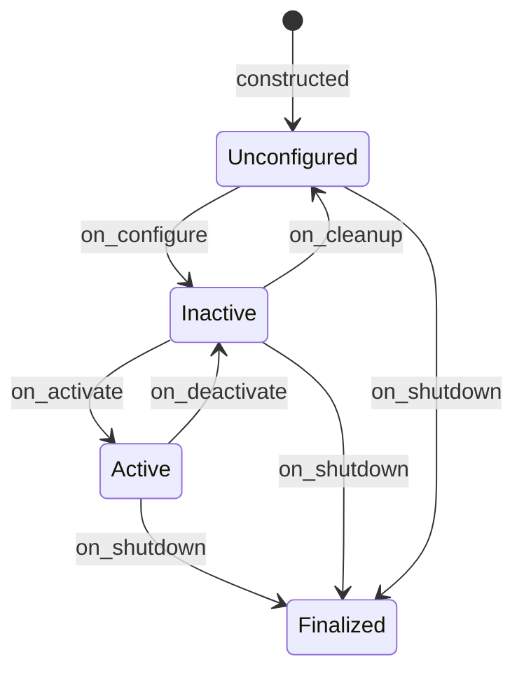

# prox_mpc_obstacle_tracker

An in-house 2D-lidar dynamic-obstacle detector and tracker for ProxMPC.

A managed lifecycle node clusters a `sensor_msgs/LaserScan`, transforms the
cluster centroids into a fixed tracking frame, runs one IMM
(constant-velocity + constant-turn-rate) filter per object, and publishes the
confirmed tracks - including sampled predicted positions along each track's
estimated arc - as a [prox_mpc_msgs/ObstacleArray](../prox_mpc_msgs).
That feed is what [prox_mpc_controller](../prox_mpc_controller) consumes for
predictive (dynamic) obstacle avoidance.

The detection and tracking math is written from scratch (Eigen only, no
third-party tracker), so the package is license-clean and unit-testable without
ROS.
The design, algorithm, parameters, and interfaces are documented in
[doc/architecture.md](doc/architecture.md).

## Table of Contents

- [Key Features](#key-features)
- [Prerequisites](#prerequisites)
- [Build](#build)
- [Run](#run)
- [Interfaces](#interfaces)
- [Lifecycle](#lifecycle)
- [Composition](#composition)
- [Testing](#testing)
- [License](#license)

## Key Features

- **Lifecycle node:** managed `configure -> activate -> deactivate -> cleanup`, with
  a signal-safe shutdown ladder in the standalone driver.
- **Self-contained pipeline:** LaserScan -> planar points -> adjacency clusters ->
  tracking-frame centroids -> IMM (CV + CTRV) tracks with sampled predicted
  positions.
- **Multi-object tracking:** gated greedy nearest-neighbour association, one
  IMM filter per track (a constant-velocity Kalman filter and a
  constant-turn-rate-and-velocity EKF run in parallel, blended by model
  probability), and a birth/confirm/death lifecycle. `imm_enabled: false`
  restores the legacy single-CV path.
- **Curved prediction feed:** each published obstacle carries
  `prediction_steps` predicted positions at `prediction_dt` spacing (default
  25 x 0.1 s = 2.5 s), so the controller can follow turning obstacles instead
  of a straight constant-velocity ray.
- **Wall rejection:** a cluster-radius cap drops extended structure (walls) whose
  centroid would otherwise be tracked as a phantom fast-moving obstacle.
- **Pure core:** the clustering and tracker are a ROS-free Eigen library
  (`prox_mpc_obstacle_tracker_core`) covered by GoogleTest.

## Prerequisites

- ROS 2 Jazzy on Ubuntu 24.04.
- [prox_mpc_msgs](../prox_mpc_msgs) (workspace package).
- `Eigen3`, `rclcpp`, `rclcpp_components`, `rclcpp_lifecycle`, `lifecycle_msgs`,
  `sensor_msgs`, `geometry_msgs`, `tf2`, `tf2_ros` (resolved by `rosdep`).

## Build

```bash
colcon build --symlink-install --packages-select prox_mpc_msgs prox_mpc_obstacle_tracker
source install/setup.bash
```

## Run

The standalone executable is a self-activating lifecycle node: it brings itself up
(`configure -> activate`), spins, and tears itself down on `SIGINT`/`SIGTERM`.
The bundled launch file loads [config/obstacle_tracker.yaml](config/obstacle_tracker.yaml)
and wires the node-only logger level, with a `params_file` argument to override the
parameters:

```bash
ros2 launch prox_mpc_obstacle_tracker obstacle_tracker.launch.py
ros2 launch prox_mpc_obstacle_tracker obstacle_tracker.launch.py \
  params_file:=/path/to/custom.yaml
```

To run the executable directly instead of through the launch file:

```bash
ros2 run prox_mpc_obstacle_tracker obstacle_tracker \
  --ros-args --params-file \
  $(ros2 pkg prefix prox_mpc_obstacle_tracker)/share/prox_mpc_obstacle_tracker/config/obstacle_tracker.yaml
```

[config/obstacle_tracker.yaml](config/obstacle_tracker.yaml) is the single source
of truth for the parameters.
Watch the output with:

```bash
ros2 topic echo /tracked_obstacles
```

In simulation the tracker is started automatically by the demo's Nav2 launch with
`predictive:=True` (see
[prox_mpc_demo/doc/nav2-simulation.md](../prox_mpc_demo/doc/nav2-simulation.md)).

## Interfaces

| Interface | Type | QoS | Direction | Description |
| --- | --- | --- | --- | --- |
| `scan` (configurable) | `sensor_msgs/msg/LaserScan` | `SensorDataQoS` (best-effort, depth 1) | Subscribed | Input lidar scan; subscribed on activate. |
| `tracked_obstacles` (configurable) | `prox_mpc_msgs/msg/ObstacleArray` | reliable, depth 5 | Published | Confirmed tracks in the tracking frame. |

The node also requires the TF `tracking_frame <- scan_frame` to place the obstacles
in the tracking frame.
The full parameter and lifecycle reference is in
[doc/architecture.md](doc/architecture.md).

The detection-range cutoffs are validated as a pair: `max_detection_range` must be
greater than `min_detection_range`, or `0.0` for "no cap" (the scan's own
`range_max` applies).
A reversed pair fails `on_configure` rather than bringing up a tracker that
discards every scan; the same condition arising from the sensor's own
`range_min`/`range_max` is logged as a throttled warning.

### IMM and prediction parameters

Declared and validated in `on_configure` (out-of-range values fail the
transition; no clamping), with
[config/obstacle_tracker.yaml](config/obstacle_tracker.yaml) as the single
source of truth.

| Name | Type | Default | Units | Range | Meaning |
| --- | --- | --- | --- | --- | --- |
| `imm_enabled` | bool | `true` | - | true/false | Run IMM(CV+CTRV); `false` = legacy single-CV KF path (single-switch rollback, no rebuild). |
| `imm_p_cv_stay` | double | `0.95` | - | (0.0, 1.0) exclusive | Markov `P(CV -> CV)`; off-diagonal is `1 -` this. |
| `imm_p_ctrv_stay` | double | `0.99` | - | (0.0, 1.0) exclusive | Markov `P(CTRV -> CTRV)`; off-diagonal is `1 -` this. The `0.99` default keeps the turning model sticky on sustained orbits. |
| `ctrv_process_noise_accel` | double | `1.0` | m²/s⁴ | >= 0.0 | CTRV linear-acceleration noise variance `σ_a²` (discrete white-noise form). |
| `ctrv_process_noise_yaw_accel` | double | `1.0` | rad²/s⁴ | >= 0.0 | CTRV yaw-acceleration noise variance `σ_ω̇²` (drives the `ω` random walk). |
| `ctrv_init_omega_variance` | double | `1.0` | rad²/s² | > 0.0 | `ω` variance at track birth and in the CV -> CTRV mixing conversion. |
| `prediction_steps` | int | `25` | samples | [0, 100] | Predicted positions published per obstacle; `0` publishes none (the controller falls back to straight-ray). |
| `prediction_dt` | double | `0.1` | s | > 0.0 | Spacing between predicted samples. |

The defaults span `25 x 0.1 s = 2.5 s`, covering the controller's maximum
prediction time (`np*dt + obstacle_timeout = 2.0 + 0.5 s` at the benchmark
preset), so the controller always interpolates and never extrapolates there.

### Detection correction parameters

| Name | Type | Default | Units | Range | Meaning |
| --- | --- | --- | --- | --- | --- |
| `cluster_center_offset_gain` | double | `0.5` | - | [0.0, 1.0] | Arc-centroid -> disc-centre correction: the cluster centroid is pushed away from the sensor along its ray by this fraction of the enclosing cluster radius. A lidar sees only the near arc of a compact obstacle, so the raw centroid is biased toward the sensor and slides around the disc as the viewpoint changes (fake tangential velocity during close passes). `0.5` matches the half-disc arc seen at close range; thin far arcs are under-corrected, which errs toward the sensor-facing surface (conservative). `0.0` disables (raw centroid). |

## Lifecycle

The node is a managed lifecycle node.
The standalone `obstacle_tracker` executable is a self-activating driver: it walks
the node up (`configure -> activate`), spins, and on `SIGINT`/`SIGTERM` runs a
single checked finalize ladder (`deactivate -> cleanup -> shutdown`).
Repeat signals are idempotent, because one shutdown reaches the process twice
whenever a supervisor signals the process group and the launch parent also
forwards to each child; a genuine hang is bounded by the supervisor's `SIGKILL`
escalation rather than by a force-quit in the handler.



`on_configure` declares and validates every parameter, builds the tracker, the TF
buffer/listener, and the publisher; `on_activate` resets the tracker and creates
the scan subscription so processing begins; `on_deactivate` drops the subscription
and stops output; `on_cleanup` and `on_shutdown` release resources through one
idempotent teardown path.
Per-transition detail is in [doc/architecture.md](doc/architecture.md).

## Composition

The lifecycle node is also registered as an `rclcpp_components` node
(`prox_mpc_obstacle_tracker::ObstacleTrackerNode`), so it can be loaded into a
shared-process component container instead of the standalone executable:

```bash
ros2 run rclcpp_components component_container
ros2 component load /ComponentManager prox_mpc_obstacle_tracker \
  prox_mpc_obstacle_tracker::ObstacleTrackerNode
```

When loaded as a component the lifecycle transitions are driven externally (the
container does not self-activate the node); the standalone executable is the path
that brings itself up.

## Testing

```bash
colcon test --packages-select prox_mpc_obstacle_tracker
colcon test-result --all --verbose
```

Four GoogleTest suites run.
`test_clustering` and `test_tracker` cover the ROS-free core: scan-to-points and
adjacency segmentation (including the wall-radius cap and the scan-seam splice),
and the tracking filters, association, and birth/confirm/death lifecycle.
`test_imm_filter` drives the per-track IMM estimator through its public API on
noiseless trajectories: CV equivalence against a reference constant-velocity
Kalman filter on straight-line motion, turn-rate convergence and curved-sample
accuracy against a straight ray on the benchmark's `dynamic_circle` orbit,
continuity of the CTRV transition and its Jacobian across the small-`ω` branch,
and the numerical guards - model probabilities staying on the simplex through
mixed hit/miss sequences and likelihood underflow, and `dt <= 0` predicts and
degenerate sampling arguments behaving as no-ops.
`test_obstacle_tracker_node` is a lifecycle-node integration test that drives the
transition ladder and the scan-to-publish path against a synthetic scan.
`uncrustify` is the enforced C++ formatter; `cpplint` and `ament_copyright` are
disabled (short SPDX header per file; full text in [LICENSE](../LICENSE)).

## License

[Apache-2.0](../LICENSE).
